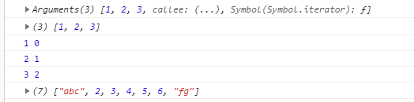

* 用途
1. rest(可变)参数
    * 用来取代arguments 但比arguments灵活,只能是最后部分形参参数
    function add(...values) {
    let sum = 0;
    for(value of values) {
      sum += value;
    }
    return sum;
    }
2. 扩展运算符
    let arr1 = [1,3,5];
    let arr2 = [2,...arr1,6];
    arr2.push(...arr1);


```
  //values最终是用来取代arguments
    function fun(...values) {
        console.log(arguments);
        //是个伪数组，不具有数组的方法
        //报错
//        arguments.forEach(function (item, index) {
//            console.log(item, index);
//        });

        console.log(values);
        //此时不是伪数组
        values.forEach(function (item, index) {
            console.log(item, index);
        })
    }
    fun(1,2,3);

    let arr = [2,3,4,5,6];
    let arr1 = ['abc',...arr, 'fg'];
    console.log(arr1);
```




