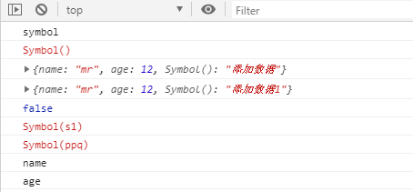

  前言：ES5中对象的属性名都是字符串，容易造成重名，污染环境


​    Symbol：
​      **概念**：ES6中的添加了一种原始数据类型symbol

​				(已有的原始数据类型：String, Number, boolean, null, undefined, 对象)

​      **特点**：
​        1、Symbol属性对应的值是**唯一的**，解决命名冲突问题
​        2、Symbol值不能与其他数据进行计算，包括同字符串拼串
​        3、for in, for of遍历时不会遍历symbol属性。

​      **使用**：
​        1、调用Symbol函数得到symbol值
​          let symbol = Symbol();
​          let obj = {};
​          obj[symbol] = 'hello';

​        2、传参标识
​          let symbol = Symbol('one');
​          let symbol2 = Symbol('two');
​          console.log(symbol);// Symbol('one')
​          console.log(symbol2);// Symbol('two')

​        3、内置Symbol值

          * 除了定义自己使用的Symbol值以外，ES6还提供了11个内置的Symbol值，指向语言内部使用的方法。
          - Symbol.iterator
           * 对象的Symbol.iterator属性，指向该对象的默认遍历器方法


```
      let symbol = Symbol();
      console.log(typeof symbol);//symbol
      console.log(symbol);//Symbol()

      let obj = {name : 'mr',age:12}
      //添加属性
      //每创建一个都需要Symbol()拿到值
      obj[symbol] = '添加数据';
      console.log(obj);//{name: "mr", age: 12, Symbol(): "添加数据"}


      obj[symbol] = '添加数据1';
      console.log(obj);//{name: "mr", age: 12, Symbol(): "添加数据1"}

      //用作对象的属性(唯一)
      //可以传入惟一的标识
      let symbol1 = Symbol();
      console.log(symbol1 == symbol);

      //用作对象的属性(唯一)
      //可以传入惟一的标识
      let symbol2 = Symbol('s1');
      console.log(symbol2);//Symbol(s1)

      //可以定义常亮
      const  PPQ = Symbol('ppq');
      console.log(PPQ);//Symbol(ppq)


      //for in, for of遍历时不会遍历symbol属性。
      //name
      //age
      for (let item in obj) {
        console.log(item)
      }
```





- 对象的Symbol.iterator属性，指向该对象的默认遍历器方法


```
    //当使用for...of 遍历数据结构时，首先会找到Symbol.iterator
    //如果没有找到则不能进行遍历，会进行报错
    let targetDate = {
      [Symbol.iterator] : function () {
        //记录指针的位置
        let nextIndex = 0;
        //遍历器对象
        return {
          next : function () {
            //this指向当前的对象targetDate
            return nextIndex < this.length ? {value :this[nextIndex++],done:false} :
                    {value: undefined,done: true}
          }
        }
      }
    }

    //三点运算符，解构赋值，默认调用iterator接口
```


