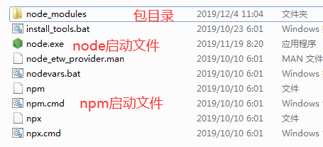

# 简介

- Node.js是一个能够在服务器端运行JavaScript的开放源代码、 跨平台JavaScript运行环境。 

-  Node采用Google开发的V8引擎运行js代码，使用事件驱动、 非阻塞和异步I/O模型等技术来提高性能，可优化应用程序的传 输量和规模。 

- Node大部分基本模块都用JavaScript编写。在Node出现之前， JS通常作为客户端程序设计语言使用，以JS写出的程序常在用 户的浏览器上运行。 

- 目前，Node已被IBM、Microsoft、Yahoo!、Walmart、 Groupon、SAP、 LinkedIn、Rakuten、PayPal、Voxer和 GoDaddy等企业采用。

-  Node主要用于编写像Web服务器一样的网络应用，这和PHP 和Python是类似的。 

- 但是Node与其他语言最大的不同之处在于，PHP等语言是阻 塞的而Node是非阻塞的。 

- Node是事件驱动的。开发者可以在不使用线程的情况下开发 出一个能够承载高并发的服务器。其他服务器端语言难以开发 高并发应用，而且即使开发出来，性能也不尽人意。 

- Node正是在这个前提下被创造出来。 

- Node把JS的易学易用和Unix网络编程的强大结合到了一起

- Node.js允许通过JS和一系列模块来编写服务器端应用和网络 相关的应用。 

-  核心模块包括文件系统I/O、网络（HTTP、TCP、UDP、DNS、 TLS/SSL等）、二进制数据流、加密算法、数据流等等。Node 模块的API形式简单，降低了编程的复杂度。 

- 使用框架可以加速开发。常用的框架有Express.js、Socket.IO 和Connect等Node.js的程序可以在Microsoft Windows、 Linux、Unix、Mac OS X等服务器上运行。 

- Node.js也可以使用CoffeeScript、TypeScript、Dart语言，以 及其他能够编译成JavaScript的语言编程

# 创始人

瑞安·达尔（Ryan Dahl） 

# 请求流程

- **单线程**进行操作

- 异步的

# 用途

• Web服务API，比如REST 

• 实时多人游戏 

• 后端的Web服务，例如跨域、服务器端的请求 

• 基于Web的应用 

• 多客户端的通信，如即时通信

# 目录

