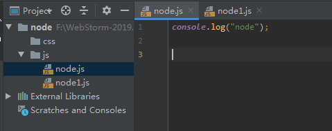
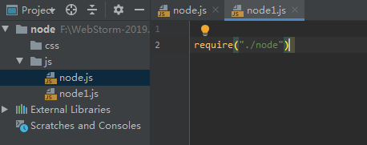

# **COMMONJS规范**

- CommonJS规范的提出，主要是为了弥补当 前JavaScript没有模块化标准的缺陷。 
-  CommonJS规范为JS指定了一个美好的愿景， 希望JS能够在任何地方运行。 
-  CommonJS对模块的定义十分简单： 

​                     模块引用 、 模块定义 、 模块标识


# ECMAScript标准的缺陷

- 没有模块系统 

-  标准库较少 

- 没有标准接口 

- 缺乏管理系统


# 模块化

-  如果程序设计的规模达到了一定程度，则 必须对其进行模块化。 

-  模块化可以有多种形式，但至少应该提供 能够将代码分割为多个源文件的机制。 

- CommonJS 的模块功能可以帮我们解决该 问题。
- 一个js文件就是一个模块


# 模块引用


- 在规范中，定义了**require**()方法，这个方 法接手模块标识，以此将一个模块引入到 当前运行环境中。 

  可以传递一个路径作为参数，node会根据路径引入外部模块

  这个路径如果是相对路径一定要以  **.** 或者 **..**开头

  

  

  

  

  ```
  F:\node\node.exe F:\WebStorm-2019.3\node\js\node1.js
  node
  ```

  

- 使用require引入模块之后会返回一个对象，这个对象就是引入的模块

- node中，每个js文件中的代码都是独立运行在一个**函数中**的，不是全局作用域，**一个模块的变量和函数在其他模块中无法访问**

  node.js

  ```
  console.log("node");
  
  var nadea = 10;
  ```

  node1.js

  ```
  var node =  require("./node")
  
  console.log(node);//{}
  ```

  解果：

  ```
  F:\node\node.exe F:\WebStorm-2019.3\node\js\node1.js
  node
  {}
  ```

- 通过exports来向外部暴露变量和方法

  node.js

  ```
  console.log("node");
  //像外部暴露属性或者方法
  //通过exports来向外部暴露变量和方法
  exports.nodea = 10;
  exports.func = function () {
      console.log("func")
  }
  ```

  node1.js

  ```
  
  
  var node =  require("./node")
  
  console.log(node);//{}
  node.func();
  ```

  ```
  F:\node\node.exe F:\WebStorm-2019.3\node\js\node1.js
  node
  { nodea: 10, func: [Function] }
  func
  
  ```

-  模块引用的示例代码： 

    var math = require('math');

# 模块定义

-  在运行环境中，提供了exports对象用于导 出当前模块的方法或者变量，并且是唯 一的导出的出口。 

- 在模块中还存在一个module对象，它代表 模块自身，而exports是module的属性。 

- 在Node中一个文件就是一个模块。

  

  ```
  exports.nodea = 10;
  exports.func = function () {
      console.log("func")
  }
  ```

  

# 模块标识

-  模块标识其实就是模块的名字，也就是传 递给require()方法的参数，它必须是符合 驼峰命名法的字符串，或者是以.  或  ..开头的 相对路径、或者绝对路径。 

-  模块的定义十分简单，接口也十分简洁。 每个模块具有独立的空间，它们互不干扰， 在引用时也显得干净利落。


# 模块分类

- 核心模块

  有系统系统的模块

  标识：模块的名字

  

- 文件模块

  用户自己创建的模块

  标识：文件路径


# global

node中有一个全局对象global

作用和网页中的windown类似

在全局中创建的变量都会作为global的属性保存

在全局中创建的反函数都会作为global方法 保存

- 

```
var a = 10;
//global是node对象
console.log(global.a);
```

```
F:\node\node.exe F:\WebStorm-2019.3\node\js\node3.js
undefined
```

- 

```
a = 10;

console.log(global.a);
```

```
F:\node\node.exe F:\WebStorm-2019.3\node\js\node3.js
10
```


- 

```
var a = 10;

console.log(global.a);

console.log(arguments);
```

```
[Arguments] {
  '0': {},
  '1': [Function: require] {
    resolve: [Function: resolve] { paths: [Function: paths] },
    main: Module {
      id: '.',
      path: 'F:\\WebStorm-2019.3\\node\\js',
      exports: {},
      parent: null,
      filename: 'F:\\WebStorm-2019.3\\node\\js\\node3.js',
      loaded: false,
      children: [],
      paths: [Array]
    },
    extensions: [Object: null prototype] {
      '.js': [Function],
      '.json': [Function],
      '.node': [Function],
      '.mjs': [Function]
    },
    cache: [Object: null prototype] {
      'F:\\WebStorm-2019.3\\node\\js\\node3.js': [Module]
    }
  },
  '2': Module {
    id: '.',
    path: 'F:\\WebStorm-2019.3\\node\\js',
    exports: {},
    parent: null,
    filename: 'F:\\WebStorm-2019.3\\node\\js\\node3.js',
    loaded: false,
    children: [],
    paths: [
      'F:\\WebStorm-2019.3\\node\\js\\node_modules',
      'F:\\WebStorm-2019.3\\node\\node_modules',
      'F:\\WebStorm-2019.3\\node_modules',
      'F:\\node_modules'
    ]
  },
  '3': 'F:\\WebStorm-2019.3\\node\\js\\node3.js',
  '4': 'F:\\WebStorm-2019.3\\node\\js'
}

```


- 

```
var a = 10;

console.log(global.a);
//arguments.callee:保存的是当前执行的函数的对象
console.log(arguments.callee);

console.log(arguments.callee + "");
```


```
F:\node\node.exe F:\WebStorm-2019.3\node\js\node3.js
undefined
[Function]

function (exports, require, module, __filename, __dirname) {
var a = 10;

console.log(global.a);
//arguments.callee:保存的是当前执行的函数的对象
console.log(arguments.callee + "");
}
```


**注意**：

当node在执行模块中的代码时，会首先在代码的最顶部添加代码：

```
function (exports, require, module, __filename, __dirname) {
```

在代码的最低添加

```
}
```


实际上模块中的代码都是包装在一个函数中执行的

并且在函数执行时，同时传递5个实参

**exports**：该对象用来将变量或者函数暴露到外部

**require**：函数用来引用外部的模块

**module：module**代表当前模块本身    exports就是module的属性（本质上一样）

**_filename**：当前模块的完整路径

 **__dirname**：当前模块所在的文件夹的目录


# exports&module

exports:

```
exports.name = "MrChengs";

exports.age = 21;

exports.fn = function () {
    console.log("输出")
}
```


```
var node =  require("./node3")

console.log(node.name);
console.log(node.age);
node.fn();
```


```
F:\node\node.exe F:\WebStorm-2019.3\node\js\node1.js
MrChengs
21
输出
```


module:

```
module.exports={
    name : "Mr_Chengs",
    age : 21,
    fn : function () {
        console.log("输出")
    }
}
```


```
var node =  require("./node3")

console.log(node.name);
console.log(node.age);
node.fn();
```


```
F:\node\node.exe F:\WebStorm-2019.3\node\js\node1.js
Mr_Chengs
21
输出
```


