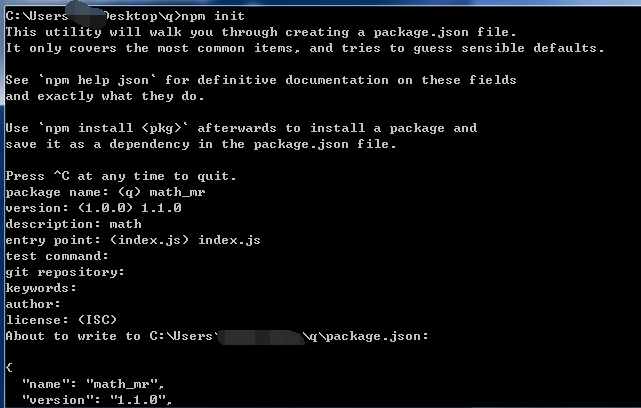
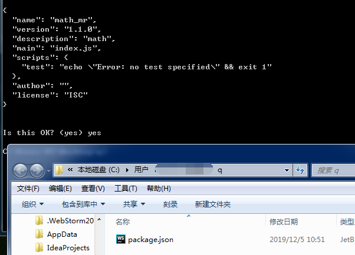
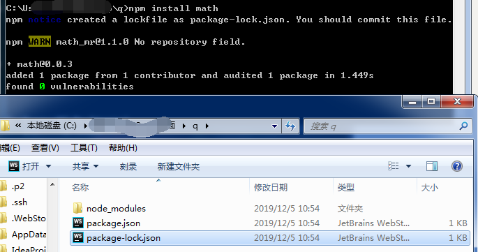
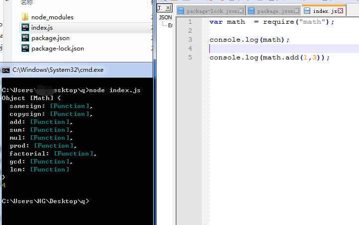
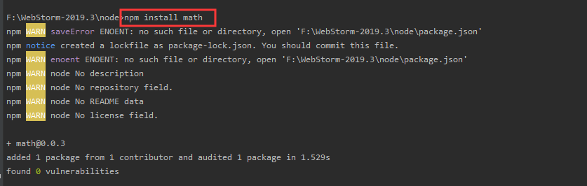
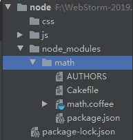

# NPM

NPM(Node Package Manager)

- CommonJS包规范是理论，NPM是其中一种实践。
-  对于Node而言，NPM帮助其完成了第三方模块的发布、安装和依赖等。借助NPM，Node与第三方模块之间形成了很好的一个生态系统。


#  NPM命令
-  npm –v – 查看版本

-  npm
  – 帮助说明

-  npm search 包名
  – 搜索模块包

- npm install 包名
  – 在当前目录安装包 • npm install 包名 –g – 全局模式安装包

  -一般都是工具

- npm init创建json文件（进行初始化）
- npm remve 包名   删除包
- npm install 包名 --save 安装包并且添加到依赖中
- npm install 下载当前这个项目所需要依赖的包（json文件同目录）

- npm remove 包名
  – 删除一个模块
-  npm install 文件路径
  – 从本地安装
-  npm install 包名 –registry=地址
  – 从镜像源安装
-  npm config set registry 地址
  – 设置镜像源

# 外部文件进行安装

进行初始化json文件






进行安装包




引用




# WebStrom


进行下载




进行查询文件目录




# cnpm

https://npm.taobao.org/镜像地址

定制的 [cnpm](https://github.com/cnpm/cnpm) (gzip 压缩支持) 命令行工具代替默认的 `npm`

```
npm install -g cnpm --registry=https://registry.npm.taobao.org
```

npm:代表官方

cnpm：代表国内镜像


# 搜索包的流程


node在使用模块名字引入时

会首先在node_modules中寻找是否包含该模块

- 如果有则使用，没有则去上一级目录node_modules中去寻找
- 如果有则使用，没有则去上一级目录去寻找
- 如果直到找到磁盘的根目录，如果没有则进行报错


