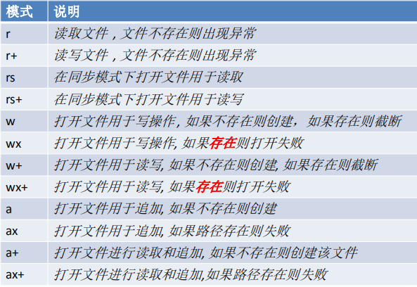

# 文件系统

-  在Node中，与文件系统的交互是非常重要的，服务器的本质就将本地的文件发送给远程的客户端
-  Node通过fs模块来和文件系统进行交互
-  该模块提供了一些标准文件访问API来打开、读取、写入文件，以及与其交互。
-  要使用fs模块，首先需要对其进行加载
  – **const fs = require("fs");**


# 同步和异步调用

- fs模块中所有的操作都有两种形式可供选择**同步**和**异步**。 • 同步文件系统会阻塞程序的执行，也就是除非操作完毕，否则不会向下执行代码。
- 异步文件系统不会阻塞程序的执行，而是在操作完成时，通过回调函数将结果返回。


# 打开和关闭文件

- 打开文件
  – fs.open(path, flags[, mode], callback) – fs.openSync(path, flags[, mode])
- 关闭文件
  – fs.close(fd, callback) – fs.closeSync(fd)


# 打开状态




# 同步文件写入


```
//引入
var fs = require("fs");

//path:文件路径（会默认创建文件）
//flags:对文件的操作
//mode:设置文件的权限（一般不使用）
//callback:
//会对文件有一个返回，可以通过返回值进行对文件的操作
var fd = fs.openSync("node.txt", "w");
console.log(fd);//3

//fs.writeSync(fd, string[, position[, encoding]])
//fd:需要写入的文件描述符
//string:写入的内容
//position:写入的位置(索引位置)
//encoding:编码
fs.writeSync(fd,"msg");

//关闭
//同步的 close(2)。返回 undefined。

fs.closeSync(fd);

```


# 异步文件写入


```
//引入
var fs = require("fs");

//fs.open(path[, flags[, mode]], callback)
//path:文件路径
//flags:操作方式
//mode:设置文件的权限（一般不使用）
//callback:回调函数


//异步没有返回值，即使有返回值也是undefined
//返回值通过回调函数进行返回
//回调函数有两个参数：1、err错误对象，如果有错误则进行返回  2、
var fd =  fs.open("node1.txt","w",function (err,fd){
    //console.log(arguments);//[Arguments] { '0': null, '1': 3 }
    if (!err){
        //如果没有出错进行对文件操作
        fs.write(fd,"异步操作",function (err) {
           if (!err){
               console.log("success！");
           }
           //关闭
            fs.close(fd,function (err) {
                //没有错就进行关闭
                if (!err){
                    console.log("close")
                }
            });
        })

    }else {
        console.log(err);
    }
});
```


```
F:\node\node.exe F:\WebStorm-2019.3\node\Buffer\fs.js
success！
close

```


异步不会进行阻塞代码的执行

提高系统的执行效率！


# 简单文件写入


```
var fs = require("fs");


// fs.writeFile(file, data[, options], callback)
// fs.writeFileSync(file, data[, options])
//file:要操作文件的路径
//data:要写入的数据
//options:对写入进行一些设置
//callback:回调函数

//异步
fs.writeFile("node3.txt","简单同步日志写入",function(err) {
    //无错处理
    if(!err){
        console.log("写入成功！")
    }
})

//同步
fs.writeFileSync("node4.txt","简单异步日志写入", { encoding: 'utf8', mode: 0o666, flag: 'w' })
```


# 流式文件写入

同步异步、简单文件写入都不适合大文件的写入，性能差，容易发生内存溢出


```
//引入
var fs = require("fs");

//创建一个可写流
//fs.createWriteStream(path[, options])

var ws = fs.createWriteStream("node5.txt");

//通过监听流的opoen事件和close事件来打开和关闭
//on:绑定事件多次
//once:绑定事件多次(一次监听之后自动失效）
ws.once("open",function () {
    console.log("open");
})

ws.once("close",function () {
    console.log("close");
})


//同ws写文件
//只要不关闭就可以一直写入
ws.write("111111"+"\n");
ws.write("222222"+"\n");

//关闭
ws.end();
```

```
F:\node\node.exe F:\WebStorm-2019.3\node\Buffer\fs.js
open
close
```


# 同步文件读取

fs.readSync(fd, buffer, offset, length, position)


# 异步文件读取

fs.read(fd, buffer, offset, length, position, callback)


# 简单文件读取


fs.readFile(path[, options], callback)
fs.readFileSync(path[, options])

```
//引入
var fs = require("fs");

// fs.readFile(path[, options], callback)
//callback:
//  data:读取的数据
//  err:错误信息

//异步
fs.readFile("node5.txt",function (err,data) {
    //如果没有错误进行输出
    if (!err){
        console.log(data);//<Buffer 31 31 31 31 31 31 0a 32 32 32 32 32 32 0a>
    }
})

//同步
// fs.readFileSync(path[, options])
var nodes = fs.readFileSync("node5.txt");
console.log(nodes);//<Buffer 31 31 31 31 31 31 0a 32 32 32 32 32 32 0a>
```


# 流式文件读取

一次读取适用于一些较大的文件

可以将文件分多次读取到内存中


```

//引入
var fs = require("fs");

//创建一个可读流
var rs = fs.createReadStream("node5.txt");

//监听流的开启和关闭
rs.once("open",function(){
    console.log("open")
})

rs.once("close",function () {
    console.log("close")
    
    //如果需要进行复制
    ws.end();
    
})

//可读流需要绑定一个数据，必须为其绑定一个data时间
//data事件绑定完毕，会自动开始读取数据
rs.on("data",function (data) {
    //data在参数中返回
    console.log("data")
    console.log(data)
})

```


```
F:\node\node.exe F:\WebStorm-2019.3\node\Buffer\fs.js
open
data
<Buffer 31 31 31 31 31 31 0a 32 32 32 32 32 32 0a>
close
```


