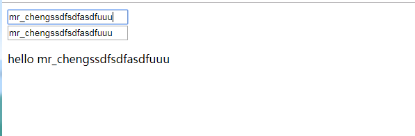

- 引入Vue.js
- 创建Vue对象
- - el : 指定根element(选择器)
- - data : 初始化数据(页面可以访问)

- 双向数据绑定 : v-model

- 显示数据 : {{xxx}}


数据绑定：数据在页面与内存中的变量自动转移

数据的双向绑定：两个方向数据都可以自动转移


```
<!--模板-->
<div id="test">
  <input type="text" v-model="msg"><br><!--指令-->
  <input type="text" v-model="msg"><!--指令-->
  <p>hello {{msg}}</p><!--大括号表达式-->
</div>

<script type="text/javascript" src="../js/vue.js"></script>
<script type="text/javascript">
  const vm = new Vue({ // 配置对象 options
    // 配置选项(option)
    el: '#test',  // element: 指定用vue来管理页面中的哪个标签区域
    data: {
      msg: 'mr_chengs'
    }
  })
</script>
```

程序运行结果：




