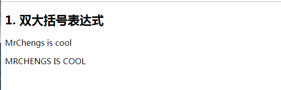
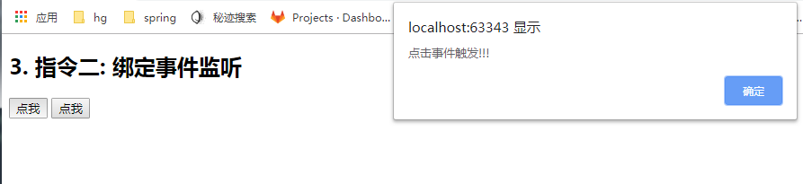
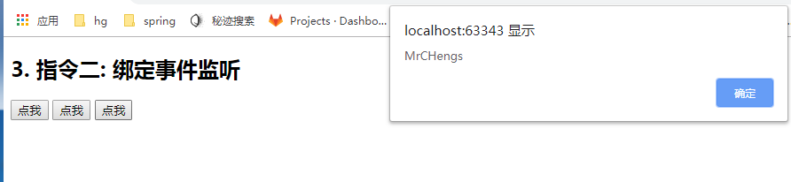

### MVVM的图


**model**:模型，本质上是数据对象（data）

**view**：视图，模板页面

**viewModel**：视图模型(view的实例)


两个语法：指令、表达式（{{}}）


### 模板语法


**模板的理解** 

1) 动态的 html 页面 

2) 包含了一些 JS 语法代码 

​		a. 双大括号表达式 

​		b. 指令(以 v-开头的自定义标签属性)


**双大括号表达式**

1) 语法: **{{exp}}** 

2) 功能: 向页面输出数据 

3) 可以调用对象的方法

```
<div id="app">
  <h2>1. 双大括号表达式</h2>
  <p>{{content}}</p>
  <p>{{content.toUpperCase()}}</p>

</div>


<script type="text/javascript" src="../js/vue.js"></script>
<script type="text/javascript">
  new Vue({
    el: '#app',
    data: {
      content: 'MrChengs is cool'
    }
  })
</script>
```




**指令**一**:** **强制数据绑定**

1) 功能: 指定变化的属性值 

2) 完整写法: **v-bind:xxx='yyy'** //yyy 会作为表达式解析执行 

3) 简洁写法: **:xxx='yyy'** 

```
<div id="app">
  <h2>2. 指令一: 强制数据绑定</h2>
  <a href="url">访问指定站点</a><br>
  <a v-bind:href="url">访问指定站点2</a><br>
  <a :href="url">访问指定站点2</a><br>
</div>

<script type="text/javascript" src="../js/vue.js"></script>
<script type="text/javascript">
  new Vue({
    el: '#app',
    data: {
      content: 'NBA I Love This Game',
      url: 'http://www.baidu.com'
    }
  })
</script>
```

点击可以进行请求路径的跳转


**指令二: **绑定事件监听

1) 功能: 绑定指定事件名的回调函数 
2) 完整写法: 
	v-on:keyup='xxx' 
	v-on:keyup='xxx(参数)' 
	v-on:keyup.enter='xxx' 
3) 简洁写法: 
	@keyup='xxx' 
	@keyup.enter='xxx'

```
<div id="app">
  <h2>3. 指令二: 绑定事件监听</h2>
  <button v-on:click="test">点我</button>
  <button @click="test">点我</button>
</div>


<script type="text/javascript" src="../js/vue.js"></script>
<script type="text/javascript">
  new Vue({
    el: '#app',
    data: {
      content: 'NBA I Love This Game',
      url: 'http://www.baidu.com'
    },
    methods: {
      test () {
        alert('点击事件触发')
      }
    }
  })
</script>
```



点击事件传递参数

```
<div id="app">
  <h2>3. 指令二: 绑定事件监听</h2>
  <button v-on:click="test">点我</button>
  <button @click="test">点我</button>
  <button @click="test1('MrCHengs')">点我</button>

</div>


<script type="text/javascript" src="../js/vue.js"></script>
<script type="text/javascript">
  new Vue({
    el: '#app',
    data: {
      content: 'NBA I Love This Game',
      url: 'http://www.baidu.com'
    },
    methods: {
      test () {
        alert('点击事件触发!!!')
      },
      test1(msg){
        alert(msg)
      }
    }
  })
</script>
```



注意：<button @click="test1(url)">点我</button>

此时传递的 是url(注：url在data层，此时可以进行打印url中的数据)

