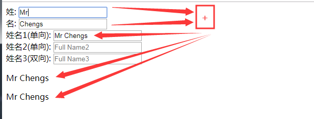
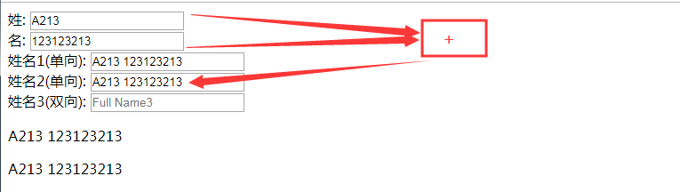
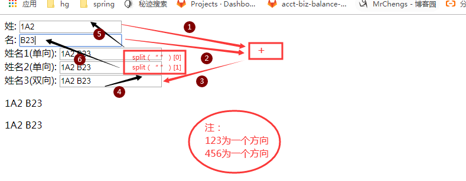

1.计算属性
在computed属性对象中定义计算属性的方法
在页面中使用{{方法名}}来显示计算的结果


2.监视属性:
通过通过vm对象的$watch()或watch配置来监视指定的属性
 当属性变化时, 回调函数自动调用, 在函数内部进行计算


3.计算属性高级:
通过getter/setter实现对属性数据的显示和监视
计算属性存在缓存, 多次读取只执行一次getter计算


**计算属性:(computed)**

```
<div id="demo">
  姓: <input type="text" placeholder="First Name" v-model="firstName"><br>
  名: <input type="text" placeholder="Last Name" v-model="lastName"><br>
  <!--fullName1是根据fistName和lastName计算产生-->
  姓名1(单向): <input type="text" placeholder="Full Name1" v-model="fullName1"><br>
  姓名2(单向): <input type="text" placeholder="Full Name2" v-model="fullName2"><br>
  姓名3(双向): <input type="text" placeholder="Full Name3" v-model="fullName3"><br>

  <p>{{fullName1}}</p>
  <p>{{fullName1}}</p>
</div>


 const  ve = new Vue({
    el:'#demo',
    data:{
      firstName : 'A',
      lastName : 'B',
      //fullName1 : 'AB',
    },
    computed:{
      //计算属性
      //在computed属性对象中定义计算属性的方法
      //在页面中使用{{方法名}}来显示计算的结果
      fullName1(){//计算属性的方法
        return this.firstName + " " + this.lastName;
      }
    }
  })
```




**监视属性(watch/$watch)**

```
<div id="demo">
  姓: <input type="text" placeholder="First Name" v-model="firstName"><br>
  名: <input type="text" placeholder="Last Name" v-model="lastName"><br>
  <!--fullName1是根据fistName和lastName计算产生-->
  姓名1(单向): <input type="text" placeholder="Full Name1" v-model="fullName1"><br>
  姓名2(单向): <input type="text" placeholder="Full Name2" v-model="fullName2"><br>
  姓名3(双向): <input type="text" placeholder="Full Name3" v-model="fullName3"><br>

  <p>{{fullName1}}</p>
  <p>{{fullName1}}</p>
</div>


 const  ve = new Vue({
    el:'#demo',
    data:{
      firstName : 'A',
      lastName : 'B',
      //fullName1 : 'AB',
      fullName2 : 'AB',
    },
    computed:{
      //计算属性
      //在computed属性对象中定义计算属性的方法kkkkkkkkkkiijj
      //在页面中使用{{方法名}}来显示计算的结果
      fullName1(){//计算属性的方法
        return this.firstName + " " + this.lastName;
      }
    },
    watch:{//配质监视
      firstName :function (newValue,oldValue) {//监听的属性是一个回调函数
        //firstName发生变化，此时修改fullName属性
        //this代表vue的实例对象
        this.fullName2 = newValue + " " + this.lastName;
      }
    }
  })

  ve.$watch('lastName',function (newVal,oldVal) {
      //跟新fullname2
    this.fullName2 = this.firstName + " " + newVal
  })
```




**计算属性高级(get/set)**

```
<div id="demo">
  姓: <input type="text" placeholder="First Name" v-model="firstName"><br>
  名: <input type="text" placeholder="Last Name" v-model="lastName"><br>
  <!--fullName1是根据fistName和lastName计算产生-->
  姓名1(单向): <input type="text" placeholder="Full Name1" v-model="fullName1"><br>
  姓名2(单向): <input type="text" placeholder="Full Name2" v-model="fullName2"><br>
  姓名3(双向): <input type="text" placeholder="Full Name3" v-model="fullName3"><br>

  <p>{{fullName1}}</p>
  <p>{{fullName1}}</p>
</div>


 const  ve = new Vue({
    el:'#demo',
    data:{
      firstName : 'A',
      lastName : 'B',
      //fullName1 : 'AB',
      fullName2 : 'AB',
    },
    computed:{
      //计算属性
      //在computed属性对象中定义计算属性的方法kkkkkkkkkkiijj
      //在页面中使用{{方法名}}来显示计算的结果
      fullName1(){//计算属性的方法
        return this.firstName + " " + this.lastName;
      },
      fullName3:{
        //回调函数：计算得到当前属性的值并且返回
        //1你定义的 2你没有调用 3最终执行了
        //1什么时候调用 2用来做什么
        //需要当前属性值的时回调，用来返回当前属性值（根据相关的数据计算）
        get(){
          return this.firstName + " " + this.lastName;
        },
        //回调函数：属性值发生改变的时候调用，更新相关的属性数据
        set(value){
          this.firstName = value.split(" ")[0]
          this.lastName = value.split(" ")[1]

        }
      }
    },
    watch:{//配质监视
      firstName :function (newValue,oldValue) {//监听的属性是一个回调函数
        //firstName发生变化，此时修改fullName属性
        //this代表vue的实例对象
        this.fullName2 = newValue + " " + this.lastName;
      }
    }
  })

  ve.$watch('lastName',function (newVal,oldVal) {
      //跟新fullname2
    this.fullName2 = this.firstName + " " + newVal
  })

```




通过getter/setter实现对属性数据的显示和监视

计算属性存在缓存, 多次读取只执行一次getter计算


