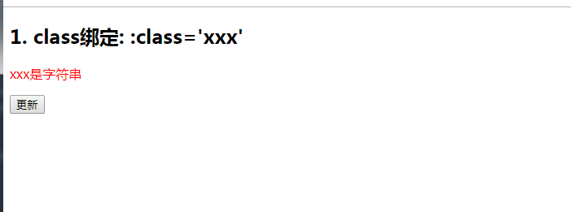
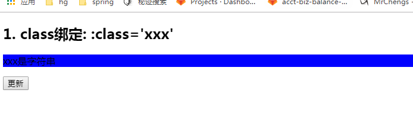
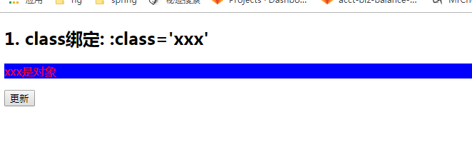
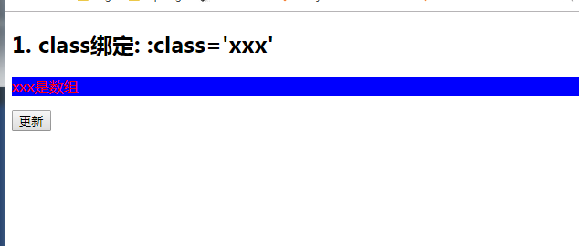
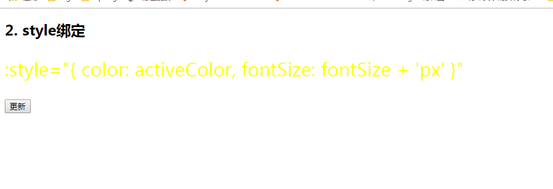
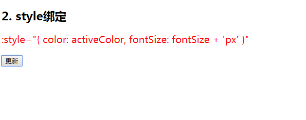

**理解**

1) 在应用界面中, 某个(些)元素的样式是变化的 

2) class/style 绑定就是专门用来实现动态样式效果的技术


**class** **绑定**

1) :class='xxx' 
2) 表达式是字符串: 'classA' 
3) 表达式是对象: {classA:isA, classB: isB} 
4) 表达式是数组: ['classA', 'classB']


**style** **绑定**

1) :style="{ color: activeColor, fontSize: fontSize + 'px' }" 
2) 其中 activeColor/fontSize 是 data 属性


**class绑定：字符串**

```
 <style>
    .classA {
      color: red;
    }
    .classB {
      background: blue;
    }
    .classC {
      font-size: 20px;
    }
  </style>
```

```
<div id="demo">
  <h2>1. class绑定: :class='xxx'</h2>
  <p :class="myClass">xxx是字符串</p>

  <button @click="update">更新</button>

</div>
```

```
  new Vue({
    el: '#demo',
    data:{
      myClass:'classA'

    },
    methods:{
      update(){
        this.myClass = 'classB'
      }
    }
  })
```

初始化状态



点击事件之后




**class绑定：对象**

属性名：选择器的名称

属性值：Boolean类型

```
 <style>
    .classA {
      color: red;
    }
    .classB {
      background: blue;
    }
    .classC {
      font-size: 20px;
    }
  </style>
```

```
<div id="demo">
  <h2>1. class绑定: :class='xxx'</h2>

  <p :class="{classA: hasClassA, classB: hasClassB}">xxx是对象</p>

  <button @click="update">更新</button>
</div>
```

```
  new Vue({
    el: '#demo',
    data:{
      myClass:'classA',
      hasClassA : true,
      hasClassB:true

    },
    methods:{
      update(){
        this.myClass = 'classB'
      }
    }
  })
```




**class绑定：数组**

```
 <style>
    .classA {
      color: red;
    }
    .classB {
      background: blue;
    }
    .classC {
      font-size: 20px;
    }
  </style>
```

```
<div id="demo">
  <h2>1. class绑定: :class='xxx'</h2>
//一个属性写死一个不写死
  <p :class="[classA, 'classB']">xxx是数组</p>

  <button @click="update">更新</button>
</div>
```

```
 new Vue({
    el: '#demo',
    data:{
      myClass:'classA',
      hasClassA : true,
      hasClassB:true,
      classA : 'classA'

    },
    methods:{
      update(){
        this.myClass = 'classB'
      }
    }
  })

```




**style** **绑定**

```
  <style>
    .classA {
      color: red;
    }
    .classB {
      background: blue;
    }
    .classC {
      font-size: 20px;
    }
  </style>
```

```
<div id="demo">

  <h2>2. style绑定</h2>
  <p :style="{color:activeColor, fontSize}"> :style="{ color: activeColor, fontSize: fontSize + 'px' }"</p>

  <button @click="update">更新</button>
</div>

```

```
 new Vue({
    el: '#demo',
    data:{
      myClass:'classA',
      hasClassA : true,
      hasClassB:true,
      classA : 'classA',
      activeColor:'yellow',
      fontSize:'30px'


    },
    methods:{
      update(){
        this.myClass = 'classB'
        this.activeColor = 'red'
        this.fontSize = '20px'

      }
    }
  })
```

默认初始化页面：



点击事件




