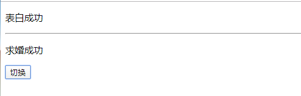
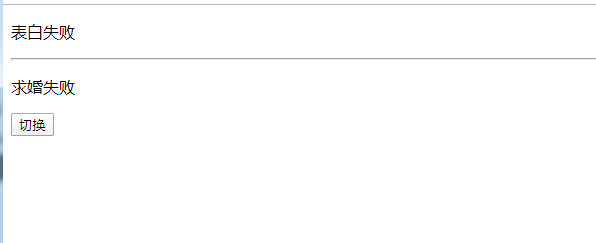

**条件渲染指令**

1) v-if 与 v-else 

2) v-show


**比较** **v**-**if** **与** **v-show**

3) 如果需要频繁切换 v\-show 较好 

4) 当条件不成立时, v-if 的所有子节点不会解析(项目中使用)

**5)v-if会将标签移除，v-show会将标签属性设置为不可见**


v-if&v-show：跟Boolean值进行条件渲染

```
<div id="demo">
  <p v-if="ok">表白成功</p>
  <p v-else>表白失败</p>

  <hr>
  <p v-show="ok">求婚成功</p>
  <p v-show="!ok">求婚失败</p>

  <button @click="ok=!ok">切换</button>
</div>
```

```
new Vue({
    el: '#demo',
    data: {
      ok: true,
    }
  })
```

初始化页面



点击按钮进行切换

