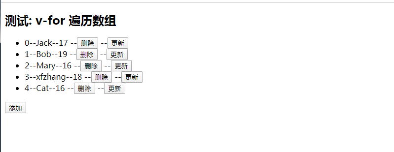
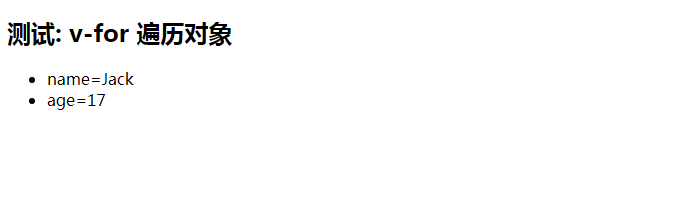

1) 列表显示指令 

数组: v-for / index 

对象: v-for / key 


2) 列表的更新显示 

删除 item 

替换 item 


3) 列表的高级处理 

列表过滤 

列表排序 


**测试: v-for 遍历数组**

```
<div id="demo">
  <h2>测试: v-for 遍历数组</h2>
  <ul>
    <li v-for="(p, index) in persons" :key="index">
      {{index}}--{{p.name}}--{{p.age}}
      --<button @click="deleteP(index)">删除</button>
      --<button @click="updateP(index, {name:'Cat', age: 16})">更新</button>
    </li>
  </ul>
  <button @click="addP({name: 'xfzhang', age: 18})">添加</button>
</div>
```

```
  new Vue({
    el: '#demo',
    data: {
      persons: [//vue本身只是监视persons的改变，没有监视数据内部的改变
        {name: 'Tom', age:18},
        {name: 'Jack', age:17},
        {name: 'Bob', age:19},
        {name: 'Mary', age:16}
      ]
    },
    methods: {
      deleteP (index) {
        this.persons.splice(index, 1) // 调用了不是原生数组的splice(), 而是一个变异(重写)方法
              // 1. 调用原生的数组的对应方法
              // 2. 更新界面
      },
      updateP (index, newP) {
        console.log('updateP', index, newP)
        // this.persons[index] = newP  // vue根本就不知道，没有改变persons本身
        //此时可以使用vue的数组变异方法
        //vue 进行重写数据的方法，在数据改变之后进行遍历界面
        this.persons.splice(index, 1, newP)
        // this.persons = []
      },
      addP (newP) {
        this.persons.push(newP)
      }
    }
  });
```




**测试: v-for 遍历对象**

```
<div id="demo">

  <h2>测试: v-for 遍历对象</h2>

  <ul>
    <li v-for="(item, key) in persons[1]" :key="key">{{key}}={{item}}</li>
  </ul>

</div>
```

```
new Vue({
    el: '#demo',
    data: {
      persons: [//vue本身只是监视persons的改变，没有监视数据内部的改变
        {name: 'Tom', age:18},
        {name: 'Jack', age:17},
        {name: 'Bob', age:19},
        {name: 'Mary', age:16}
      ]
    }
    })
```



**过滤与排序**

```
<div id="demo">
  <input type="text" v-model="searchName">
  <ul>
    <li v-for="(p, index) in filterPersons" :key="index">
      {{index}}--{{p.name}}--{{p.age}}
    </li>
  </ul>
  <div>
    <button @click="setOrderType(2)">年龄升序</button>
    <button @click="setOrderType(1)">年龄降序</button>
    <button @click="setOrderType(0)">原本顺序</button>
  </div>
</div>
```


```
  new Vue({
    el: '#demo',
    data: {
      searchName: '',//搜索的初始化值
      orderType: 0, // 0代表不排序, 1代表降序, 2代表升序
      persons: [
        {name: 'Tom', age:18},
        {name: 'Jack', age:17},
        {name: 'Bob', age:19},
        {name: 'Mary', age:16}
      ]
    },

    computed: {
      filterPersons () {
//        debugger
        // 取出相关数据
        const {searchName, persons, orderType} = this
        let arr = [...persons]
        // 过滤数组
        if(searchName.trim()) {
          //计算数组中是否包含输入的字符串
          arr = persons.filter(p => p.name.indexOf(searchName)!==-1)
        }

        // 排序
        if(orderType) {
          arr.sort(function (p1, p2) {
            if(orderType===1) { // 降序
              return p2.age-p1.age
            } else { // 升序
              return p1.age-p2.age
            }
          })
        }
        
        return arr
      }
    },

    methods: {
      setOrderType (orderType) {
        this.orderType = orderType
      }
    }
  })
```


