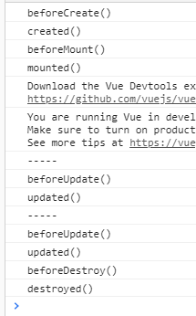

**生命周期流程图**


**vue** **生命周期分析**

1) 初始化显示 

- beforeCreate() 

- created() 

- beforMount()

- mounted() 

2) 更新状态: this.xxx = value 

- beforeUpdate()

- updated()

3) 销毁 vue 实例: vm.

- $destory() 

- *beforeDestory()* 

- *destoryed()* 


**常用的生命周期方法** 

1) created()/mounted(): 发送 ajax 请求, 启动定时器等异步任务 

2) beforeDestory(): 做收尾工作, 如: 清除定时器


```
<div id="test">
  <button @click="destroyVue">destory vue</button>
  <p v-if="isShow">定时器进行定期执行数据显示</p>
</div>
```

```
 new Vue({
    el: '#test',
    data: {
      isShow: true
    },
    // 初始化阶段
    mounted () {
      // 执行定时器任务
            this.intervalId = setInterval(() => {
              console.log('-----')
              this.isShow = !this.isShow
            }, 1000)
          },

    //结束之前调用的方法
    beforeDestroy() {
      console.log('beforeDestroy()')
      // 执行收尾的工作
      clearInterval(this.intervalId)
    },

    methods: {
      destroyVue () {
        //清除
        this.$destroy()
      }
    }
  })

```

点击停止按钮就会进行停止监听器。


```
<div id="test">
  <button @click="destroyVue">destory vue</button>
  <p v-if="isShow">尚硅谷IT教育</p>
</div>
```

```
new Vue({
    el: '#test',
    data: {
      isShow: true
    },

    beforeCreate() {
      console.log('beforeCreate()')
    },

    created() {
      console.log('created()')
    },

    beforeMount() {
      console.log('beforeMount()')
    },

    mounted () {
      console.log('mounted()')
      // 执行异步任务
      this.intervalId = setInterval(() => {
        console.log('-----')
        this.isShow = !this.isShow
      }, 1000)
    },


    beforeUpdate() {
      console.log('beforeUpdate()')
    },
    updated () {
      console.log('updated()')
    },


    beforeDestroy() {
      console.log('beforeDestroy()')
      // 执行收尾的工作
      clearInterval(this.intervalId)
    },

    destroyed() {
      console.log('destroyed()')
    },

    methods: {
      destroyVue () {
        this.$destroy()
      }
    }
  })
```




