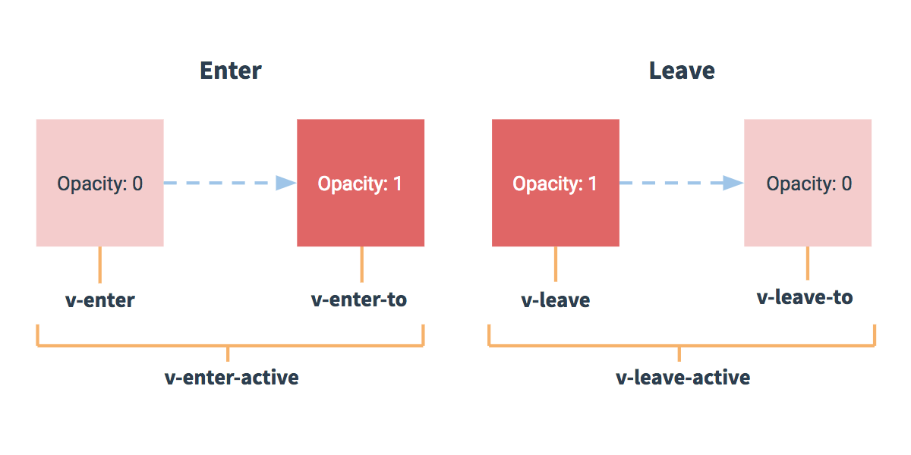

**vue** **动画的理解**

1) 操作 css 的 trasition 或 animation 

2) vue 会给目标元素添加/移除特定的 class 

3) 过渡的相关类名 
	xxx-enter-active: 指定显示的 transition 
	xxx-leave-active: 指定隐藏的 transition 
	xxx-enter/xxx-leave-to: 指定隐藏时的样式





**基本过渡动画的编码**

1) 在目标元素外包裹<transition name="xxx"> 
2) 定义 class 样式 
	指定过渡样式: transition 
	指定隐藏时的样式: opacity/其它


- 

```
    /*指定过渡样式*/
    .xxx-enter-active, .xxx-leave-active {
      transition: opacity 10s
    }
    /*指定隐藏时的样式*/
    .xxx-enter, .xxx-leave-to {
      opacity: 0;
    }
```

```
<div id="demo">
  <button @click="show = !show">Toggle</button>
  <transition name="xxx">
    <p v-show="show">hello</p>
  </transition>
</div>

```

```
  new Vue({
    el: '#demo',
    data: {
      show: true
    }
  })
```


- 

```
 .move-enter-active {
      transition: all 1s
    }

    .move-leave-active {
      transition: all 3s
    }

    .move-enter, .move-leave-to {
      opacity: 0;
      transform: translateX(20px)
    }
```

```
<div id="demo2">
  <button @click="show = !show">Toggle2</button>
  <transition name="move">
    <p v-show="show">hello</p>
  </transition>
</div>

```

```
  new Vue({
    el: '#demo2',
    data: {
      show: true
    }
  })

```


