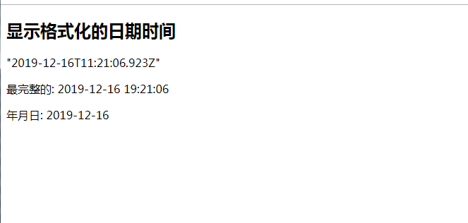

**理解过滤器**

1) 功能: 对要显示的数据进行特定格式化后再显示 
2) 注意: 并没有改变原本的数据, 可是产生新的对应的数据


**定义和使用过滤器**

1) 定义过滤器 
	Vue.filter(filterName, function(value[,arg1,arg2,...]){ 
	// 进行一定的数据处理 
	return newValue 
	}) 


2) 使用过滤器 

	<div>{{myData | filterName}}</div>
	<div>{{myData | filterName(arg)}}</div>


```
<div id="test">
  <h2>显示格式化的日期时间</h2>
  <p>{{time}}</p>
  <p>最完整的: {{time | dateString}}</p>
  <p>年月日: {{time | dateString('YYYY-MM-DD')}}</p>
</div>
```

```
<script type="text/javascript" src="https://cdn.bootcss.com/moment.js/2.22.1/moment.js"></script>
<script>
  // 定义过滤器（名字&处理函数）
  Vue.filter('dateString', function (value, format='YYYY-MM-DD HH:mm:ss') {

    //返回的数据类型
    //moment用于时间显示的js库
    return moment(value).format(format);
  })

  new Vue({
    el: '#test',
    data: {
      time: new Date()
    },
    mounted () {
      setInterval(() => {
        this.time = new Date()
      }, 1000)
    }
  })
</script>
```




