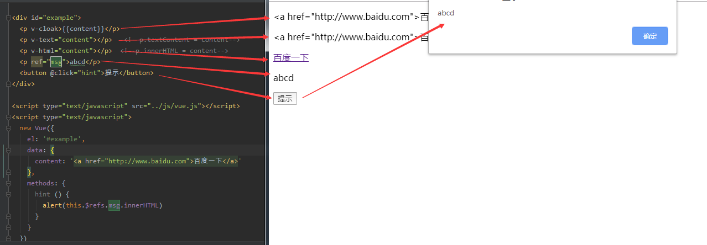
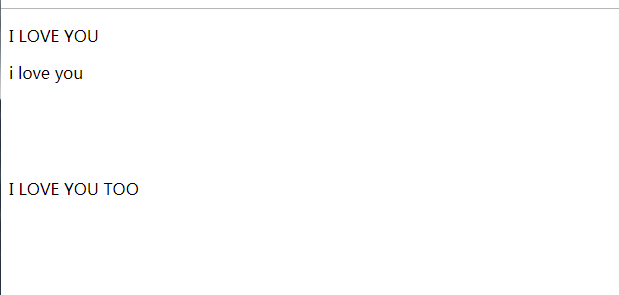

**常用内置指令**

1) 	v:text : 更新元素的 textContent 
2)	 v-html : 更新元素的 innerHTML 
3) 	v-if : 如果为 true, 当前标签才会输出到页面
4) 	v-else: 如果为 false, 当前标签才会输出到页面 
5)	 v-show : 通过控制 display 样式来控制显示/隐藏 
6)	 v-for : 遍历数组/对象
7) 	v-on : 绑定事件监听, 一般简写为@ 
8)	 v-bind : 强制绑定解析表达式, 可以省略 v-bind 
9)	 v-model : 双向数据绑定 
10)	 ref : 指定唯一标识, vue 对象通过$els 属性访问这个元素对象 
11)	 v-cloak : 防止闪现, 与 css 配合: [v-cloak] { display: none }


```
  <style>
    [v-cloak] { display: none }
  </style>
```

```
<div id="example">
  <p v-cloak>{{content}}</p>
  <p v-text="content"></p>   <!--p.textContent = content-->
  <p v-html="content"></p>  <!--p.innerHTML = content-->
  <p ref="msg">abcd</p>
  <button @click="hint">提示</button>
</div>
```

```
 new Vue({
    el: '#example',
    data: {
      content: '<a href="http://www.baidu.com">百度一下</a>'
    },
    methods: {
      hint () {
        alert(this.$refs.msg.innerHTML)
      }
    }
  })
```




**自定义指令** 

1) 注册**全局**指令 
	Vue.directive('my-directive', function(el, binding){ 
		el.innerHTML = binding.value.toupperCase() 
	}) 
2) 注册**局部**指令 
	directives : { 
		'my-directive' : { 
			bind (el, binding) { 
				el.innerHTML = binding.value.toupperCase() 
			} 
		} 
	} 
3) 使用指令 
	v-my-directive='xxx'


需求:

 自定义2个指令 

- 功能类型于v-text, 但转换为全大写  

- 功能类型于v-text, 但转换为全小写


```
<div id="test">
  <p v-upper-text="msg"></p>
  <p v-lower-text="msg"></p>
</div>
<br>
<br>
<br>
<div id="test2">
  <p v-upper-text="msg"></p>

  <!--报错：不可以调用局部的定义指令-->
  <!--<p v-lower-text="msg"></p>-->
</div>
```

```
<script type="text/javascript">
  // 注册一个全局指令
  // el: 指令所在的标签对象
  // binding: 包含指令相关数据的容器对象
  Vue.directive('upper-text', function (el, binding) {
    console.log(el, binding)
    el.textContent = binding.value.toUpperCase()
  })

  new Vue({
    el: '#test',
    data: {
      msg: "I Love You"
    },
    // 注册局部指令
    directives: {
      'lower-text'(el, binding) {
        console.log(el, binding)
        el.textContent = binding.value.toLowerCase()
      }
    }

  })


  new Vue({
    el: '#test2',
    data: {
      msg: "I Love You Too"
    }
  })
</script>
```





