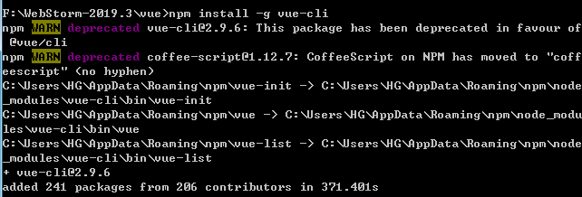
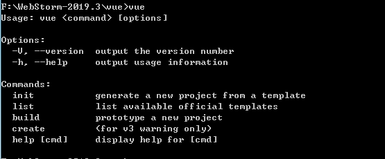
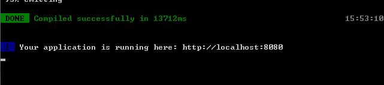
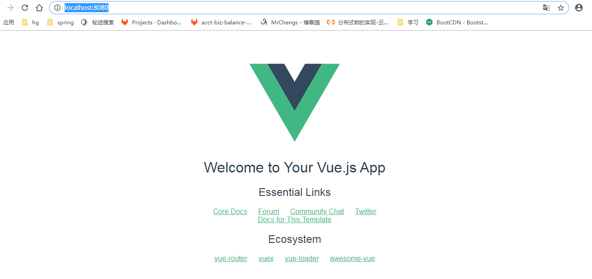

**说明**

1) vue-cli 是 vue 官方提供的脚手架工具 

2) github: https://github.com/vuejs/vue-cli 

3) 作用: 从 https://github.com/vuejs-templates 下载模板项目

**创建** **vue** **项目**

npm install -g vue-cli 

vue init webpack(可选6个模板名称) vue_test(项目名称)
cd vue_demo 
npm install 
npm run dev （开发环境）package.json文件中

访问: http://localhost:8080/

**模板项目的结构**

|-- build : webpack 相关的配置文件夹(基本不需要修改) 
		|-- dev-server.js : 通过 express 启动后台服务器 
|-- config: webpack 相关的配置文件夹(基本不需要修改) 
		|-- index.js: 指定的后台服务的端口号和静态资源文件夹 
|-- node_modules 
|-- src : 源码文件夹 
		|-- components: vue 组件及其相关资源文件夹 
		|-- App.vue: 应用根主组件 
		|-- main.js: 应用入口 js 
|-- static: 静态资源文件夹 
|-- .babelrc: babel 的配置文件 
|-- .eslintignore: eslint 检查忽略的配置 
|-- .eslintrc.js: eslint 检查的配置 
|-- .gitignore: git 版本管制忽略的配置
|-- index.html: 主页面文件
|-- package.json: 应用包配置文件 
|-- README.md: 应用描述说明的 readme 文件

