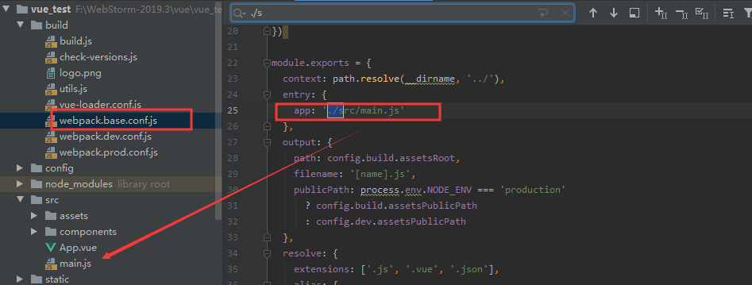
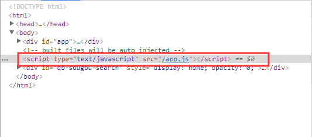
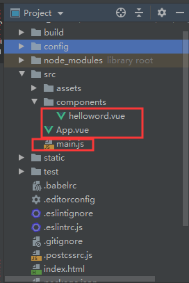
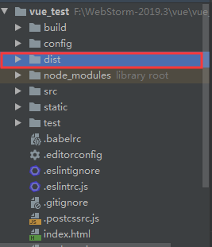
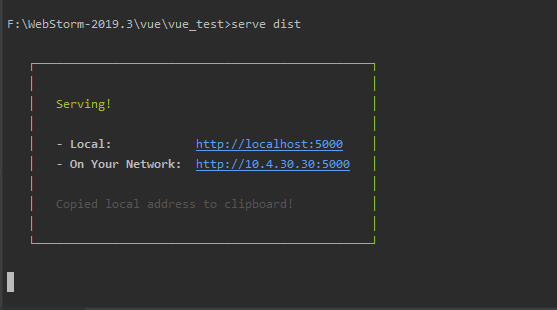
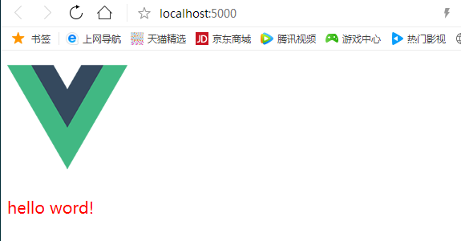
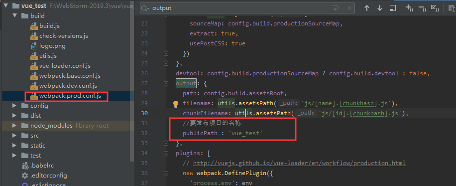
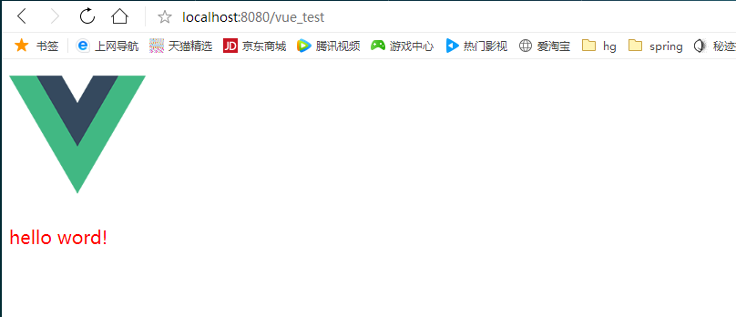

入口文件:




打包之后：会生成app.js文件




**组件开发HelloWord**




helloword.vue

```
<template>
    <div>
        <p class="msg">{{msg}}</p>
    </div>
</template>

<script>
    export default {
      data() {		//必须写函数
        return {
           msg : 'hello word!'
        }
      }
    }
</script>

<style>
  .msg{
    color: red;
    font-size: 20px;
  }
</style>
```


App.vue

```
<template>
  <div>
      
      <br>
      
    //3、使用组件标签
    <helloword/>
  </div>
</template>

<script>

  //1、引入组件
  import helloword from "./components/helloword.vue";

  export default {
    components :{
     
      // 2、映射组件标签
      helloword
    }
  }
</script>

<style>
  .logo{
    width: 150px;
    height: 150px;
  }
</style>

```


main.js

```

//入口js
import Vue from 'vue'

//引入App.vue
import App from './App.vue'


new Vue({
  el :'#app',
  components : {
  //映射标签
    App
  },
  template : '<App/>'

})
```

index.html

```
<!DOCTYPE html>
<html>
  <head>
    <meta charset="utf-8">
    <meta name="viewport" content="width=device-width,initial-scale=1.0">
    <title>vue_test</title>
  </head>
  <body>
    <div id="app"></div>
    <!-- built files will be auto injected -->
  </body>
</html>

```

效果：


**项目的打包与发布**

**打包**

```
npm run build
```

```
> vue_test@1.0.0 build F:\WebStorm-2019.3\vue\vue_test
> node build/build.js

Hash: b6d1bc92a10271640d1b
Version: webpack 3.12.0
Time: 45802ms
                                                  Asset       Size  Chunks             Chunk Names
                  static/js/app.f48bdac76edae77e0bf8.js      10 kB       0  [emitted]  app
               static/js/vendor.ec0485e92c06ccd9446e.js    94.8 kB       1  [emitted]  vendor
             static/js/manifest.2ae2e69a05c33dfc65f8.js  857 bytes       2  [emitted]  manifest
    static/css/app.9f84f440079248e5eeef14875786f61f.css  130 bytes       0  [emitted]  app
static/css/app.9f84f440079248e5eeef14875786f61f.css.map  309 bytes          [emitted]
              static/js/app.f48bdac76edae77e0bf8.js.map    16.7 kB       0  [emitted]  app
           static/js/vendor.ec0485e92c06ccd9446e.js.map     494 kB       1  [emitted]  vendor
         static/js/manifest.2ae2e69a05c33dfc65f8.js.map    4.97 kB       2  [emitted]  manifest
                                             index.html  510 bytes          [emitted]

  Build complete.

  Tip: built files are meant to be served over an HTTP server.
  Opening index.html over file:// won't work.

```




打包之后会生成一个dist文件


**发布** **1:** **使用静态服务器工具包**

```
静态服务器serve
npm install -g serve 

启动服务
serve dist 

访问: http://localhost:5000
```



效果：




**发布** **2:** **使用动态** **web** **服务器(tomcat)**

修改配置: webpack.prod.conf.js 

	output: { 
		publicPath: '/xxx/' //打包文件夹的名称 
	} 

重新打包: 
	npm run build 
修改 dist 文件夹为项目名称: xxx 
将 xxx 拷贝到运行的 tomcat 的 webapps 目录下 
访问: http://localhost:8080/xxx


修改配置



```
publicPath : '/vue_test/'
```

效果：




