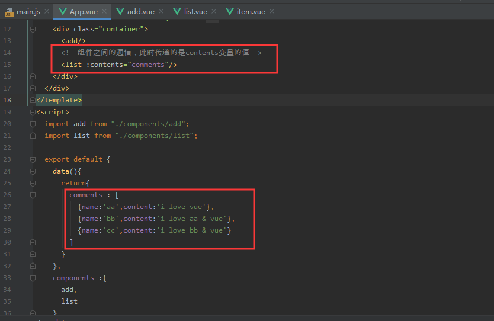

入口main.js

将真个页面进行拆分

成为四个组件

同时每个组件之间都可能进行组件组件之间的通信


App整个主题

add添加组件

list显示组件

item显示组件中具体的显示内容


此时add&list共同使用数据：comments

通过对comments的修改进行对页面的数据动态显示


此时add&list都需要使用到共同的数据

将数据存放在父组件中

声明接收属性两种方式实现


app通信到list组件

组件之间的通信，此时传递的是contents变量的值




list声明接收属性并且将数据传递得组件item

```
 import  item from './item'

    export default {
      //声明接收属性,:这个属性就会成为组件对象的属性 组件对象
      props : ['contents'],//只指定属性名
      data(){
        //此时的this是组件对象
        return{

        }
      },
      components:{
        item
      }
    }
```


传递给item组件

```
<item v-for="(comment,index) in contents" :key="index"  :comment="comment" />
```


item声明接收属性并且指定属性值得类型

```
<script>
    export default {
      //生命接收comment
      props:{//指定属性名和属性值的类型
        comment:Object
      }
    }
</script>
```


最终效果


