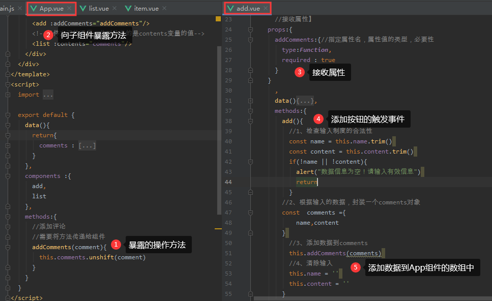
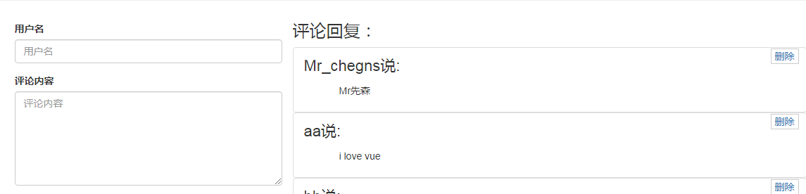

此时操作的数据是在App中

在App组件中需要向子组件进行暴露操作当前数组的方法

```
<add :addComments="addComments"/>
```

```
    methods:{
      //添加评论
      //需要将方法传递给组件
      addComments(comment){
        this.comments.unshift(comment)
      }
    }
```


在add模块中

```
<input type="text" class="form-control" placeholder="用户名" v-model="name">

<textarea class="form-control" rows="6" placeholder="评论内容" v-model="content"></textarea>

```

```
  export default {
      //接收属性】
    props:{
      addComments:{//指定属性名，属性值的类型，必要性
        type:Function,
        required : true
      }
    }
      ,
      data(){
        return{
          name:'',
          content:''
        }
      },
      methods:{
        add(){
          //1、检查输入制度的合法性
          const name = this.name.trim()
          const content = this.content.trim()

          if(!name || !content){
            alert("数据信息为空！请输入有效信息")

            return
          }

        //2、根据输入的数据，封装一个comments对象
        const  comments ={
            name,content
        }

          //3、添加数据到comments
          this.addComments(comments)

          //4、清除输入
          this.name = ''
          this.content = ''
        }
      }
    }

```





结果：




