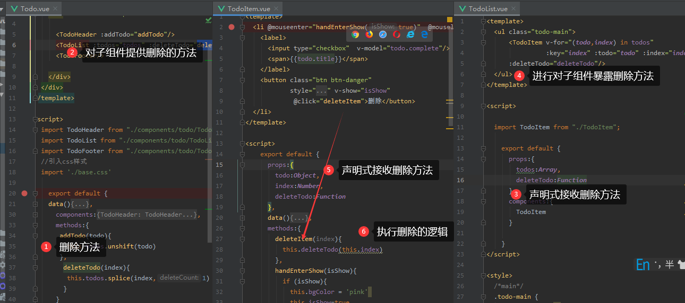

**引入样式的方法2**

Todo.vue

```
<script>
  import TodoHeader from "./components/todo/TodoHeader";
  import TodoList from "./components/todo/TodoList";
  import TodoFooter from "./components/todo/TodoFooter";
  //引入css样式
  import './base.css'

    export default {
    data(){
    ....
  
```


**初始化页面显示**


**初始化效果：**


**交互添加数据**


效果


**鼠标移入移出的显示设置**


效果:


**删除**




效果


