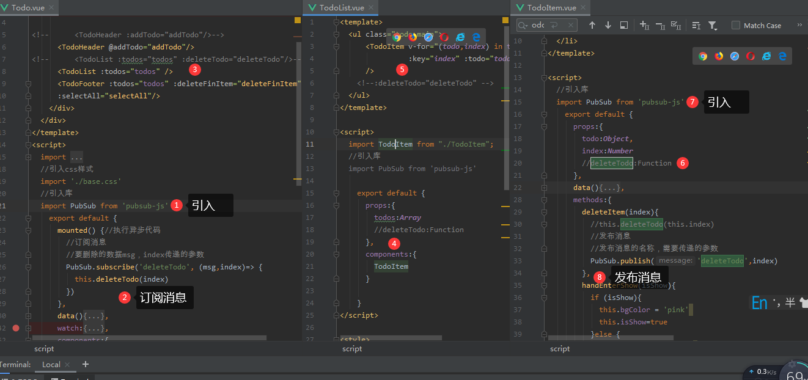

安装库

```
F:\WebStorm-2019.3\vue\vue_test>npm install --save pubsub-js
npm WARN ajv-keywords@2.1.1 requires a peer of ajv@^5.0.0 but none is installed. You must install peer dependencies yourself.
npm WARN optional SKIPPING OPTIONAL DEPENDENCY: fsevents@1.2.11 (node_modules\fsevents):
npm WARN notsup SKIPPING OPTIONAL DEPENDENCY: Unsupported platform for fsevents@1.2.11: wanted {"os":"darwin","arch":"any"} (current: {"os":"win32","arch":"x6
4"})

+ pubsub-js@1.7.0
added 1 package from 1 contributor and audited 13001 packages in 66.115s
found 23 vulnerabilities (2 low, 8 moderate, 12 high, 1 critical)
  run `npm audit fix` to fix them, or `npm audit` for details

```

向外暴露对象

一个方法用于发布

一个用于接收





