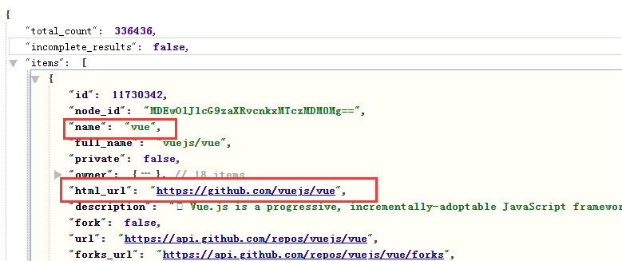
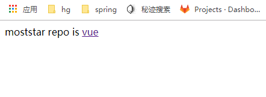

## **1  项目中常用的** **2** **个** **ajax** **库** 

### **1.1  vue**-resource

vue 插件, 非官方库, vue1.x 使用广泛


### **1.2  axios**

通用的 ajax 请求库, 官方推荐, vue2.x 使用广泛


## 2  vue-resource 的使用

### 2.1   在线文档

```
https://github.com/pagekit/vue-resource/blob/develop/docs/http.md
```


### 2.2  **下载**

npm install vue-resource --save


### 2.3    编码

```
// 引入模块 
import VueResource from 'vue-resource' 

// 使用插件 
Vue.use(VueResource) 
// 通过 vue/组件对象发送 ajax 请求 
this.$http.get('/someUrl').then((response) => { 
	// success callback 
	console.log(response.data) 
	//返回结果数据 
}, (response) => { 
	// error callback
	console.log(response.statusText) //错误信息 
})
```


### 2.4  测试

main.js

```
import Ajax from "./Ajax"

//引入VueResource
import VueResource from 'vue-resource'

//声明使用插件,会生成一个$http的方法
Vue.use(VueResource)

//Ajax的调用
new Vue({
  el :'#app',
  components : {
    App,Todo,Ajax
  },
  template : '<Ajax/>'

})

```

Ajax.vue

```
<template>
    <div>
        <div v-if="!repoUrl">loading...</div>
      <div v-else>moststar repo is <a :href="repoUrl">{{repoName}}</a></div>
    </div>
</template>
<script>

    export default {
      data(){
        return{
          repoUrl:'',
          repoName:''
        }
      },
      mounted() {
        //ajax请求获取数据
        const url = 'https://api.github.com/search/repositories?q=vue&sort=stars'
        this.$http.get(url).then(
          //请求成功的响应回调
          response=>{
            const  res = response.data;//取出数据
            //得到排序之后的第一条数据（点击率最高的）
            //接口得到的数据为json数据
            //进行取出第一条数据的两个字段
            const mostRepo = res.items[0];//取出json字段的第一个items属性
            this.repoUrl = mostRepo.html_url;//取出第一个items属性的html_url属性值
            this.repoName = mostRepo.name;//取出第一个items属性的name属性值
          },
          //请求失败的响应回调
          response=>{
                alert("请求error")
          }
        )
      }
    }
</script>
<style>

</style>

```


查看调接口的数据类型




项目启动成功之后：



点击可以成功跳转到相应的页面


## 3  axios 的使用


### 3.1  **在线文档**

```
https://github.com/pagekit/vue-resource/blob/develop/docs/http.md
```


### **3.2  下载**

```
npm install axios --save
```


### 3.3  **编码**

```
// 引入模块 
import axios from 'axios' 

// 发送 ajax 请求 
axios.get(url) .then(response => { 
	console.log(response.data) // 得到返回结果数据 
	})
	.catch(error => { 
	console.log(error.message) 
	})
```


### 3.4测试

Ajax.vue

```
<template>
    <div>
        <div v-if="!repoUrl">loading...</div>
      <div v-else>moststar repo is <a :href="repoUrl">{{repoName}}</a></div>
    </div>
</template>
<script>

  import axios from 'axios'

  export default {
      data(){
        return{
          repoUrl:'',
          repoName:''
        }
      },
      mounted() {
        //ajax请求获取数据
        const url = 'https://api.github.com/search/repositories?q=vue&sort=stars'

        axios.get(url).then(response=>{
            const  res = response.data;//取出数据
            //得到排序之后的第一条数据（点击率最高的）
            //接口得到的数据为json数据
            //进行取出第一条数据的两个字段
            const mostRepo = res.items[0];//取出json字段的第一个items属性
            this.repoUrl = mostRepo.html_url;//取出第一个items属性的html_url属性值
            this.repoName = mostRepo.name;//取出第一个items属性的name属性值
          }
        ).catch(error =>{
          alert("请求error")
        })

        // this.$http.get(url).then(
        //   //请求成功的响应回调
        //   response=>{
        //     const  res = response.data;//取出数据
        //     //得到排序之后的第一条数据（点击率最高的）
        //     //接口得到的数据为json数据
        //     //进行取出第一条数据的两个字段
        //     const mostRepo = res.items[0];//取出json字段的第一个items属性
        //     this.repoUrl = mostRepo.html_url;//取出第一个items属性的html_url属性值
        //     this.repoName = mostRepo.name;//取出第一个items属性的name属性值
        //   },
        //   //请求失败的响应回调
        //   response=>{
        //         alert("请求error")
        //   }
        // )
      }
    }
</script>
<style>

</style>

```

结果同上


## 如果传递的值是动态的

```
const url = 'https://api.github.com/search/repositories?q=vue&sort=${sortName}'
```


```
      mounted() {
        //ajax请求获取数据
        const  serName='vue';
        const url = 'https://api.github.com/search/repositories?q='+serName+'&sort=stars';
        console.log(url)

        axios.get(url).then(response=>{
            const  res = response.data;//取出数据
            //得到排序之后的第一条数据（点击率最高的）
            //接口得到的数据为json数据
            //进行取出第一条数据的两个字段
            const mostRepo = res.items[0];//取出json字段的第一个items属性
            this.repoUrl = mostRepo.html_url;//取出第一个items属性的html_url属性值
            this.repoName = mostRepo.name;//取出第一个items属性的name属性值
          }
        ).catch(error =>{
          alert("请求error")
        })

        // this.$http.get(url).then(
        //   //请求成功的响应回调
        //   response=>{
        //     const  res = response.data;//取出数据
        //     //得到排序之后的第一条数据（点击率最高的）
        //     //接口得到的数据为json数据
        //     //进行取出第一条数据的两个字段
        //     const mostRepo = res.items[0];//取出json字段的第一个items属性
        //     this.repoUrl = mostRepo.html_url;//取出第一个items属性的html_url属性值
        //     this.repoName = mostRepo.name;//取出第一个items属性的name属性值
        //   },
        //   //请求失败的响应回调
        //   response=>{
        //         alert("请求error")
        //   }
        // )
      }
```


es6

```
 mounted() {
        //ajax请求获取数据
        const  serName='vue';
        const url = `https://api.github.com/search/repositories?q=${serName}&sort=stars`
        console.log(url)

        axios.get(url).then(response=>{
            const  res = response.data;//取出数据
            //得到排序之后的第一条数据（点击率最高的）
            //接口得到的数据为json数据
            //进行取出第一条数据的两个字段
            const mostRepo = res.items[0];//取出json字段的第一个items属性
            this.repoUrl = mostRepo.html_url;//取出第一个items属性的html_url属性值
            this.repoName = mostRepo.name;//取出第一个items属性的name属性值
          }
        ).catch(error =>{
          alert("请求error")
        })

        // this.$http.get(url).then(
        //   //请求成功的响应回调
        //   response=>{
        //     const  res = response.data;//取出数据
        //     //得到排序之后的第一条数据（点击率最高的）
        //     //接口得到的数据为json数据
        //     //进行取出第一条数据的两个字段
        //     const mostRepo = res.items[0];//取出json字段的第一个items属性
        //     this.repoUrl = mostRepo.html_url;//取出第一个items属性的html_url属性值
        //     this.repoName = mostRepo.name;//取出第一个items属性的name属性值
        //   },
        //   //请求失败的响应回调
        //   response=>{
        //         alert("请求error")
        //   }
        // )
      }
    }
```


