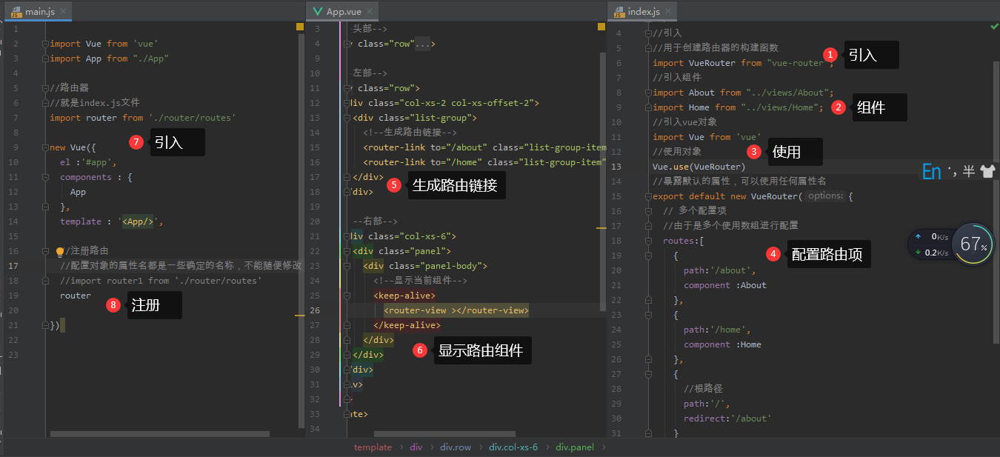
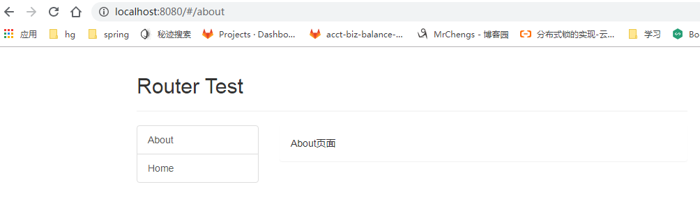
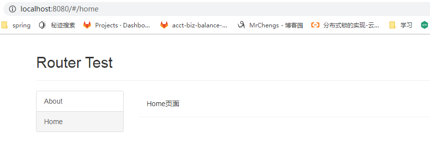

入口文件main.js

父组件：App.vue

子组件：About.vue，Home.vue

路由器模块：index.js


**1、路由器模块**

需要引入路由器的构建函数

引入需要的组件：About.vue，Home.vue

引入vue对象

```
//引入
//用于创建路由器的构建函数
import VueRouter from "vue-router";

//引入组件
import About from "../views/About";
import Home from "../views/Home";

//引入vue对象
import Vue from 'vue'
```


使用对象

```
//使用对象
Vue.use(VueRouter)
```


对象进行暴露

暴露默认的属性，可以使用任何属性名

配置多个路由此时使用数组

可以**重定向到根路径进行显示**

```
export default new VueRouter({
  // 多个配置项
  //由于是多个使用数组进行配置
  routes:[
    {
      path:'/about',
      component :About
    },
    {
      path:'/home',
      component :Home
    },
    {
      //根路径
      path:'/',
      redirect:'/about'
    }
  ]
})
```


**2、子组件：About.vue，Home.vue**

```
<template>
    <div>
Home页面
    </div>
</template>
<script>
    export default {}
</script>
<style>
</style>
```


```
<template>
    <div>
About页面
    </div>
</template>
<script>
    export default {}
</script>
<style>
</style>

```


**3、父组件：App.vue**

生成路由链接

```
  <router-link to="/about" class="list-group-item">About</router-link>
          <router-link to="/home" class="list-group-item">Home</router-link>
```

显示当前组件

````
 <router-view ></router-view>
````


**4、入口文件main.js**

引入路由器

```
//路由器
//就是index.js文件位置
import router from './router/routes'
```

注册路由

```
new Vue({
  el :'#app',
  components : {
    App
  },
  template : '<App/>',
  //注册路由
  //配置对象的属性名都是一些确定的名称，不能随便修改
  //import router1 from './router/routes'
  router

})
```


基本代码流程




效果：

默认页面：会进行重定向到about路由上:http://localhost:8080/#/about




进行点击Home:http://localhost:8080/#/home



