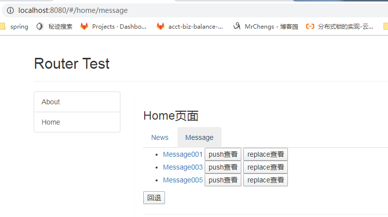

在基本路由的基础上进行修改


主要在home组件中生成两个子组件：News.vue & Message.vue

在home组件中进行显示两个组件


**News.vue组件**

```
<template>
    <div>
      <ul>
        <li v-for="(news, index) in newsArr" :key="index">{{news}}</li>
      </ul>
    </div>
</template>
<script>
  export default {
    data () {
      return {
        newsArr: ['News001', 'News002', 'News003']
      }
    }
  }
</script>
<style>
</style>
```


**Message.vue组件**

```
<template>
  <div>
    <ul>
      <li v-for="m in messages" :key="m.id">
        <router-link :to="`/home/message/detail/${m.id}`">{{m.title}}</router-link>
        <button @click="pushShow(m.id)">push查看</button>
        <button @click="replaceShow(m.id)">replace查看</button>
      </li>
    </ul>
    <button @click="$router.back()">回退</button>
    <hr>
    <router-view></router-view>
  </div>
</template>

<script>
  export default {
    data () {
      return {
        messages: [
          /* {id: 1, title: 'Message001'},
           {id: 3, title: 'Message003'},
           {id: 5, title: 'Message005'}*/
        ]
      }
    },
    mounted () {//模仿ajax实时掉接口进行数据的显示
      setTimeout(() => {
        const messages = [
          {id: 1, title: 'Message001'},
          {id: 3, title: 'Message003'},
          {id: 5, title: 'Message005'}
        ]
        this.messages = messages
      }, 1000)
    },
    methods: {
      pushShow (id) {
        this.$router.push(`/home/message/detail/${id}`)
      },

      replaceShow(id) {
        this.$router.replace(`/home/message/detail/${id}`)
      }
    }
  }
</script>
<style>
</style>
```


**Home.vue组件中**

进行生成路由组件以及显示当前组件

```
      <div>
        <ul class="nav nav-tabs">
          <li><router-link to="/home/news">News</router-link></li>
          <li><router-link to="/home/message">Message</router-link></li>
        </ul>

        <router-view></router-view>
      </div>

```


**进行配置路由**

```
  //配置嵌套路由
    {
      path:'/home',
      component:Home,
      children:[//嵌套路由会有很多使用数组
        {
          path:'/home/news',  // '/'永远代表根目录
          component:News
        },
        {
          path:'message',//简化写法
          component:Message
        },
        //默认显示页面
        {
          path:"",
          redirect:'/home/news'
        }
      ]
    }
```


效果：

list组件进行显示


message组件显示




