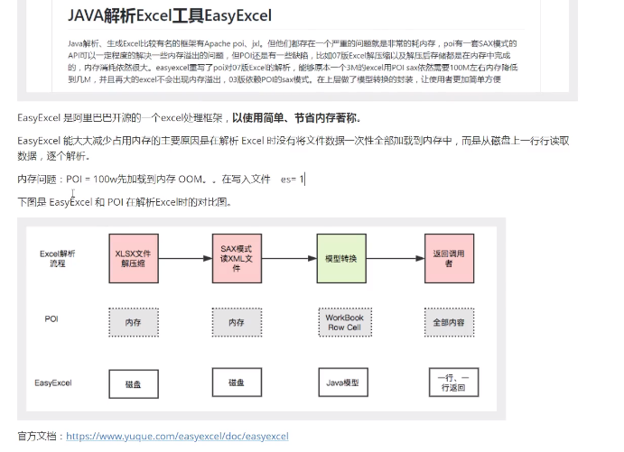
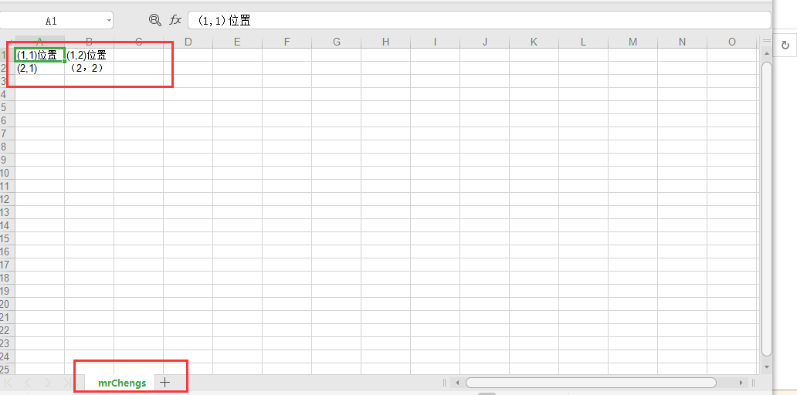

## POI

​	

大量的用户数据导出为excel

excel中的数据导入到数据库


|  Apache POI项目需要帮助的任务： |                 |                                                              |                       |
| :----------------------------------------------------------- | --------------- | ------------------------------------------------------------ | --------------------- |
| 标题                                                         | 语言能力        | 困难                                                         | 已建立                |
| 1个致力于以HSSF / XSSF文件格式转移/克隆/复制行/单元格 | 爪哇            |  专家 | 2019/10/3下午11:33:18 |
| 2 |                 |  初学者 | 2016/7/16上午1:47:11  |
| 3增强对Microsoft Excel文件格式支持的图表的支持 | XML，Java       |  专家 | 2016/5/29下午3:43:13  |
| 4记录新的Microsoft Visio 2007+支持代码 | 英文，xml       |  旅人 | 2016/5/29下午3:34:20  |
| 5添加对OOXML严格格式的支持 | XML，Java       |  高级 | 2016/2/27下午6:28:54  |
| 6改进新Microsoft Visio 2007+支持代码的测试覆盖率 | 爪哇            |  旅人 | 2016/2/27下午4:07:19  |
| 7为Visio Document支持添加/更新了文档 | 英语，xml，java |  旅人 | 2016/2/27下午4:03:54  |

|  Tasks the Apache POI Project would like help with: |                  |                                                              |                        |
| :----------------------------------------------------------- | ---------------- | ------------------------------------------------------------ | ---------------------- |
| Title                                                        | Languages        | Difficulty                                                   | Created                |
| 1Work on shifting/cloning/copying rows/cells in HSSF/XSSF file formats | java             |  Expert | 2019/10/3 下午11:33:18 |
| 2 |                  |  Beginner | 2016/7/16 上午1:47:11  |
| 3Enhance support for charts in the Microsoft Excel file format support | xml,java         |  Expert | 2016/5/29 下午3:43:13  |
| 4Document the new Microsoft Visio 2007+ support code | english,xml      |  Journeyman | 2016/5/29 下午3:34:20  |
| 5Add support for OOXML strict format | xml,java         |  Advanced | 2016/2/27 下午6:28:54  |
| 6Improve test-coverage of new Microsoft Visio 2007+ support code | java             |  Journeyman | 2016/2/27 下午4:07:19  |
| 7Addd/Update documentation for Visio Document support | english,xml,java |  Journeyman | 2016/2/27 下午4:03:54  |


## EasyExcel

https://github.com/alibaba/easyexcel





## poi

 //下面是07(xlsx)版本的，上面是03(xls)

HSSF：Excel97-2003版本，扩展名为.xls。一个sheet最大行数65536，最大列数256。

XSSF：Excel2007版本开始，扩展名为.xlsx。一个sheet最大行数1048576，最大列数16384。

SXSSF：是在XSSF基础上，POI3.8版本开始提供的支持低内存占用的操作方式，扩展名为.xlsx。


```xml
        <!-- 最多65535-->
        <dependency>
            <groupId>org.apache.poi</groupId>
            <artifactId>poi</artifactId>
            <version>3.17</version>
        </dependency>
       
		<!--大于65535-->
        <dependency>
            <groupId>org.apache.poi</groupId>
            <artifactId>poi-ooxml</artifactId>
            <version>3.17</version>
        </dependency>

```


### 写

### 03

```java
 @Test
    public void testWrite3() throws IOException {
        //创建工作簿
        Workbook workbook  = new HSSFWorkbook();
        //创建一个工作表
        Sheet sheet = workbook.createSheet("mrChengs");

        //创建一个一行
        Row row = sheet.createRow(0);
        //创建一个单元格 （第一行的第一个列）
        Cell cell = row.createCell(0);
        cell.setCellValue("(1,1)位置");
        //创建一个单元格 （第一行的第二个列）
        Cell cell1 = row.createCell(1);
        cell1.setCellValue("(1,2)位置");

        //第二行
        Row row1 = sheet.createRow(1);
        //第二行第一列
        Cell cell2 = row1.createCell(0);
        cell2.setCellValue("(2,1)");
        //第二行第二列
        Cell cell3 = row1.createCell(1);
        cell3.setCellValue("（2，2）");

        //03版本使用xls结尾
        FileOutputStream fileOutputStream =
                new FileOutputStream("C:\\Users\\ccrr\\Desktop\\test\\" + "poi.xls");

        workbook.write(fileOutputStream);

        fileOutputStream.close();

        System.out.println("poi 03已生成");


    }
```





### 07

```java
 @Test
    public void testWrite7() throws IOException {
        //创建工作簿
        Workbook workbook  = new XSSFWorkbook() ;
        //创建一个工作表
        Sheet sheet = workbook.createSheet("mrChengs");

        //创建一个一行
        Row row = sheet.createRow(0);
        //创建一个单元格 （第一行的第一个列）
        Cell cell = row.createCell(0);
        cell.setCellValue("(1,1)位置");
        //创建一个单元格 （第一行的第二个列）
        Cell cell1 = row.createCell(1);
        cell1.setCellValue("(1,2)位置");

        //第二行
        Row row1 = sheet.createRow(1);
        //第二行第一列
        Cell cell2 = row1.createCell(0);
        cell2.setCellValue("(2,1)");
        //第二行第二列
        Cell cell3 = row1.createCell(1);
        cell3.setCellValue("（2，2）");

        //03版本使用xls结尾
        FileOutputStream fileOutputStream =
                new FileOutputStream("C:\\Users\\ccrr\\Desktop\\test\\" + "poi07.xlsx");

        workbook.write(fileOutputStream);

        fileOutputStream.close();

        System.out.println("poi 03已生成");


    }
```


### 大数据量 

大文件HSSF
缺点:最多只能处理65536行,否则会抛出异常
iava. 1ang. I1egalArqumentException: Invalid row number (65536) outside allowable range (O. .65535)优点:过程中写入缓存,不操作磁盘,最后一次性写入磁盘 ,速度快

```java
    @Test
    public void testWrite3Big() throws IOException{

        long begin = System.currentTimeMillis();

        //创建工作簿
        Workbook workbook  = new HSSFWorkbook();
        //创建一个工作表
        Sheet sheet = workbook.createSheet("mrChengs");
        //写入数据
        for (int rowNum = 0 ;rowNum <65536;rowNum++){
            Row row = sheet.createRow(rowNum);
            for (int cellNum = 0;cellNum<10;cellNum++){
                Cell cell = row.createCell(cellNum);
                cell.setCellValue(cellNum);
            }
        }
        System.out.println("end...");

        FileOutputStream fileOutputStream =
                new FileOutputStream("C:\\Users\\ccrr\\Desktop\\test\\" + "bigpoi.xls");
        workbook.write(fileOutputStream);
        fileOutputStream.close();

        long end = System.currentTimeMillis();
        System.out.println("time " +( end - begin)) ;

    }
```

```
end...
time 5712
```


大文件写XSSF
缺点:写数据时速度非常慢.非常耗内存,也会发生内存溢出,如100万条
优点:可以写较大的数据量,如20万条

```java
@Test
    public void testWrite7big() throws IOException{

        long begin = System.currentTimeMillis();

        //创建工作簿
        Workbook workbook  = new XSSFWorkbook();
        //创建一个工作表
        Sheet sheet = workbook.createSheet("mrChengs");
        //写入数据
        for (int rowNum = 0 ;rowNum <65536;rowNum++){
            Row row = sheet.createRow(rowNum);
            for (int cellNum = 0;cellNum<10;cellNum++){
                Cell cell = row.createCell(cellNum);
                cell.setCellValue(cellNum);
            }
        }
        System.out.println("end...");

        FileOutputStream fileOutputStream =
                new FileOutputStream("C:\\Users\\ccrr\\Desktop\\test\\" + "bigpoi07.xlsx");
        workbook.write(fileOutputStream);
        fileOutputStream.close();

        long end = System.currentTimeMillis();
        System.out.println("time " +( end - begin)) ;

    }

```

```
end...
time 20020
```


大文件写SXSSF
优点:可以写非常大的数据量,如100万条甚至更多条,写数据速度快,占用更少的内存
**注意:**
过程中会产生临时文件,需要清理临时文件
默认由100条记录被保存在内存中,如果超过这数量,则最前面的数据被写入临时文件
如果想自定义内存中数据的数量,可以使用new SXSSFWorkbook (数量)

SXSSFWorkbook-来至官方的解释:实现"BigGridDemo"策珞的流式XSSFWorkbook版本。这允许写入非常大的文件而不会耗尽内
存，因为任何时候只有可配置的行部分被保存在内存中。

请注意,仍然可能会消耗大量内存,这些内存基于您正在使用的功能,例如合井区域,注...仍然只存储在内存中,因此如果广泛使用,可能需要大量内存.

```java
    @Test
    public void testWrite7SXSSF() throws IOException{

        long begin = System.currentTimeMillis();

        //创建工作簿
        Workbook workbook  = new SXSSFWorkbook();
        //创建一个工作表
        Sheet sheet = workbook.createSheet("mrChengs");
        //写入数据
        for (int rowNum = 0 ;rowNum <65536;rowNum++){
            Row row = sheet.createRow(rowNum);
            for (int cellNum = 0;cellNum<10;cellNum++){
                Cell cell = row.createCell(cellNum);
                cell.setCellValue(cellNum);
            }
        }
        System.out.println("end...");

        FileOutputStream fileOutputStream =
                new FileOutputStream("C:\\Users\\ccrr\\Desktop\\test\\" + "bigpoi07SXXF.xlsx");
        workbook.write(fileOutputStream);
        fileOutputStream.close();
        //清除零时文件
        ((SXSSFWorkbook)workbook).dispose();

        long end = System.currentTimeMillis();
        System.out.println("time " +( end - begin)) ;

    }
```


### 读

//获取值需要注意值的类型

### 03

```java
    @Test
    public void testRead3() throws IOException{


        //获取文件流
        FileInputStream fileInputStream = new FileInputStream("C:\\Users\\ccrr\\Desktop\\test\\03.xls");

        //创建工作簿
        Workbook workbook  = new HSSFWorkbook(fileInputStream);

        //得到一个工作表  即sheet位置
        Sheet sheet = workbook.getSheetAt(0);

        //得到行
        Row row = sheet.getRow(0);
        //得到列
        Cell cell = row.getCell(0);
        Cell cell1 = row.getCell(1);

        System.out.println(cell.getStringCellValue() + "--" + cell1.getStringCellValue());

        fileInputStream.close();


    }

```

### 07

```java
 @Test
    public void testRead7() throws IOException{
        //获取文件流
        FileInputStream fileInputStream = new FileInputStream("C:\\Users\\ccrr\\Desktop\\test\\07.xlsx");

        //创建工作簿
        Workbook workbook  = new XSSFWorkbook(fileInputStream);

        //得到一个工作表  即sheet位置
        Sheet sheet = workbook.getSheetAt(0);

        //得到行
        Row row = sheet.getRow(0);
        //得到列
        Cell cell = row.getCell(0);
        Cell cell1 = row.getCell(1);

        System.out.println(cell.getStringCellValue() + "--" + cell1.getStringCellValue());

        fileInputStream.close();


    }
```


### 不同列的类型

```java
   //读
    @Test
    public void testRead7() throws IOException{
        //获取文件流
        FileInputStream fileInputStream = new FileInputStream("C:\\Users\\ccrr\\Desktop\\test\\07.xlsx");
        //创建工作簿
        Workbook workbook  = new XSSFWorkbook(fileInputStream);
        //得到一个工作表  即sheet位置
        Sheet sheet = workbook.getSheetAt(0);
        //获取标题内容
        Row tittleRow = sheet.getRow(0);
        if (tittleRow != null){
            //获取列数
            int count = tittleRow.getPhysicalNumberOfCells();
            //获取所有的列
            for (int i =0;i<count;i++){
                Cell cell = tittleRow.getCell(i);
                //获取类型
                //int cellType = cell.getCellType();
                String stringCellValue = cell.getStringCellValue();
                System.out.print(stringCellValue + "|");
            }
            System.out.println();
        }
        //获取表中内容
        //获取所有的行
        int rowCount = sheet.getPhysicalNumberOfRows();
        for (int i = 1;i<rowCount;i++){
            Row row = sheet.getRow(i);
            if (row != null){
                int cellCounts = tittleRow.getPhysicalNumberOfCells();
                for (int cellNum = 0;cellNum <cellCounts;cellNum ++){
                    Cell cell = row.getCell(cellNum);
                    //匹配数据类型
                    if (cell != null){
                        int type =cell.getCellType();
                        String cellValue= "";
                        switch (type){
                            case XSSFCell.CELL_TYPE_STRING:
                                cellValue = cell.getStringCellValue();
                                System.out.print(cellValue);
                                break;
                            case XSSFCell.CELL_TYPE_NUMERIC:
                                cellValue = String.valueOf(cell.getNumericCellValue());
                                System.out.print(cellValue);
                                break;
                            default:
                                cellValue = cell.getStringCellValue();
                                System.out.print(cellValue);
                             break;
                        }
                    }
                }
            }
            System.out.println();
        }


        fileInputStream.close();
    }

```


```
姓名|性别|收集|价格|
mrchengs 男 1.23456789E9 1.2
mc 男 3.213123123E9 2.2
```


### 带有计算属性

```java
 @Test
    public void testRead7() throws IOException{
        //获取文件流
        FileInputStream fileInputStream = new FileInputStream("C:\\Users\\ccrr\\Desktop\\test\\sum.xls");
        //创建工作簿
        Workbook workbook  = new HSSFWorkbook(fileInputStream);
        //得到一个工作表  即sheet位置
        Sheet sheet = workbook.getSheetAt(0);

        //具有计算规则的定位
        Row row = sheet.getRow(4);
        Cell cell = row.getCell(0);

        //拿到计算公式
        HSSFFormulaEvaluator hssfFormulaEvaluator = new HSSFFormulaEvaluator((HSSFWorkbook)workbook);

        //输出单元格内容
        int cellType = cell.getCellType();

        switch (cellType){
            case Cell.CELL_TYPE_FORMULA://公式
                String cellFormula = cell.getCellFormula();
                System.out.println(cellFormula);//SUM(A2:A4)
                //计算
                CellValue evaluate = hssfFormulaEvaluator.evaluate(cell);
                String s = evaluate.formatAsString();//400.0
                System.out.println(s);
                break;
            default:
                break;


        }

        fileInputStream.close();
    }
```

```

SUM(A2:A4)
400.0
```


## easyExcel


```
     <dependency>
            <groupId>com.alibaba</groupId>
            <artifactId>easyexcel</artifactId>
            <version>2.2.0-beta2</version>
        </dependency>

```


https://www.yuque.com/easyexcel/doc/write


