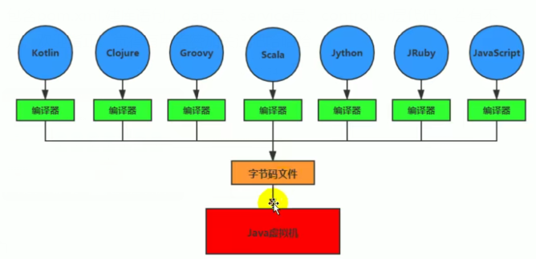

# Java生态圈

java是目前最为应用广泛的软件开发平台之一

随着Java以及java社区的不断壮大

java早已经不再是单一的一门计算机语言

更是一个平台、一个社区

- 作为一个平台，java虚拟机扮演着举足轻重的作用

  Groovy、Scala、JRuby、Kotlin都是java平台的一部分

- 作为一种文化，java几乎成了开源的名词

- 作为一个社区

  java拥有全世界最多的技术拥护者和开源社区支持

# 特点

跨平台的语言：write once，run anywhere

jvm：跨语言的平台

# 字节码

- java字节码指的是用java语言编译成的字节码

  准确的说任何能在jvm平台上执行的字节码格式都是一样的，统称为：jvm字节码

- 不同的编译器，可以编译出相同的字节码文件，字节码文件可以在不同的jvm上运行

- java虚拟机与java语言没有必然的联系，他只是与特定的二进制文件格式---class文件格式关联

  class文件包含了java虚拟机指令集和符号表，以及一些辅助消息

