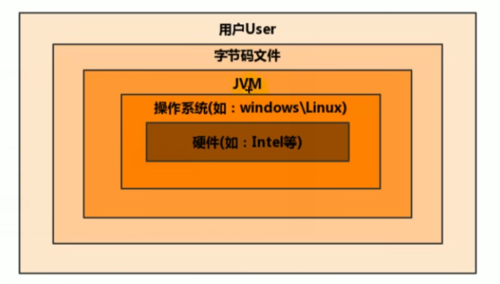
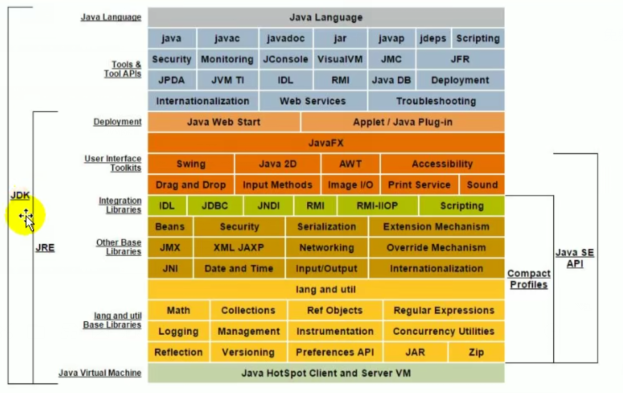
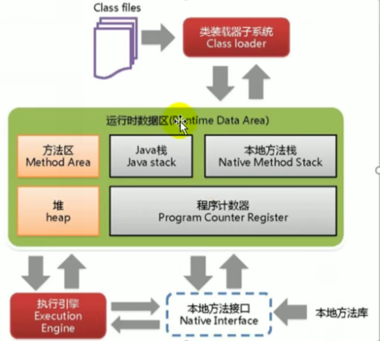
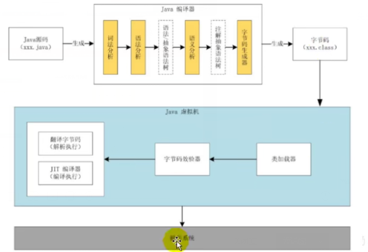

# 虚拟机

虚拟机（Virt machine）：一台虚拟的计算机

是一款软件，用来执行一系列的虚拟计算机指令

大体上可以分为：系统虚拟机&程序虚拟机

- Visua Box、Vmware就属于系统虚拟机，**完全是对物理计算机的仿真**，提供了

  一个可以运行完整操作系统的软件平台

- 程序虚拟机的典型代表是java虚拟机，**专门为执行单个计算机程序而设计**,

  在java虚拟机中执行的指令成为java字节码

# 作用

java虚拟机就是二进制字节码的运行环境

负责装载字节码到其内部

解释/编译为对应平台上的机器指令执行

每一条java指令mjava虚拟机规范中都有详细定义，如怎么取操作数，处理的结果集放在那

特点：

- 一次编译，到处运行
- 自动内存管理
- 自动垃圾回收功能

# JVM位置

JVM是运行在操作系统之上的，与硬件没有直接的交互

# JVM的整体结构

- HotSpot VM是目前市面高性能虚拟机之一

- 它采用解释器与即时编译器并存架构

  

# java代码执行流程

# JVM的架构模型

Java编译器输入的指令是一种基于**<u>栈的指令集架构</u>**，另一种指令集架构是基于**<u>寄存器的指令集架构</u>**

两种架构的区别：

- 基于栈式架构的特点

  - 设计和实现更简单，适用于资源受限制的系统
  - 避开了寄存器的分配难题：使用零地址指令方式分配
  - 指令流中的大部分是零地址指令，其执行过程依赖于操作栈，指令集更小，编译器易于实现
  - 不需要硬件支持，可移植性好，更好的实现跨平台

- 基于寄存器结构的特点

  - 典型的应用是x86的二进制指令集

  - 指令集结构完全依赖硬件，可移植性差

  - 性能优秀和执行更高效

  - 花费更少的指令完成一项操作

  - 大部分情况下，基于寄存器架构的指令集往往都是一地址指令

    二地址指令和三地址指令为主，而基于栈式架构是以零地址指令为主

# JVM的生命周期

- 虚拟机的启动

  Java虚拟机的启动是通过引导类加载器(bootstrap class loader)创建一个初始类(init class)来完成的

  这个类是由虚拟机的具体实现指定的

- 虚拟机的执行

  - 一个运行中java虚拟机有着一个清晰任务：执行java程序
  - 程序开始执行时他才执行，程序结束时他就停止
  - **执行一个所谓的java程序时，真正执行的是一个叫做java虚拟机的进程**

- 虚拟机推出

  - 程序正常运行结束
  - 程序在执行过程中遇到了异常或者错误异常终止
  - 由于操作系统出现错误导致java虚拟机进程结束
  - 某线程调用Runtime类或者System类的exit方法
  - JNI（Java Native Interface）规范描述了JNI Invocation API来加载或者卸载java虚拟机时，Java虚拟机推出的情况

