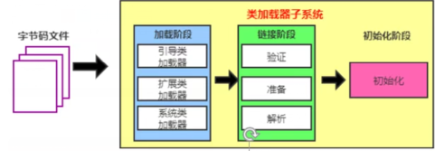

### 类加载器子系统的作用

- 类加载器子系统负责从文件系统或者网络种加载class文件，class文件在文件开头有特定的文件标识

- ClassLoader只负责加载class文件的加载，至于是否可运行，由Execution Engine决定

- 加载器的类信息存放于一块称为方法区的内存空间。除了有用信息外，方法区种还会存放运行时常量池信息

  可能还包括字符串字面量和数字常量（这部分常量 信息是Class文件种常量池部分的内存映射）

### 类加载器ClassLoader角色

- 1、class file 存在于本地磁盘上，理解为设计师在纸上画的模板，最终这个模板在执行时候加载到jvm当中来

  根据这个模板去实例化出n个一模一样的实力

- 2、class file加载到JVM中，被称为DNA元数据模板，放在方法去

- 2、class file加载到jvm种，被称为DNA元数据模板，放在方法区

- 3、在.class文件 --->JVM --->最终称为元数据模板，此过程需要一个运输器（类加载器）

###  类加载过程

画图实现类加载过程

