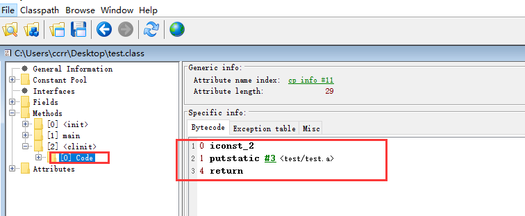
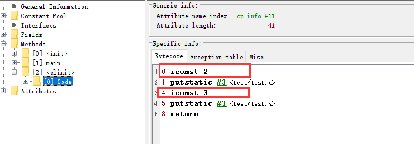
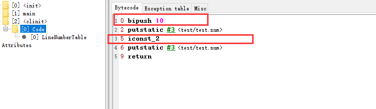
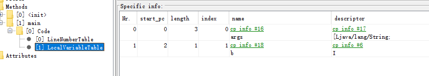

### 初始化

- <u>初始化阶段即使执行类构造器方法<clinit>()过程</u>
- 此方法不需要定义，时javac编译器自动收集类中的所有变量的赋值动作和静态代码块中锋的语句合并而来
- 构造器方法种中指令按语句在源文件中出现顺序执行
- <u><clinit>()不同于类的构造器</u>，
- 若该类具有父类，JVM会保证子类的<clinit>（）执行前，父类的<clinit>()已执行完毕
- 虚拟机必须保证一个类的<clinit>()方法在多线程下同步枷锁


- 测试1

class文件的分析

```java
public class test {
    private static  int a = 2;
    public static void main(String[] args) {
        System.out.println(test.a);
    }
}
```


此时赋值为2




- 测试2

添加静态代码块

```java
    private static  int a = 2;

    static {
        a=3;
    }
    public static void main(String[] args) {
        System.out.println(test.a);
    }
```

开始赋值为2，后赋值为3




- 测试3

//在linking的prepare阶段 num = 2

//在initialization阶段由10 赋值成为2

//如果static静态代码块和private static  int num = 2;互换位置则num=10

```java
    static {
        num = 10;
    }
    private static  int num = 2;
    public static void main(String[] args) {
        System.out.println(test.num);
    }
```

由字节码文件可以看出：先赋值为10，后被2值给覆盖




- 测试4

static静态代码块中可以给变量赋值但是不能引用

否则会报错：Illegal forward reference


- 测试5

如果类中没有静待变量和静态代码块

该字节码中不存在clinit类的构造器

```java
   private   int a = 2;
    public static void main(String[] args) {
        int b =2;
    }
```




- 注意

任何一个类声明之后，内部至少存在一个类的构造器（显式定义/类的默认声明<init>（如上图））


- 测试5

- 继承关系
- 父类的<clinit>构造器会在子类执行之前执行完成

```java
    static  class  father{
        public static  int A = 3;
        static {
            A = 4;
        }
    }
    static  class Son extends  father{
        public static  int B =A;
    }
    public static void main(String[] args) {
        System.out.println(Son.B);//4
    }
```

首先加载father，其次在执行Son


