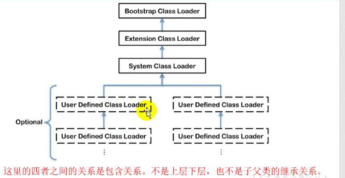

### 类加载器的分类

- JVM支持两种类型的类加载器

  - 引导类加载器（Bootstrap ClassLoader）
  - 自定义类加载器（User-Defined ClassLoader）

- 从概念上讲，自定义类加载器一般是由开发人员地定义的一类类加载器

  java虚拟机规范中没有这么定义，而是将所有派生于抽象类ClassLoader的类加载器都划分在自定义类加载器

- 常见的类加载器始终有三个：

  


可以查看：ExtClassLoader内部类


```java
public class test {
    public static void main(String[] args) {
        //获取系统类加载器
        ClassLoader systemClassLoader = ClassLoader.getSystemClassLoader();
        System.out.println(systemClassLoader);//sun.misc.Launcher$AppClassLoader@18b4aac2
        //获取系统累加器上层：扩展类加载器
        ClassLoader extParent = systemClassLoader.getParent();
        System.out.println(extParent);//sun.misc.Launcher$ExtClassLoader@4554617c

        //获取扩展类加载器的上层：获取不到引导类加载器
        ClassLoader parent = extParent.getParent();
        System.out.println(parent);//null

        //对于用户自定义来说:默认使用系统类加载器进行加载
        ClassLoader classLoader = test.class.getClassLoader();
        System.out.println(classLoader);//sun.misc.Launcher$AppClassLoader@18b4aac2

        //string类使用引导类 加载器进行加载
        //系统的核心类库都是使用引导类加载器进行加载
        ClassLoader stringClassLoder = String.class.getClassLoader();
        System.out.println(stringClassLoder);//null
    }
}
```


### 虚拟机自带的类加载器

- 启动类加载器（引导类加载器 Bootstrap ClassLoader）

  - 由C/C++语言实现，嵌套在JVM内部

  - 用来加载hava的核心库（JAVA_HOME/jre/lib/rt.jar、resource.jar或sun.boot.class.path路径下的内容）

    用于提供JVM自身所需要的类

  - 不继承java.lang.ClassLoader，没有父类加载器

  - 加载器扩展类和应用程序类加载器，并指定为他们的父类加载器

  - 出于安全考虑，Bootstrap启动类加载器之家在包名为java\javax\sun等来头的类

- 扩展类加载器

  - java语言编写，由sun.misc.Launcher$ExtClassLoader实现

  - 派生于ClassLoader类

  - 父类加载器为启动类加载器

  - 从java.ext.dirs系统属性所指定的目录加载类库

    或者从JDK的安装目录jre/lib/ext子目录下加载类库

    用户创建的JAR放在此目录，也会自动由扩展类加载器进行加载

- 应用程序类加载器（系统类加载器，AppClassLoader）

  - java语言编写，由sun.misc,Launcher￥AppClassLoader实现
  - 派生于ClassLoader
  - 父类加载器为扩展类加载器
  - 负责加载环境变量classpath或系统属性，java.class.path指定路径下的类库
  - 该类加载是程序中默认的类加载器，一般来说，Java应用都类都是由该加载器完成
  - 通过ClassLoader#getSysremClassLoader()方法可以获取该类加载器


```java
  //获取BootstrapClassLoader能加载的api路径
        URL [] urls = sun.misc.Launcher.getBootstrapClassPath().getURLs();
        for (URL url : urls){
            System.out.println(url);
        }
```

```
file:/C:/Program%20Files/Java/jdk1.8.0_101/jre/lib/resources.jar
file:/C:/Program%20Files/Java/jdk1.8.0_101/jre/lib/rt.jar
file:/C:/Program%20Files/Java/jdk1.8.0_101/jre/lib/sunrsasign.jar
file:/C:/Program%20Files/Java/jdk1.8.0_101/jre/lib/jsse.jar
file:/C:/Program%20Files/Java/jdk1.8.0_101/jre/lib/jce.jar
file:/C:/Program%20Files/Java/jdk1.8.0_101/jre/lib/charsets.jar
file:/C:/Program%20Files/Java/jdk1.8.0_101/jre/lib/jfr.jar
file:/C:/Program%20Files/Java/jdk1.8.0_101/jre/classes
```


```java
//扩展类加载
String extDir = System.getProperty("java.ext.dirs");
        for (String path : extDir.split(";")){
            System.out.println(path);
        }
```

```
C:\Program Files\Java\jdk1.8.0_101\jre\lib\ext
C:\WINDOWS\Sun\Java\lib\ext
```


### 关于ClassLoader

ClassLoader类，是一个抽象类，其后所有的类加载器都继承至ClassLoader（不包括启动类加载器）


| 方法                                               | desc                            |
| -------------------------------------------------- | ------------------------------- |
| getParent()                                        | 返回该类的超类加载器            |
| loadClass(String name)                             | 加载名称为name的类              |
| findClass(String name)                             | 查找名为name的类加载器          |
| findLoadedClass(String name)                       | 札沼名为name的已经被加载过的类  |
| defineClass(String name,byte [] b,int off,int len) | 把字节数据b的内容转为一个java类 |
| resolve(Class<?> c)                                | 连接指定一个Java类              |


### ClassLoader的获取方法

| num1:获取当前类的ClassLoader                   |
| ---------------------------------------------- |
| clazz.getClassLoader                           |
| num2:获取当前线程的上下文ClassLoader           |
| Thread.currentThread().getContextClassLoader() |
| num3:获取当前系统的ClassLoader                 |
| ClassLoader.getSystemClassLoader()             |
| num4:当前调用者的classLoader                   |
| DriverManager.getCallerClassLoader()           |


