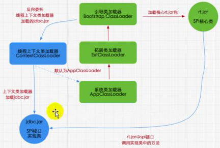

### 双亲委派机制

java虚拟机对class文件采用的是**<u>按需加载</u>**的方式，也就是说当前需要使用该类才会将他的class文件加载到内存生成class对象

加载某个类的class文件时，java虚拟机采用的是<u>**双亲委派机制模式**</u>，即把请求交由父类处理，是一种任务委派模式


创建一个String类与系统的一致

```java
package java.lang;

public class String {
    static {
        System.out.println("333");
    }
}
```

进行测试

```java
public class Test {
    public static void main(String[] args) {
        String s = new java.lang.String();
        System.out.println("sss");
    }
}
```

```
com.me.test.Test
sss
```

此时加载的时系统核心库的String对象


### 双亲委派机制原理

- 如果一个类加载器收到了请求，他不会自己先去加载，而是把这个请求委托给父类加载器去执行

- 如果父类加载器还存在其他的父类加载器，则进行一部向上委托，一次递归，请求最终将到达顶层的启动类加载器

- 如果父类加载器可以完成类加载任务，就成功返回，如果父类加载器无法完成加载任务，子加载器才会尝试自己去加载，即双亲委派机制

  


测试：

```java
public class String {
    static {
        System.out.println("333");
    }
    public static void main(String[] args) {
        System.out.println("sss");
    }
}
```

```java
错误: 在类 java.lang.String 中找不到 main 方法, 请将 main 方法定义为:
   public static void main(String[] args)
否则 JavaFX 应用程序类必须扩展javafx.application.Application
```

此时既是双亲委派机制，在上层的核心库String没有main方法


### 双亲委派机制的优势




优势

- 避免类的重复加载
- 保护程序安全，防止核心API别修改
  - 自定义类：java.lang.String


