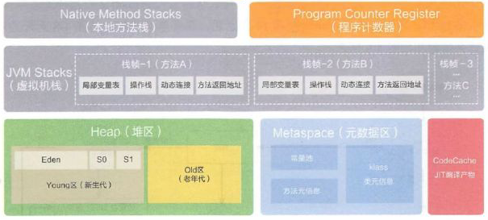

### 运行时数据区

划分：

### 内存

内存是非常重要的系统资源，是硬盘和cpu的中间仓库和桥梁

承载着操作系统和应用 程序的实时运行

JVM内存布局规定了java在运行过程中内存的<u>**申请、分配、管理**</u>的策略

保证了JVM的告诉稳定运行

**<u>不同的JVM对于内存的划分方式和管理机制存在部分差异</u>**

### 详细运行数据区

### 线程

Java虚拟机定义了若干种程序运行期间会使用到的运行数据区，其中有一些会随着虚拟机启动而创建，随着虚拟机推出而销毁。另一些是与线程一一对应，这些与线程对应的数据区会随着线程的开始和结束而创建和销毁

- 每个线程：独立的程序计数器、栈、本地栈
- 线程间共享：堆，堆外内存（永久带/元空间/代码缓存）

