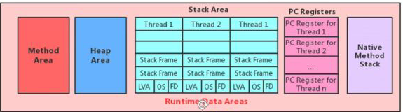
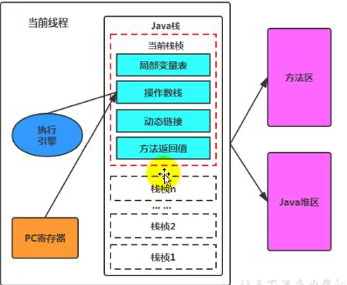
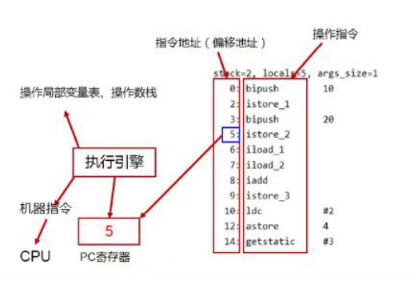

### 程序寄存器

JVM中的程序寄存器存储指令相关的现场信息

CPU只有把数据装载到寄存器才能运行

JVM中的PC寄存器是对物理PC寄存器的一种模拟




### 作用

用来存储指向下一条指令的地址，即将要执行的指令代码

由执行引擎读取下一条指令




### 介绍

- 是一块很小的内存空间，几乎可以小到忽略不计，也是运行速度最快的存储区域
- 在JVM规范中，每个线程都有他自己的程序计数器，是线程私有的，生命周期与线程的生命周期保持一致
- 任何时间一个线程都只有一盒方法在执行，也就是<u>**当前方法**</u>，程序计数器会存储当前线程正在执行的java方法的JVM指令地址，或者，如果是Native方法，则是未指定值undefined
- 是程序控制流的指示器、分支、循环、跳转、异常处理、线程恢复等基础功能都需要程序计数器完成
- 字节码解释器工作就是通过这个计数器的值来选取下一条需要执行的字节码指令
- 是唯一一个在java虚拟机规范中没有规定任何OutOtmemoryError情况的区域


### 代码

```java 
    public static void main(String[] args) {
       int i = 10;
       int j =20;
       int k = i+j;
    }
```


```xaml
D:\SecondProject\IDEAFile\jvmtest\target\classes\com\me\test>javap -v Test.class


  public static void main(java.lang.String[]);
    descriptor: ([Ljava/lang/String;)V
    flags: ACC_PUBLIC, ACC_STATIC
    Code:
      stack=2, locals=4, args_size=1
//左边的数值：程序计数器
//右边：相应字节码指令
         0: bipush        10//取数10
         2: istore_1//保存在索引为1的位置
         3: bipush        20//取数20
         5: istore_2//保存在索引为2的位置
         6: iload_1//取数
         7: iload_2//取数2
         8: iadd//进行加操作
         9: istore_3//相加之后保存在索引为3的位置
        10: return
      LineNumberTable:
        line 5: 0
        line 6: 3
        line 7: 6
        line 8: 10
      LocalVariableTable:
        Start  Length  Slot  Name   Signature
            0      11     0  args   [Ljava/lang/String;
            3       8     1     i   I
            6       5     2     j   I
           10       1     3     k   I
}
SourceFile: "Test.java"

```




