### 虚拟机栈的北京

由于跨平台性的设计，java的指令都是根据栈来设计的

不同平台的cpu架构不同，所以不能设计为基于寄存器的


优点是跨平台，指令集小，编译器容易实现

缺点是性能下降，实现同样的功能需要更多的指令


### 内存中的栈和对

**<u>栈是运行时的单位，堆是存储的单位</u>**

即：栈解决程序运行问题，程序该如何执行，或者说如何处理数据

堆解决是数据存储问题，即数据怎么放，放在那


### java虚拟机栈是什么

java虚拟机栈也叫java栈

每个线程在创建是都会创建一个虚拟机栈，其内部<u>保存一个个的栈帧，对应着一次次的java方法调用</u>

是线程私有的


生命周期和线程一致


主要管java程序的运行，他保存方法的**局部变量**、**部分结果**，并且**参与方法的调用和返回**

局部变量：8中集中类型、对象的引用

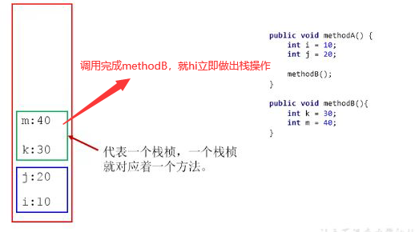


### 栈的优点

- 栈是一种快速有效的分配存储方式，访问速度仅次于程序计数器
- jvm直接对java栈的操作由两个：
  - 每个方法的执行，伴随着<u>进栈</u>
  - 执行完成之后<u>出栈</u>
- 对于栈来说不存在垃圾回收的问题


### 常见的栈异常

java虚拟机允许**<u>栈的大小是动态的或者是固定不变的</u>**

- 采用固定大小的java虚拟机栈，那每一个线程的java虚拟机栈容量可以在线程创建的时候独立选定。

  如果线程请求分配的栈容量超过java虚拟机栈允许的最大容量，将会抛出：**<u>StackOverflowError</u>**异常

- java虚拟机栈可以动态扩展，并且尝试扩展的时候无法申请到足够的内存，或者再创将新的线程没有足够的内存创建对应的虚拟机栈，此时会抛出：**<u>OutOfMemoryError</u>**


### 设置栈的内存大小

使用参数 -Xss 选项来设置线程的最大栈空间

栈的大小直接决定了函数调用的最大深度

-Xss256k(M/MB)


### 栈的存储单位

- 每个线程都有自己的栈，栈中的数据都是以**<u>栈帧（Stack Frame）的格式存在</u>**

- 在这个线程上正在执行的每个方法都各自对应一个栈帧
- 栈帧是一个内存区块，是一个数据集，维系着方法执行过程中的各种数据信息


### 栈运行的原理

- jvm对java栈的操作只有两个，就是对栈帧的压栈和出栈，遵循先进后出原则

- 在一条活动中，一个时间点上，只会有一个活动的栈帧，即只有当前正在执行的方法的栈帧（栈顶）是有效的

  没这个栈帧被称为**<u>当前栈帧</u>**，与当前栈帧对应的方法就是**<u>当前的方法</u>**，定义这个方法的类就是**<u>当前类</u>**

- 执行引擎运行的所有字节码指令只针对当前栈帧进行操作

- 如果在该方法中调用了其方法，对应的新的栈帧就hi被创建出来，再放栈的顶端，成为新的当前栈帧

- 不同的线程所包含的栈帧是不允许相互引用的，即不可能在当前栈帧当中引用另外一个栈帧

- 如果当前方法调用了其他犯法，方法返回之际，当前栈帧会传回此方法的执行结果给前一个栈帧，接着虚拟机丢弃当前栈帧，是得前一个方法成为当前栈帧

- java方法有两种返回函数的方式

  - 正常的函数返回使用return指令
  - 抛异常

  

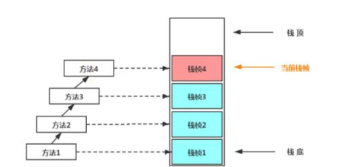


### 栈帧的内部结构

- 局部变量表（LocalVariables）
- 操作数栈（Operand Stack）
- 动态链接（Dynamic Linking）（或指向运行时常量池的方法引用）
- 方法返回地址（Return Address）（或方法正常退出或者异常推出的定义）
- 一些附加细腻些


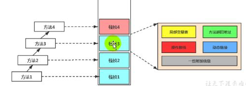


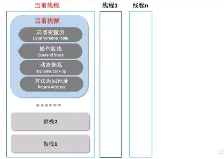


### 局部变量表

- 局部变量吧也成为局部变量数据或者贬低变量表

- <u>**定义为一个数字数组，主要用于存储方法参数和定义在方法体内的局部变量**</u>

  这些数据类型包括各类基本数据类型、对象引用，以及returnAddress类型

- 由于局部变量表是建立在线程的栈上，是线程私有数据，所以不存在**<u>数据安全问题</u>**

- <u>**局部变量表所需要的容量在编译期确定下来**</u>，并且保存在方法Code属性的maximum local

  variables数据项中，在方法运行期间是不会概念变量表的大小的
  
- <u>**方法嵌套调用的次数由栈的大小决定，一般来说，栈越大，方法嵌套调用次数越多**</u>

  对于函数而言，参数和局部变量越多，使用局部变量越膨胀，栈帧就越大，进而函数调用会占用更多的空间

- 局部变量表中的变量只在当前方法调用有效


#### 关于Slot

- 参数值的存放总是在局部变量数据的index0开始，到数组长度-1的索引结束
- 局部变量表，最基本的存储单元是Slot（变量槽）
- 局部变量表中存放编译器可知的各种基本类型，引用类型，returnAddredd类型的变量
- 32位以内的类型只占用一个slot，64位占用两个slot


​	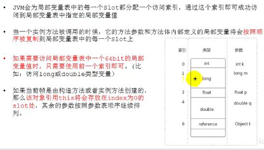


slot是可以重用的

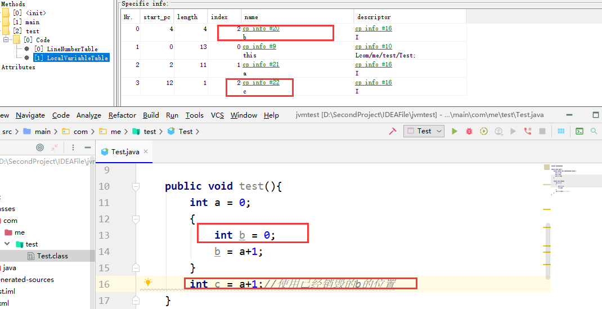


#### 静态变量和局部变量的对比

- 参数表分配完毕之后，在根据方法体内定义的变量顺序和作用域分配
- 类变量有两次初始化机会：
  - “准备阶段”执行系统初始化，对类变量设置零值
  - “初始化：阶段，赋予程序员在代码中定义的值
- 类变量初始化不同的是，局部变量表不存在系统初始化的过程，意味着一旦定义了局部变量必须认为的初始化，否则无法使用


此时会报错：变量为进行初始化，编译不通过

```java
public void test(){
	int a;
	System.out.print(a)
}
```


补充：

- 在栈帧中，与性能调优最为密切的就是局部变量表
- 局部变量表中的变量也是重要的垃圾回收根节点，只要局部变量表中直接或间接引用的对象不会回收


### 操作数栈

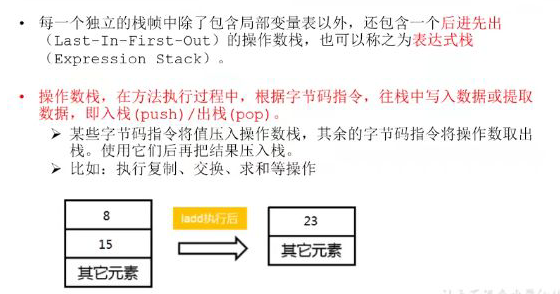

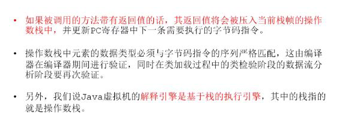

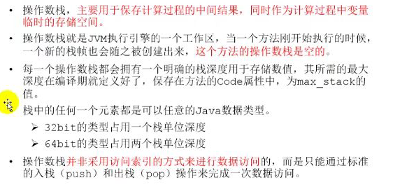

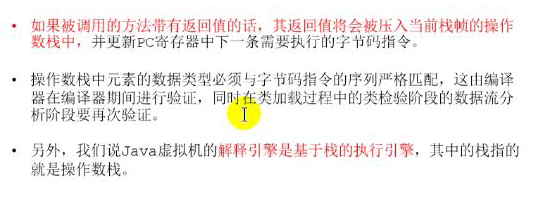

```java
    public static void main(String[] args) {
       int i = 15;
       int j =8;
       int k = i+j;
    }
```

```
 public static void main(java.lang.String[]);
    descriptor: ([Ljava/lang/String;)V
    flags: ACC_PUBLIC, ACC_STATIC
    Code:
      stack=2, locals=4, args_size=1
         0: bipush        15
         2: istore_1
         3: bipush        8
         5: istore_2
         6: iload_1
         7: iload_2
         8: iadd
         9: istore_3
        10: return
      LineNumberTable:
        line 5: 0
        line 6: 3
        line 7: 6
        line 8: 10
      LocalVariableTable:
        Start  Length  Slot  Name   Signature
            0      11     0  args   [Ljava/lang/String;
            3       8     1     i   I
            6       5     2     j   I
           10       1     3     k   I
}
SourceFile: "Test.java"

```

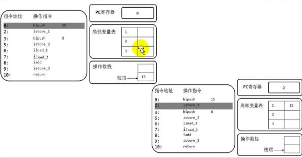

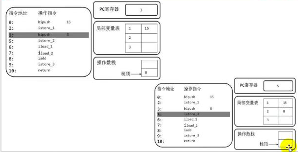

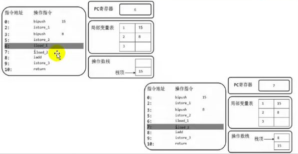

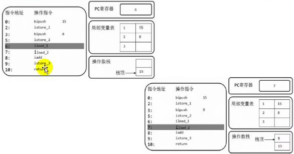


#### 栈顶缓存技术

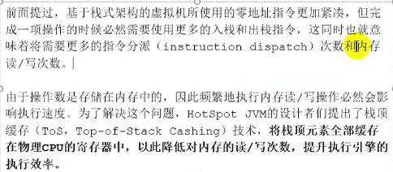


### 动态链接

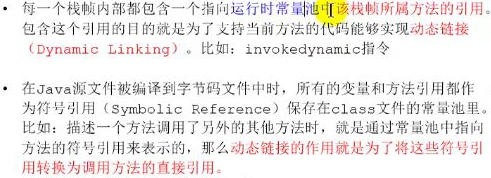


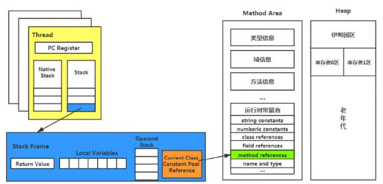


#### 方法的调用

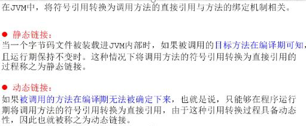

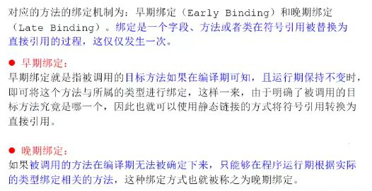


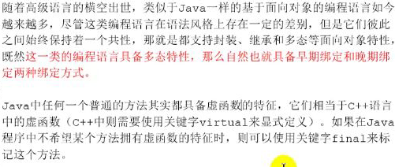


#### 虚方法和非虚方法

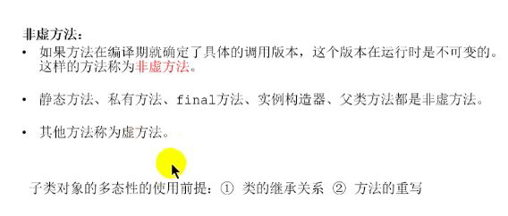


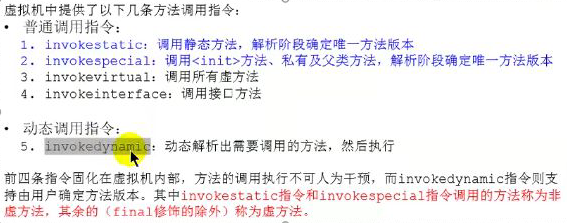


### 方法返回地址

- 存放调用该方法的pc寄存器的值
- 一个方法的结束有两种方式：
  - 正常执行完成
  - 出现异常进行抛异常
- 无论那种方式退出，在方法退出后都会返回该方法被调用的位置
  - 正常结束：调用者的pc计数器的值作为返回地址，即调用给方法的指令的下一个地址
  - 异常退出：返回地址是通过异常表来确定的，栈帧中一般不会保存这部分信息


本质上，方法的退出就是当前栈帧的出栈过程

此时需要恢复上层方法的局部变量表、操作数栈、将返回值压入栈帧的操作、设置pc寄存器的值等

让调用者方法继续执行


正常/异常的区别：异常完成退出不会给上层调用者产生任何返回值


当一个方法开始执行后，只有两种方式可以退出这个方法

1、执行引擎遇到任意一个方法返回的字节码指令（return），会有返回值传递给上层，简称：正常完成出口

- 一个方法在正常调用完成之后究竟需要是哟个哪一个返回指令还需要根据返回值的实际数据类型而定

- 在字节码指令中，返回指令包含ireturn（boolean，byte,char,short,int）,

  lreturn\freturn\dreturn\areturn，return指令供声明为void的方法、实力初始化方法、类，接口的初始化使用


2、在方法执行过程中遇到异常，并且这个异常没有在方法内进行处理，也就是只要在本方法的异常表中没有搜索到匹配的异常处理器，就会导致方法退出，简称：异常完成出口


### 一些附加信息

栈帧中允许携带域java虚拟机实现相关的一些附加信息，如：对程序调式提供的支持信息


