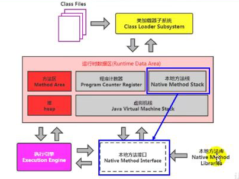
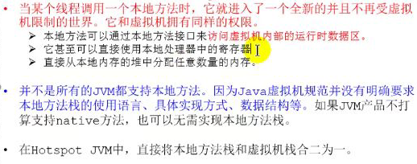

### 本地方法栈

- java虚拟机栈用于管理java方法的调用，本地方法栈用于管理本地方法的调用
- 本地方法栈也是线程私有的
- 允许被实现成固定或者是可动态扩展的内存大小
  - 如果线程请求分配栈容量超过了本地方法栈允许的最大容量，java虚拟机会抛异常：StackOverflowError
  - 如果本地方法栈可以动态扩展，并且在尝试扩展的时候无法申请到足够的内存，或者在创建新的线程是没有足够的内存去创建对应的本地方法栈，会抛出：OutOfMemoryError
- 本地方法是使用c语言实现的
- 具体的做法是Native Method Stack登记native方法，在Execution Engine执行式加载到本地方法库
- 

