## 核心概述

（1）一个Java实例只存在一个堆内存，也是Java内存管理的核心区域


（2）Java堆区在JVM启动时候创建，其空间大小也确定，使jvm管理的最大的一块内存空间

- 堆内存是可以调节的

- ```
  public class HeapDemo1 {
      public static void main(String[] args) {
          System.out.println("Start");
          try {
              Thread.sleep(100000);
          } catch (InterruptedException e) {
              e.printStackTrace();
          }
          System.out.println("End");
      }
  
  }
  ```

- 配置对参数-Xms20m

- 使用java提供的工具进行查询Java VisualVm 

- 添加Visual GC插件

  https://www.cnblogs.com/myshare/p/8745209.html

- 查询

- 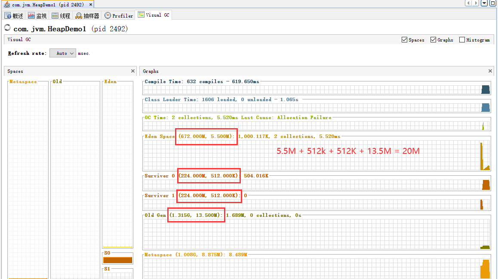

- 此时Eden + Surviver + old = 20M


（3）虚拟机规范规定堆可以处于物理上不连续的内存空间，但是在逻辑上该被视为连续的


（4）所有的线程共享jAVA堆，在这里可以划分线程的私有缓冲区


（5）所有的对象实例以及数组都应该在运行时分配在堆上（几乎）（虚拟机规范）


（6）数组和对象可能永远不会存在栈上，因为栈帧中保存引用，这个引用指向对象或者数组在堆中的位置

- ```java
  public class SimpleHeap {
      private int id;
      public SimpleHeap(int id) {
          this.id = id;
      }
      public void  show(){
          System.out.println("Id :" + id);
      }
      public static void main(String[] args) {
          SimpleHeap simpleHeap = new SimpleHeap(1);
          SimpleHeap simpleHeap1 = new SimpleHeap(2);
          int arr[] = new int[10];
          Object object [] = new Object[10];
      }
  }
  ```

- 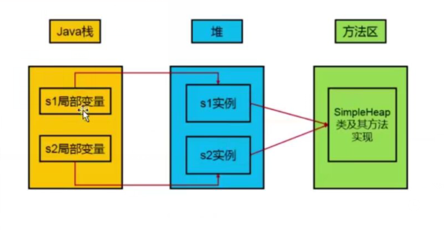

- 创建字节码的指令
- 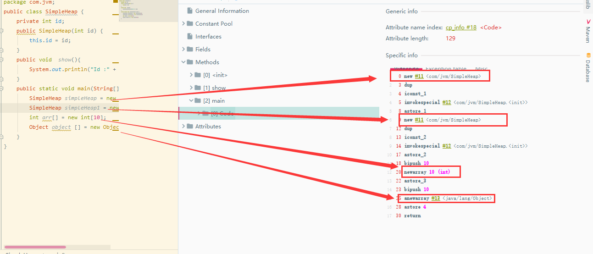


（7）在方法结束后，堆中的对象不会马上移除，仅仅在垃圾回收时候才会被移除


（8）堆，是GC执行垃圾回收的重点区域


 

## 内存细分

现代垃圾收集器大部分都基于分代收集理论设计,堆空间细分为:

Java 7及之前堆内存逻辑上分为三部分:新生区+养老区+**<u>永久区</u>**
➢Young Generation Space    新生区    Young/New
        又被划分为Eden区和Survivor区
➢Tenure generation space     养老区     0ld/Tenure
➢Permanent Space          永久区       Perm


Java 8及之后堆内存逻辑上分为三部分:新生区+养老区+<u>**元空间**</u>
➢Young Generation Space    新生区   Young/New
	又被划分为Eden区和Survivor区
➢Tenure generation space   养老区   0ld/ Tenure
➢Meta Space                          元空间        Meta

约定:新生区=新生代=年轻代     养老区=老年区=老年代      永久区=永久代


HEAP的堆分配

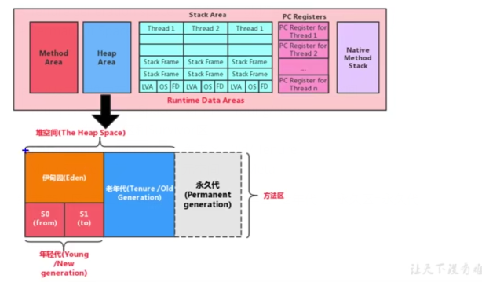

设置对空间大小的参数 **-Xmx10m**（Eden + survivor 的大小）

-XX:PrintGCDetails:打印gc的细节


```java
public class HeapDemo {
    public static void main(String[] args) {
        System.out.println("Start");
        try {
            Thread.sleep(100000);
        } catch (InterruptedException e) {
            e.printStackTrace();
        }
        System.out.println("End");
    }
}
```

配置参数-XX:+PrintGCDetails

```
[GC (Allocation Failure) [PSYoungGen: 2048K->496K(2560K)] 2048K->829K(9728K), 0.0015383 secs] [Times: user=0.00 sys=0.00, real=0.00 secs] 
End
Heap
 PSYoungGen      total 2560K, used 1419K [0x00000000d5f00000, 0x00000000d6200000, 0x0000000100000000)
  eden space 2048K, 45% used [0x00000000d5f00000,0x00000000d5fe6f10,0x00000000d6100000)
  from space 512K, 96% used [0x00000000d6100000,0x00000000d617c040,0x00000000d6180000)
  to   space 512K, 0% used [0x00000000d6180000,0x00000000d6180000,0x00000000d6200000)
 ParOldGen       total 7168K, used 333K [0x0000000081c00000, 0x0000000082300000, 0x00000000d5f00000)
  object space 7168K, 4% used [0x0000000081c00000,0x0000000081c53628,0x0000000082300000)
 Metaspace       used 3784K, capacity 4536K, committed 4864K, reserved 1056768K
  class space    used 420K, capacity 428K, committed 512K, reserved 1048576K
```


## 设置堆内存大小&OOM

Java堆区用于存储Java对象实例，那么堆的大小在JVM启动时就已经设定好了

可以通过选项”-**Xmx**"和”**-Xms**"来进行设置。
➢“-Xms" 用于表示堆区的**起始内存**，等价于-XX: InitialHeapSize
➢“-Xmx"则用于表示堆区的**最大内存**，等价于-XX : MaxHeapSize
●一旦堆区中的内存大小超过“-Xmx"所指定的最大内存时，将会抛出OutOfMemoryError异常。
●**通常会将-Xms和-Xmx两个参数配置相同的值，其目的是为了能够在java垃圾回收机制清理完堆区后不需要重新分隔计算堆区的大小，从而提高性能**。
●默认情况下，初始内存大小:物理电脑内存大小/ 64
						 最大内存大小:物理电脑内存大小/ 4


参数查询地址

**https://docs.oracle.com/javase/8/docs/technotes/tools/unix/java.html**


默认情况下的大小：

```java
       //堆内存总量
       long initalMemory =  Runtime.getRuntime().totalMemory() /1024/1024;

       //堆最大内存总量
        long maxMemory = Runtime.getRuntime().maxMemory() / 1024/1024;

        System.out.println(initalMemory);//123
        System.out.println(maxMemory);//1796
```

注意：如果手动设置参数大小，实际打印会小于设置的数值

survivor1 和survivor2两个大小相等，只会使用其中一个存储，另一个做复制算法


查看设置的参数：

方式1：

jps查询当前进程的pid

在使用jstat -gc 进程id


方式2：

-XX:+PrintGCDetails


## OutOfMemory

代码实例：

-Xms20m -Xmx20m

```java
package com.jvm;

import java.util.ArrayList;
import java.util.Random;

/**
 * @author ccrr
 */
public class OutOfMemoryTest {

    public static void main(String[] args) {
        ArrayList<Pict> list = new ArrayList();
        while (true){
            try {
                Thread.sleep(3000);
            } catch (InterruptedException e) {
                e.printStackTrace();
            }
            list.add(new Pict(new Random().nextInt(1024*1024)));
        }
    }
}
class  Pict{
    private byte [] pixels;

    public Pict(int  pixels) {
        this.pixels = new byte[pixels];
    }
}

```


```java
Exception in thread "main" java.lang.OutOfMemoryError: Java heap space
	at com.jvm.Pict.<init>(OutOfMemoryTest.java:27)
	at com.jvm.OutOfMemoryTest.main(OutOfMemoryTest.java:19)
```


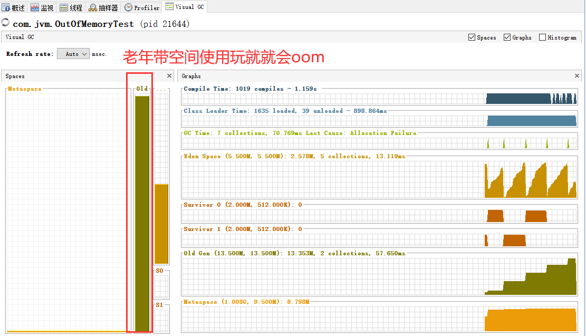


通过取样器查询内存问题那些数据对象较多

byte [] 数组对象较多

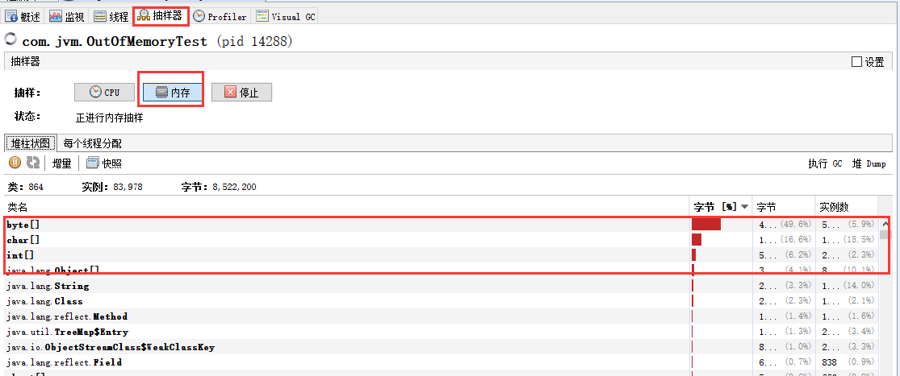


## 年轻代和老年代


- 存储在JVM中的Java对象可以被划分为两类:
  ➢- -类是生命周期较短的瞬时对象，这类对象的创建和消亡都非常迅速
  ➢另外一类对象的生命周期却非常长，在某些极端的情况下还能够与JVM的生命周期保持一致。


- Java堆区进一步细分的话， 可以划分为年轻代(YoungGen) 和老年代(OldGen)

  其中年轻代又可以划分为Eden空间、Survivor0空间和Survivor1空间(有时也叫做
  from区、to区)。

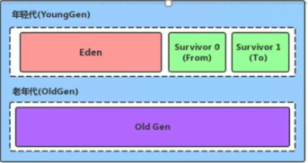


### 比例

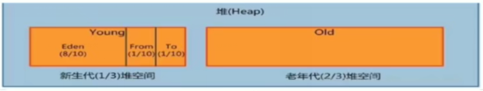

配置新生代与老年代在堆结构的占比。
➢默认-XX:NewRatio=2，表示新生代占1，老年代占2，新生代占整个堆的1/3
➢可以修改-X:NewRatio=4，表示新生代占1，老年代占4，新生代占整个堆的1/5


-Xms600m -Xmx600m

```java
public class EdenSurivovrTest {

    public static void main(String[] args) {
        try {
            Thread.sleep(100000);
        }catch (Exception e){
        }
    }
}
```


默认比例是1：2

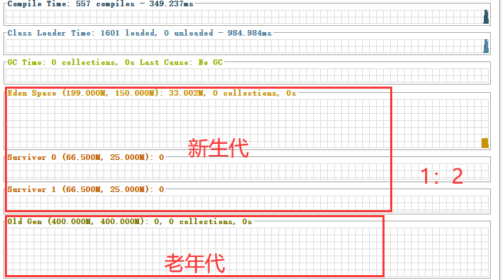


查看方式：

```cmd
C:\Users\test>jps
13488 Launcher
1984 Main
7536 RemoteMavenServer36
14836
6420 EdenSurivovrTest
12488 Jps
13480 NailgunRunner

C:\Users\test>jinfo -flag SurvivorRatio 6420
-XX:SurvivorRatio=8
```


- 在HotSpot中，Eden空间和另外两个Survivor空间缺省所占的比例是8:1:1
  可以通过选项“**-XX: SurvivorRatio**"调整这个空间比例。Eden:Survivor的比例设置

  比如-XX: SurvivorRatio=8

  

  查询之后是6：1：1，存在自适应机制，使用 -XX:-UserAdaptivesSizePolicy(+开，-关)

  开关自适应内存分配策略

  

- 几乎所有的Java对象都是在Eden区被new出来的。
  绝大部分的Java对象的销毁都在新生代进行了。
  ➢IBM公司的专门研究表明，新生代中80号 的对象都是“朝生夕死”的。

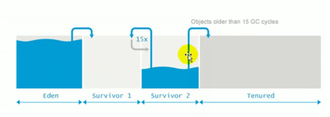


- 可以使用选项"-Xmn"设置新生代最大内存大小
  ➢这个参数-般使用默认值就可以了。


## 图解对象分配过程


为新对象分配内存是一件非常严谨和复杂的任务，JVM的设计者们不仅需要考虑内存如何分
配、在哪里分配等问题，并且由于内存分配算法与内存回收算法密切相关，所以还需要考
虑GC执行完内存回收后是否会在内存空间中停生内存碎片。.
- new的对象先放伊甸园区。此区有大小限制。
- 当伊甸园的空间填满时，程序又需要创建对象，JVM的垃 圾回收器将对伊甸园区进行垃
  圾回收(Minor GC)，将伊甸园区中的不再被其他对象所引用的对象进行销毁。再加载
  新的对象放到伊甸园区
- 然后将伊甸园中的剩余对象移动到幸存者0区。
- 如果再次触发垃圾回收，此时上次幸存下来的放到幸存者0区的，如果没有回收，就会
  放到幸存者1区。
- 如果再次经历垃圾回收，此时会重新放回幸存者0区，接着再去幸存者1区。
- 啥时候能去养老区呢?可以设置次数。默认是15次。
  可以设置参数: **-XX:MaxTenuringThreshold=<N>**进行设置。


总结：

- 针对幸存者s0，s1：复制之后，谁空谁是to
- 关于垃圾回收：频繁在新生区手机，很少在老年代收集，几乎不再元空间手机


注意：

触发Minor GC 会在Endn满，同时对Survivor进行GC

Survivor满了不会触发Minor GC，会直接晋升


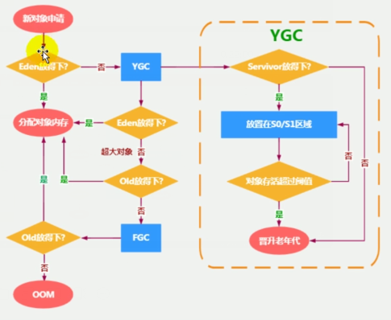


## 调优工具

命令行

jconsole

visualvm+

jprofiler

java flight recorder

gcviewer

gc easy


## gc

Minor GC。 Major GC。 Full GC


JVM在进行GC时，并非每次都对上面三个内存区域一起回收的， **大部分时候回收的都是指新生代**。


针对HotSpot VM的实现，它里面的GC按照回收区域又分为两大种类型:

一种 是部分收集(Partial GC)

一种是整堆收集(Fu1l GC)


部分收集:不是完整收集整个Java堆的垃圾收集。其中又分为:
➢新生代收集(Minor GC / Young GC) :只是新生代的垃圾收集
➢老年代收集(Major GC / 0ld GC) :只是老年代的垃圾收集。
	目前，只有CMS GC会有单独收集老年代的行为。.
	**注意，很多时候Major GC会和Full GC混淆使用，需要具体分辨是老年代回收还是整堆回收。**
➢混合收集(Mixed GC):收集整个新生代以及部分老年代的垃圾收集。
	目前，只有G1 GC会有这种行为

整堆收集(Full GC): 收集整个java堆和方法区的垃圾收集。


### 年轻代

年轻代GC(Minor GC)触发机制:

- 当年轻代空间不足时，就会触发Minor GC，这里的年轻代满指的是**Eden代满**，**Survivor满不会引发GC**。(每次 Minor GC会清理年轻代的内存。)。
- 因为Java对象大多都具备朝生夕灭的特性，所以MinorGC非常频繁，一般回收速度也比较快。这一定义既清晰又易于理解。
- Minor GC会引发STW， 暂停其它用户的线程，等垃圾回收结束，用户线程才恢复运行。


### 老年代

- 指发生在 老年代的GC，对象从老年代消失时，我们说“Major GC" 或“Fu11 GC”发生了。
- 出现了Major GC， 经常会伴随至少一 次的Minor GC (但非绝对的，在Paral1el
  Scavenge收集器的收集策略里就有直接进行Major GC的策略选择过程)
  - 也就是在老年代空间不足时，会先尝试触发Minor GC。如果之后空间还不足，
    则触发Major GC
- Major GC的速度一般会比Minor GC慢10倍以上，STW的时间更长。
- 如果Major GC后，内存还不足，就报00M了。
- Major GC的速度一 般会比Minor GC慢10倍以上。


### FUll GC

触发Fu11 GC执行的情况有如下五种:


- 调用System.gc()时，系统建议执行Ful1 GC，但是不必然执行

- 老年代空间不足

- 方法区空间不足

- 通过Minor GC后进入老年代的平均大小大于老年代的可用内存

- 由Eden区、survivor space0 (From Space) 区向survivor space1 (To
  Space)区复制时，对象大小大于To Space可用内存，则把该对象转存到老年代，且
  老年代的可用内存小于该对象大小

  

说明: full gc是开发或调优中尽量要避免的。这样暂时时间会短一些。


## 堆空间分代思想

为什么需要把Java堆分代?不分代就不能正常工作了吗?
经研究，不同对象的生命周期不同。70号- 99%的对象是临时对象。|
➢新生代:有Eden、两块大小相同的Survivor (又称为from/to， s0/s1)构成，to总为空。
➢老年代:存放新生代中经历多次Gc仍然存活的对象。

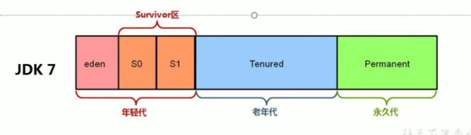


为什么需要把Java堆分代?不分代就不能正常工作了吗?
其实不分代完全可以，分代的唯一 理由就是**优化Gc性能**。如果没有分代I那所有的对
象都在-一块，就如同把-一个学校的人都关在-一个教室。Gc的时候要找到哪些对象没用,
这样就会对堆的所有区域进行扫描。而很多对象都是朝生夕死的，如果分代的话，把
新创建的对象放到某-地方，当GC的时候先把这块存储“朝生夕死”对象的区域进
行回收，这样就会腾出很大的空间出来。

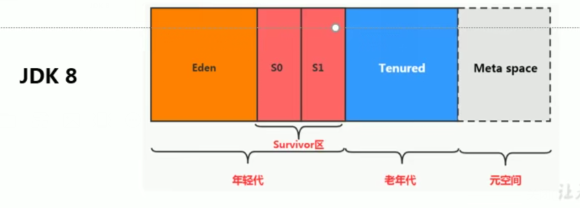

## 内存分配策略（对象promotion规则）

如果对象在Eden出生并经过第-次MinorGC后仍然存活，并且能被Survivor
容纳的话，将被移动到survivor空间中，并将对 象年龄设为1。对象在
Survivor区中每熬过-次MinorGC，年龄就增加1 岁，当它的年龄增加到一定
程度(默认为15岁，其实每个JVM、每个GC都有所不同)时，就会被晋升到老年代中。
对象晋升老年代的年龄阈值，可以通过选项-XX :MaxTenuringThreshold来设置


针对不同年龄段的对象分配原则如下所示:

- 优先分配到Eden
- 大对象直接分配到老年代
  ➢尽量避免程序中出现过多的大对象
- 长期存活的对象分配到老年代
- 动态对象年龄判断
  ➢如果Survivor 区中相同年龄的所有对象大小的总和大于Survivor空
  间的一半，年龄大于或等于该年龄的对象可以直接进入老年代，无须等到
  MaxTenur ingThreshold中要求的年龄。
- 空间分配担保
  ➢-XX:HandlePromotionFailure


## 为对象分配过程：TLAB

为什么有TLAB ( Thread Local Allocation Buffer ) ?

- 堆区是线程共享区域，任何线程都可以访问到堆区中的共享数据
- 由于对象实例的创建在JVM中非常频繁，因此在并发环境下从堆区中划分内
  存空间是线程不安全的
- 为避免多个线程操作同-地址，需要使用加锁等机制，进而影响分配速度。


什么是TLAB?。


- 从内存模型而不是垃圾收集的角度，对Eden区域继续进行划分，JVM为
  **每个线程分配了一个私有缓存区域，它包含在Eden空间内**。
- 多线程同时 分配内存时，使用TLAB可以避免- -系列的非线程安全问题，
  同时还能够提升内存分配的吞吐量，因此我们可以将这种内存分配方式称
  之为**快速分配策略**。
- 据我所知所有OpenJDK衍生出来的JVM都提供了TLAB的设计。

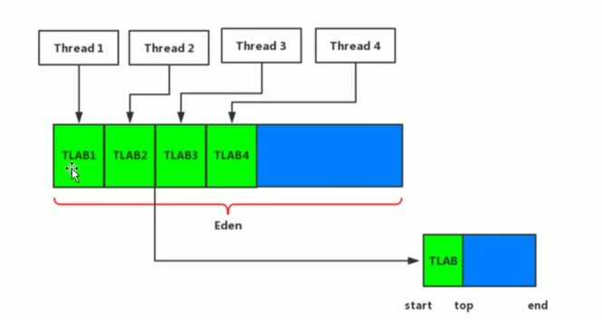


TLAB的再说明:

- 尽管不是所有的对象实例都能够在TLAB中成功分配内存，但JVM确实是将TLAB作为内存分配的首选。

- 在程序中，开发人员可以通过选项“-XX:UseTLAB”设置是否开启TLAB空间。

- 默认情况下，TLAB空间的内存非常小，仅占有整个Eden空间的de 1%

    当然我们可以通过选项“-XX :TLABWasteTargetPercent”设置TLAB空间所占用Eden空间的百分比大小。

- 一旦对象在TLAB空间分配内存失败时，JVM就会尝试着通过使  **用加锁机制**  确保数据操
  作的原子性，从而直接在Eden空间中分配内存。


加载过程

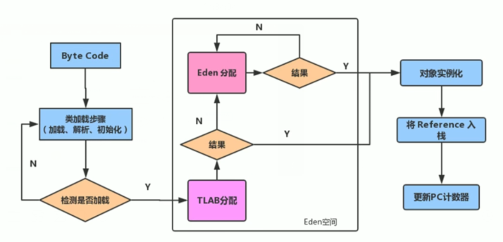


## 参数设置

- 官网说明:https://docs.oracle.com/javase/ 8/docs/technotes/tools/unix/java. html
- -Xx: +PrintFlagsInitial :查看所有的参数的默认初始值
- -XX:+PrintFlagsFinal :查看所有的参数的最终值(可能会存在修改，不再是初始值)|
- -Xms: 初始堆空间内存 (默认为物理内存的1/64) 
- -Xmx: 最大堆空间内存(默认为物理内存的1/4)
- -Xmn: 设置新生代的大小。(初始值及最大值)
- -XX:NewRatio: 配置新生代与老年代在堆结构的占比

- -XX:SurvivorRatio: 设置新生代中Eden和S0/S1空间的比例

- -xX: MaxTenuringThreshold:设置新生代垃圾的最大年龄

- -XX: +PrintGCDetails: 输出详细的GC处理日志
  ➢打印gc简要信息:①-xx:+PrintGC ②-verbose:gc

  

- -XX: HandlePromotionFailure: 是否设置空间分配担保

  在发生Minor GC之 前，虚拟机会**检查老年代最大可用的连续空间是否大于新生代所有**
  **对象的总空间**。
      如果大于，则此次Minor GC是安全的
      如果小于，则虛拟机会查看-XX: HandlePromot ionFailure设置值是否允许担保失败。
         ➢如果HandlePromotionFailure=true, 那么会继续检查老年代最大可
            用连续空间是否大于历次晋升到老年代的对象的平均大小。
    	如果大于，则尝试进行一.次Minor GC， 但这次Minor GC依然是有风险的:
        如果小于，则改为进行一次Full GC。
        如果HandlePromotionFailure=false， 则改为进行一次FullGC。

  

  在JDK6 Update24之后，HandlePromotionFailure参 数不会再影响到虛拟机的空
  间分配担保策略，观察openJDK中的源码变化，虽然源码中还定义了
  HandlePromotionFailure参数，但是在代码中已经不会再使用它。JDK6 Update
  24之后的规则变为**只要老年代的连续空间大于新生代对象总大小**或者**历次晋升的平均大**
  **小就会进行Minor GC**，否则将进行Full GC。


## 堆是分配对象的唯一选择妈

在《深入理解Java虚拟机》中关于Java堆内存有这样一段描述:
随着JIT编译期的发展与**逃逸分析技术**逐渐成熟，**栈上分配、标量替换优化技术**将会导
致一些微妙的变化，所有的对象都分配到堆上也渐渐变得不那么“绝对”了。

在Java虚拟机中，对象是在Java堆中分配内存的，这是一个普遍的常识。但是，有一
种特殊情况，那就是**如果经过逃逸分析(Escape Analysis) 后发现，- 一个对象并没有**
**逃逸出方法的话，那么就可能被优化成栈上分配**。这样就无需在堆上分配内存，也无须
进行垃圾回收了。这也是最常见的堆外存储技术。

此外，前面提到的基于OpenJDK深度定制的TaoBaoVM，其中创新的GCIH (GC
invisible heap) 技术实现off-heap，将生命周期较长的Java对象从heap中移至
heap外，并且GC不能管理GCIH内部的Java对象，以此达到降低GC的回收频率和提升
GC的回收效率的目的。.


## 逃逸分析

如何将堆上的对象分配到栈，需要使用逃逸分析手段

这是一种可以有效减少Java程序中同步负载和内存堆分配压力的跨函数
全局数据流分析算法。

通过逃逸分析，Java Hotspot编 译器能够分析出一个新的对象的引用的
使用范围从而决定是否要将这个对象分配到堆上。

逃逸分析的基本行为就是分析对象动态作用域:
	➢当一个对象在方法中被定义后，对象只在方法内部使用，则认为没有
	发生逃逸。
	➢当一个对象在方法中被定义后，它被外部方法所引用，则认为发生逃
	逸。例如作为调用参数传递到其他地方中。


如何快速判断是否发生逃逸分析：

关注new的对象是否有可能在方法外呗调用？


```java
 public void method_A(){
        V v = new V();
        
        v = null;
    }
```

没有发生逃逸对象，则可以分配到栈上，随着方法的结束，栈空间就被移除


```java
    public StringBuffer method_A(String s1,String s2){
       StringBuffer stringBuffer = new StringBuffer();
       stringBuffer.append(s1);
       stringBuffer.append(s2);
       return stringBuffer;
    }
```

会返回，外部调用就会指向new的对象

想要该方法不逃出方法，则进行改写

```java
public String method_B(String s1,String s2){
        StringBuffer stringBuffer = new StringBuffer();
        stringBuffer.append(s1);
        stringBuffer.append(s2);
        return stringBuffer.toString();
    }
```

此时只是在内部使用，外部并没有使用


在JDK 6u23版本之后，HotSpot中默认就已经开启了逃逸分析。

如果使用的是较早的版本，开发人员则可以通过:
.➢选项“-XX: +DoEscapeAnalysis"显式开启 逃逸分析
➢通过选项“-XX: +PrintEscapeAnalysis" 查看逃逸分析的筛选结果。


## 逃逸分析：优化

使用逃逸分析，编译器可以对代码做如下优化: 

- 栈上分配。将堆分配转化为栈分配。如果-一个对象在子程序中被分配，要使指向该对象的指针永远不会逃逸，对象可能是栈分配的候选，而不是堆分配。

  JIT编译器在编译期间根据逃逸分析的结果，发现如果一个对象并没有逃逸出方法的话，就可能被优化成栈上分配。分配完成后，继续在调用栈内执行，最后线程结束，栈空间被回收，局部变量对象也被回收。这样就无须进行垃圾回收了。
  常见的栈上分配的场景
  ➢在逃逸分析中，已经说明了。分别是给成员变量赋值、方法返回值、实例引用传递。.

- 同步省略。如果一个对象被发现只能从一个线程被访问到，那么对于这个对象的操作可以不考虑同步。

  线程同步的代价是相当高的，同步的后果是降低并发性和性能。

  

  在动态编译同步块的时候，JIT编译器可以借助逃逸分析来判断同步块所
  使用的锁对象是否只能够被一个线程访问而没有被发布到其他线程。如果
  没有，那么JIT编译器在编译这个同步块的时候就会取消对这部分代码的
  同步。这样就能大大提高并发性和性能。这个取消同步的过程就叫同步省
  略，也叫锁消除。|
  
  ```java
  public void test(){
          Object object = new Object();
          synchronized (object){
              //.......
          }
      }
  ```
  
  代码中的object对象进行枷锁，但是这个对象的生命周期只在test()方法，不会被其他线程访问，在JIT编译阶段就会被优化掉：
  
  ```java
      public void test(){
          Object object = new Object();
              //.......
      }
  ```
  
  查看字节码文件依然存在synchronid


- 分离对象或标量替换。有的对象可能不需要作为一个连续的内存结构存在也可以被访问到，那么对象的部分(或全部)可以不存储在内存，而是存储在CPU寄存器中。

  **标量**(Scalar)是指一个无法再分解成更小的数据的数据[Java中的原始数据类型就是标量
  相对的，那些还可以分解的数据叫做**聚合量**(Aggregate) ，Java中的对象就是聚合量，因
  为他可以分解成其他聚合量和标量。
  在JIT阶段，如果经过逃逸分析，发现一个对象不会被外界访问的话，那么经过JIT优化，就
  会把这个对象拆解成若干个其中包含的若干个成员变量来代替。这个过程就是**标量替换**。


```java
    public void alloc(){
        Point point = new Point(1,2);
        System.out.println(point.x + point.notify(););
    }

class Point{
    int x;
    int y;
}
```

标量替换之后

```java
    public void alloc(){
           int x = 1;
   			 int y= 2;
        System.out.println(point.x + point.notify(););
    }
```

Point这个集合量经过逃逸分析，发现他没有逃逸，就会被替换成两个聚合量


开启标量替换：-XX:+EliminateAllocations默认开启 


上述代码在主函数中进行了1亿次alloc。 调用进行对象创建，由于User对象实
例需要占据约16字节的空间，因此累计分配空间达到将近1.5GB。如果堆空间小
于这个值，就必然会发生GC。使用如下参数运行上述代码:
- server -Xmx100m -Xms100m - XX: +DoEscapeAnalysis -
XX: +PrintGC -XX: +El iminateAllocations
这里使用参数如下:
●参数-server: 启动Server模式，因为在Server模式下，才可以启用逃逸分析。
●参数 -XX: +DoEscapeAnalysis:启用逃逸分析
●参数-Xmx10m:指定了堆空间最大为10MB
●
参数- XX:+PrintGC:将打印GC日志。
●参数-XX:+EliminateAllocations: 开启了标量替换(默认打开)，允许将对象打
散分配在栈上，比如对 象拥有id和name两个字段，那么这两个字段将会被视为两个
独立的局部变量进行分配。


## 逃逸分析：小结

关于逃逸分析的论文在1999年就已经发表了，但直到JDK 1.6才有实现，而且这项技
术到如今也并不是十分成熟的。|

其根本，原因就是**无法保证逃逸分析的性能消耗一定能高于他的消耗。虽然经过逃逸分**
**析可以做标量替换、栈上分配、和锁消除。但是逃逸分析自身也是需要进行一系列复**
**杂的分析的，这其实也是一个相对耗时的过程**。

一个极端的例子，就是经过逃逸分析之后，发现没有一个对象是不逃逸的。那这个逃
逸分析的过程就白白浪费掉了。

虽然这项技术并不十分成熟，但是它也是**即时编译器优化技术中一个十分重要的手段**。

注意到有-些观点，认为通过逃逸分析，JVM会在栈上分配那些不会逃逸的对象，这
在理论上是可行的，但是取决于JVM设计者的选择。据我所知，Oracle Hotspot
JVM中并未这么做，这一点在逃逸分析相关的文档里已经说明，所以可以明确所有的
对象实例都是创建在堆上。

目前很多书籍还是基于JDK 7以前的版本，JDK已经发生了很大变化，intern字符串
的缓存和静态变量曾经都被分配在永久代上，而永久代已经被元数据区取代。但是，
intern字符串缓存和静态变量并不是被转移到元数据区，而是直接在堆上分配，所以
这一点同样符合前面一.点的结论:**对象实例都是分配在堆上**。


 


