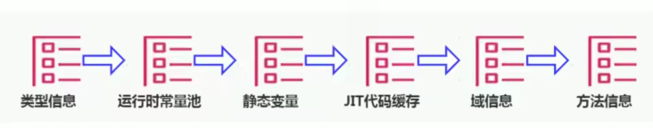

## 栈堆方法区的关系

线程共享区域角度


栈堆方法区交互关系


## 方法去在哪

《Java虚拟机规范》中明确说明:“尽管所有的方法区在逻辑上是属于堆的一部分，但
一些简单的实现可能不会选择去进行垃圾收集或者进行压缩。

但对 于HotspotJVM而言，方法区还有一个别名叫做Non-Heap (非堆)，目的就是要和堆分开。所以，方法区看作是一块独立于Java堆的内存空间。


## 基本理解

●方法区(Method Area) 与Java堆一 样，是各个线程共享的内存区域。
●方法区在JVM启动的时候被创建，并且它的实际的物理内存空间中和Java堆区一样都
可以是不连续的。
●方法区的大小，跟堆空间一样，可以选择固定大小或者可扩展。
●方法区的大小决定了系统可以保存多少个类，如果系统定义了太多的类，导致方法区溢出，虚拟机同样会抛出内存溢出错误: java. lang . OutofMemoryError:PermGen space 或者java. lang . OutOfMemoryError: Metaspace
●关闭JVM就会释放这个区域的内存。


●在jdk7及以前，习惯上把方法区，称为永久代。jdk8开始， 使用元空间取代了永久代。

●本质上，方法区和永久代并不等价。仅是对hotspot而言的。 《Java虛拟机规范》对如何实现方法区，不做统一要求。 例如: BEA JRockit/ IBM J9中不存在永久代的概念。
  ➢现在来看，当年使用永久代，不是好的idea。导致Java程序更容易OOM (超过-XX:MaxPermSize.上限)


.png)

- 而到了JDK 8，终于完全废弃了永久代的概念，改用与JRockit、J9- -样在本地
- 内存中实现的元空间(Metaspace) 来代替I

- 元空间的本质和永久代类似，都是对JVM规范中方法区的实现。不过元空间与永久
  代最大的区别在于:元空间不在虚拟机设置的内存中，而是使用本地内存。
- 永久代、元空间二者并不只是名字变了，内部结构也调整了。
- 根据《Java虚拟机规范》的规定，如果方法区无法满足新的内存分配需求时，将
  抛出OOM异常。


## 设置方法去的大小

https://docs.oracle.com/javase/8/docs/technotes/tools/unix/java.html


- 方法区的大小不必是固定的，jvm可以根据应用的需要动态调整。
- jdk7及以前

- 通过-XX:PermSize来设置永久代初始分配空间。默认值是20.75M

> -XX:MaxPermSize来设定永久代最大可分配空间。32位机器默z认是64M， 64位机器模式是
> 82M
> ➢当JVM加载的类信息容量超过了这个值，会报异常OutOfMemoryError : PermGen
> space。


jdk8及以后:

- 元数据区大小可以使用参 数-XX :MetaspaceSize和-XX:MaxMetaspaceSize指定,替代上述原有的两个参数。

- 默认值依赖于平台。windows下，-XX:MetaspaceSize是21M，

   **-XX:MaxMetaspaceSize的值是-1，即没有限制**。

- 与永久代不同，如果不指定大小，默认情况下，虚拟机会耗尽所有的可用系统内存。
  如果元数据区发生溢出，虚拟机一样会抛出异常OutOfMemoryError: Metaspace

- -XX:MetaspaceSize:
  设置初始的元空间大小。对于一个64位的服务器端JVM来说，
  其默认的-XX:MetaspaceSize值为21MB。这就是初始的高水位线，一旦触及这个
  水位线，Full GC将会被触发并卸载没用的类(即这些类对应的类加载器不再存活) ,
  然后这个高水位线将会重置。新的高水位线的值取决于GC后释放了多少元空间。如果
  释放的空间不足，那么在不超过MaxMetaspaceSize时，适当提高该值。如果释放
  空间过多，则适当降低该值。

- 如果初始化的高水位线设置过低，上述高水位线调整情况会发生很多次。 通过垃圾回
  收器的日志可以观察到Full GC多次调用。为了避免频繁地GC，建议将-
  XX:MetaspaceSize设置为一个相对较高的值。


```java
public class HeapDemo {
    public static void main(String[] args) {
        System.out.println("Start");
        try {
            Thread.sleep(1000000);
        } catch (InterruptedException e) {
            e.printStackTrace();
        }
        System.out.println("End");
    }
}
```


```cmd
C:\Users\test>jps
13360 Launcher
1984 Main
7536 RemoteMavenServer36
14836
16532 Jps
13480 NailgunRunner
19948 HeapDemo

C:\Users\test>jinfo -flag MetaspaceSize 19948
-XX:MetaspaceSize=21807104
```

21807104/1024/1024 = 21


## OOM

```java
public class MethodAreaOOM  extends ClassLoader{
    public static void main(String[] args) {
        int j = 0;
        try {
            MethodAreaOOM methodAreaOOM = new MethodAreaOOM();
            for (int i = 0; 10000 >i ;i++){
                //创建对象
                ClassWriter classWriter = new ClassWriter(0);
                //指明类
                classWriter.visit(Opcodes.V1_8,Opcodes.ACC_PUBLIC,"class" + i,null,"java/lang/Object",null);
                //返回bute[]
                byte[] code = classWriter.toByteArray();
                //类加载
                methodAreaOOM.defineClass("class"+i,code,0,code.length);
                j++;
            }
        }catch (Exception e){
        }finally {
            System.out.println(j);
        }
    }
}
```

```
-XX:MetaspaceSize=10m -XX:MaxMetaspaceSize=10m
```

```
Exception in thread "main" java.lang.OutOfMemoryError: Metaspace
	at java.lang.ClassLoader.defineClass1(Native Method)
```


## 结局OOM

1、要解决0M异常或heap space的异常，一般的手段是 首先通过内存映像分析工具
(如Eclipse Memory Analyzer) 对dump出来的堆转储快照进行分析，重点是确认
内存中的对象是否是必要的，也就是要先分清楚到底是出现了**内存泄漏**(Memory
Leak)还是**内存溢出**(Memory overf1ow) 。

2、如果是内存泄漏，可进- -步通过工具查看泄漏对象到GC Roots 的引用链。于是就
能找到泄漏对象是通过怎样的路径与GC Roots相关联并导致垃圾收集器无法自动回收
它们的。掌握了泄漏对象的类型信息，以及GC Roots引用链的信息，就可以比较准确
地定位出泄漏代码的位置。

3、如果不存在内存泄漏，换句话说就是内存中的对象确实都还必须存活着，那就应当
检查虚拟机的堆参数(-Xmx与-Xms) ，与机器物理内存对比看是否还可以调大，从代
码上检查是否存在某些对象生命周期过长、持有状态时间过长的情况，尝试减少程序
运行期的内存消耗。


## 方法区内部结构


用于存储已经被虚拟机加载的类型信息、常量、静态变量、即时编译后的代码缓存等




### 类型信息

对每个加载的类型( 类class、接口interface、枚举enum、注解annotation) ，JVM必
须在方法区中存储以下类型信息:
①这个类型的完整有效名称(全名=包名.类名)
②这个类型直接父类的完整有效名(对于interface或是java. lang.object,都没有父类)
③这个类型的修饰符(public, abstract, final的某个 子集)
④这个类型直接接口的一一个有序列表


### 域（Field）信息

JVM必须在方法区中保存类型的所有域的相关信息以及域的生命顺序


域的相关信息包括：域名称、域类型、域修饰符（public、private..）


### 方法（Method）信息

JVM必须保存所有方法的以下信息，同域信息一样包括声明顺序:

- 方法名称
- 方法的返回类型(或vdid)
- 方法参数的数量和类型(按顺序)
- 方法的修饰符(public, private, protected, static, final,synchronized, native, abstract的一个 子集)
- 方法的字节码(bytecodes)、操作数栈、局部变量表及大小(abstract和native方法除外)
- 异常表(abstract和native方 法除外)
  ➢每个异常处理的开始位置、结束位置、代码处理在程序计数器中的偏移地址、
  被捕获的异常类的常量池索引


```java
package com.jvm;

import java.io.Serializable;

public class MethodTest extends Object implements Comparable<String>, Serializable {

    //属性
    public  int a =10;
    private  static String ste = "static";

    //构造器默认

    //方法
    public void test(){
        int b = 10;
        System.out.println(b);
    }

    public static  void test2(int exc){
        System.out.println(exc);
    }

    public int compareTo(String o) {
        return 0;
    }

    public static void main(String[] args) {

    }
}

```


```txt
D:\IdeaProjects\scalaProjects\scala\target\classes\com\jvm>javap -c -v MethodTest
警告: 二进制文件MethodTest包含com.jvm.MethodTest
Classfile /D:/IdeaProjects/scalaProjects/scala/target/classes/com/jvm/MethodTest.class
  Last modified 2020-5-24; size 1219 bytes
  MD5 checksum fb56eeffc295c41996b11ae333026fb5
  Compiled from "MethodTest.java"
  
//类型信息
public class com.jvm.MethodTest extends java.lang.Object implements java.lang.Comparable<java.lang.String>, java.io.Serializable
  minor version: 0
  major version: 49
  flags: ACC_PUBLIC, ACC_SUPER
Constant pool:
   #1 = Methodref          #10.#42        // java/lang/Object."<init>":()V
   #2 = Fieldref           #9.#43         // com/jvm/MethodTest.a:I
   #3 = Fieldref           #44.#45        // java/lang/System.out:Ljava/io/PrintStream;
   #4 = Methodref          #46.#47        // java/io/PrintStream.println:(I)V
   #5 = Class              #48            // java/lang/String
   #6 = Methodref          #9.#49         // com/jvm/MethodTest.compareTo:(Ljava/lang/String;)I
   #7 = String             #50            // static
   #8 = Fieldref           #9.#51         // com/jvm/MethodTest.ste:Ljava/lang/String;
   #9 = Class              #52            // com/jvm/MethodTest
  #10 = Class              #53            // java/lang/Object
  #11 = Class              #54            // java/lang/Comparable
  #12 = Class              #55            // java/io/Serializable
  #13 = Utf8               a
  #14 = Utf8               I
  #15 = Utf8               ste
  #16 = Utf8               Ljava/lang/String;
  #17 = Utf8               <init>
  #18 = Utf8               ()V
  #19 = Utf8               Code
  #20 = Utf8               LineNumberTable
  #21 = Utf8               LocalVariableTable
  #22 = Utf8               this
  #23 = Utf8               Lcom/jvm/MethodTest;
  #24 = Utf8               test
  #25 = Utf8               b
  #26 = Utf8               test2
  #27 = Utf8               (I)V
  #28 = Utf8               exc
  #29 = Utf8               compareTo
  #30 = Utf8               (Ljava/lang/String;)I
  #31 = Utf8               o
  #32 = Utf8               main
  #33 = Utf8               ([Ljava/lang/String;)V
  #34 = Utf8               args
  #35 = Utf8               [Ljava/lang/String;
  #36 = Utf8               (Ljava/lang/Object;)I
  #37 = Utf8               <clinit>
  #38 = Utf8               Signature
  #39 = Utf8               Ljava/lang/Object;Ljava/lang/Comparable<Ljava/lang/String;>;Ljava/io/Serializable;
  #40 = Utf8               SourceFile
  #41 = Utf8               MethodTest.java
  #42 = NameAndType        #17:#18        // "<init>":()V
  #43 = NameAndType        #13:#14        // a:I
  #44 = Class              #56            // java/lang/System
  #45 = NameAndType        #57:#58        // out:Ljava/io/PrintStream;
  #46 = Class              #59            // java/io/PrintStream
  #47 = NameAndType        #60:#27        // println:(I)V
  #48 = Utf8               java/lang/String
  #49 = NameAndType        #29:#30        // compareTo:(Ljava/lang/String;)I
  #50 = Utf8               static
  #51 = NameAndType        #15:#16        // ste:Ljava/lang/String;
  #52 = Utf8               com/jvm/MethodTest
  #53 = Utf8               java/lang/Object
  #54 = Utf8               java/lang/Comparable
  #55 = Utf8               java/io/Serializable
  #56 = Utf8               java/lang/System
  #57 = Utf8               out
  #58 = Utf8               Ljava/io/PrintStream;
  #59 = Utf8               java/io/PrintStream
  #60 = Utf8               println
{


//域信息
  public int a;
    descriptor: I
    flags: ACC_PUBLIC

//构造器
  public com.jvm.MethodTest();
    descriptor: ()V
    flags: ACC_PUBLIC
    Code:
      stack=2, locals=1, args_size=1
         0: aload_0
         1: invokespecial #1                  // Method java/lang/Object."<init>":()V
         4: aload_0
         5: bipush        10
         7: putfield      #2                  // Field a:I
        10: return
      LineNumberTable:
        line 5: 0
        line 8: 4
      LocalVariableTable:
        Start  Length  Slot  Name   Signature
            0      11     0  this   Lcom/jvm/MethodTest;

//方法
  public void test();
    descriptor: ()V
    flags: ACC_PUBLIC
    Code:
      stack=2, locals=2, args_size=1
         0: bipush        10
         2: istore_1
         3: getstatic     #3                  // Field java/lang/System.out:Ljava/io/PrintStream;
         6: iload_1
         7: invokevirtual #4                  // Method java/io/PrintStream.println:(I)V
        10: return
      LineNumberTable:
        line 15: 0
        line 16: 3
        line 17: 10
      LocalVariableTable:
        Start  Length  Slot  Name   Signature
            0      11     0  this   Lcom/jvm/MethodTest;
            3       8     1     b   I

  public static void test2(int);
    descriptor: (I)V
    flags: ACC_PUBLIC, ACC_STATIC
    Code:
      stack=2, locals=1, args_size=1
         0: getstatic     #3                  // Field java/lang/System.out:Ljava/io/PrintStream;
         3: iload_0
         4: invokevirtual #4                  // Method java/io/PrintStream.println:(I)V
         7: return
      LineNumberTable:
        line 20: 0
        line 21: 7
      LocalVariableTable:
        Start  Length  Slot  Name   Signature
            0       8     0   exc   I

  public int compareTo(java.lang.String);
    descriptor: (Ljava/lang/String;)I
    flags: ACC_PUBLIC
    Code:
      stack=1, locals=2, args_size=2
         0: iconst_0
         1: ireturn
      LineNumberTable:
        line 24: 0
      LocalVariableTable:
        Start  Length  Slot  Name   Signature
            0       2     0  this   Lcom/jvm/MethodTest;
            0       2     1     o   Ljava/lang/String;

  public static void main(java.lang.String[]);
    descriptor: ([Ljava/lang/String;)V
    flags: ACC_PUBLIC, ACC_STATIC
    Code:
      stack=0, locals=1, args_size=1
         0: return
      LineNumberTable:
        line 29: 0
      LocalVariableTable:
        Start  Length  Slot  Name   Signature
            0       1     0  args   [Ljava/lang/String;

  public int compareTo(java.lang.Object);
    descriptor: (Ljava/lang/Object;)I
    flags: ACC_PUBLIC, ACC_BRIDGE, ACC_SYNTHETIC
    Code:
      stack=2, locals=2, args_size=2
         0: aload_0
         1: aload_1
         2: checkcast     #5                  // class java/lang/String
         5: invokevirtual #6                  // Method compareTo:(Ljava/lang/String;)I
         8: ireturn
      LineNumberTable:
        line 5: 0
      LocalVariableTable:
        Start  Length  Slot  Name   Signature
            0       9     0  this   Lcom/jvm/MethodTest;

  static {};
    descriptor: ()V
    flags: ACC_STATIC
    Code:
      stack=1, locals=0, args_size=0
         0: ldc           #7                  // String static
         2: putstatic     #8                  // Field ste:Ljava/lang/String;
         5: return
      LineNumberTable:
        line 9: 0
}
Signature: #39                          // Ljava/lang/Object;Ljava/lang/Comparable<Ljava/lang/String;>;Ljava/io/Serializable;
SourceFile: "MethodTest.java"

```


### non-final的类变量

静态变量哥类关联在一起，随着类的加载而被加载，他们成为类数据在逻辑上的一部分

类变量被类的所有实例共享，即使没有类的实例可以访问

```java
public class Methodtest1 {

    public static void main(String[] args) {
        Test test = null;
        test.hello();
        System.out.println(test.a);
        System.out.println(test.num);
    }
}
class Test {
    public static  int a = 10;
    public static  final int num  =1 ;

    public static void hello(){
        System.out.println("hello");
    }
}
```

```
hello
10
1
```


字节码解读Test、

：

```
D:\IdeaProjects\scalaProjects\scala\target\classes\com\jvm>javap -v -p Test

{
  public static int a;
    descriptor: I
    flags: ACC_PUBLIC, ACC_STATIC

  public static final int num;
    descriptor: I
    flags: ACC_PUBLIC, ACC_STATIC, ACC_FINAL
    ConstantValue: int 1

  com.jvm.Test();
    descriptor: ()V
    flags:
    Code:
      stack=1, locals=1, args_size=1
         0: aload_0
         1: invokespecial #1                  // Method java/lang/Object."<init>":()V
         4: return
      LineNumberTable:
        line 12: 0
      LocalVariableTable:
        Start  Length  Slot  Name   Signature
            0       5     0  this   Lcom/jvm/Test;

  public static void hello();
    descriptor: ()V
    flags: ACC_PUBLIC, ACC_STATIC
    Code:
      stack=2, locals=0, args_size=0
         0: getstatic     #2                  // Field java/lang/System.out:Ljava/io/PrintStream;
         3: ldc           #3                  // String hello
         5: invokevirtual #4                  // Method java/io/PrintStream.println:(Ljava/lang/String;)V
         8: return
      LineNumberTable:
        line 17: 0
        line 18: 8

  static {};
    descriptor: ()V
    flags: ACC_STATIC
    Code:
      stack=1, locals=0, args_size=0
         0: bipush        10
         2: putstatic     #5                  // Field a:I
         5: return
      LineNumberTable:
        line 13: 0
}
SourceFile: "Methodtest1.java"


```

  public static int a;
    descriptor: I
    flags: ACC_PUBLIC, ACC_STATIC

  **public static final int num;**
    **descriptor: I**
    **flags: ACC_PUBLIC, ACC_STATIC, ACC_FINAL**
    ConstantValue: int 1

final字段在编译时（准备阶段）就进行赋值


## 常量池vs运行时常量池

●方法区，内部包含了运行时常量池。
●字节码文件，内部包含了常量池。I
要弄清楚方法区，需要理解清楚ClassFile，因为加载类的信息都在方法区
●
要弄清楚方法区的运行时常量池，需要理解清楚ClassFile中的常量池。
https://docs.oracle.com/javase/specs/jvms/se8/html/jvms-4.html.


## 为什么需要常量池

一个java源文件中的类、接口，编译后产生-“个字 节码文件。而Java中的字节码需要数据
支持，通常这种数据会很大以至于不能直接存到字节码里，换另- -种方式，可以存到常量池，
这个字节码包含了指向常量池的引用工在动态链接的时候会用到运行时常量池，之前有介绍。


实例：


## 常量池中有什么

数量值

字符串值

类引用

字段引用

方法引用


## 运行时常量池

- 运行时常量池( Runtime Constant Pool) 是方法区的一部分。
- 常量池表(Constant Pool Table) 是Class文件的一部分，**用于存放编译期生成的各**
  **种<u>字面量</u>与<u>符号引用</u>，这部分内容将在类加载后存放到方法区的运行时常量池中**。
- 运行时常量池，在加载类和接口到虚拟机后，就会创建对应的运行时常量池。
  JVM为每个已加载的类型(类或接口)都维护一个常量池。池中的数据项像数组项-样，
  是通过索引访问的。
- 运行时常量池中包含多种不同的常量，包括编译期就已经明确的数值字面量，也包括到
  运行期解析后才能够获得的方法或者字段引用。此时不再是常量池中的符号地址了，这
  里换为真实地址。.
  ➢运行时常量池，相对于Class文件常量池的另一 重要特征是:**具备动态性**。
- 运行时常量池类似于传统编程语言中的符号表(symbol table) ，但是它所包含的数
  据却比符号表要更加丰富一-些。
- 当创建类或接口的运行时常量池时，如果构造运行时常量池所需的内存空间超过了方法
  区所能提供的最大值，则JVM会 抛OutOfMemoryError异常。


