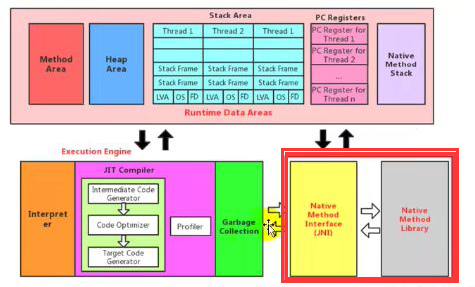

### 本地方法接口

### 什么是本地方法？

一个Native Method就是一个java调用非java代码的接口

一个Native Method是这样一个java方法：该方法的实现由非java语言实现（c语言），

在定义一个native method是，并不提供实现体，因为其实现是由非java语言在外面实现

本地接口的作用是融合不编程语言为java所用，初衷是融合c/c++程序

### 为什么使用Native Method？

java使用起来非常方便，然而有些层次的任务用java实现起来不容易

或者在意java程序的执行效率

与java环境外交互：

有时java应用需要与java外面的环境交互，这时本地方法存在的主要原因

提供一个非常简单的接口，而且无需了解java应用之外的繁琐细节

