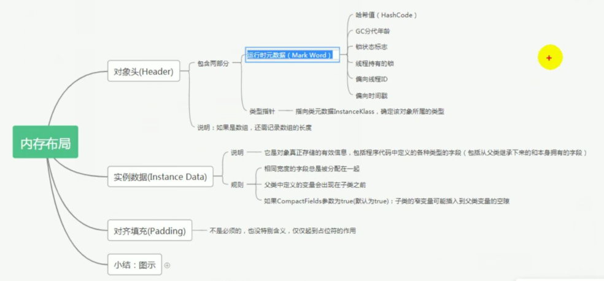
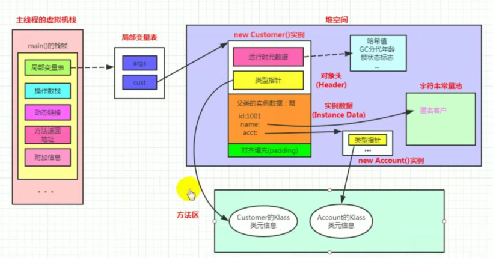
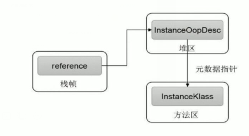
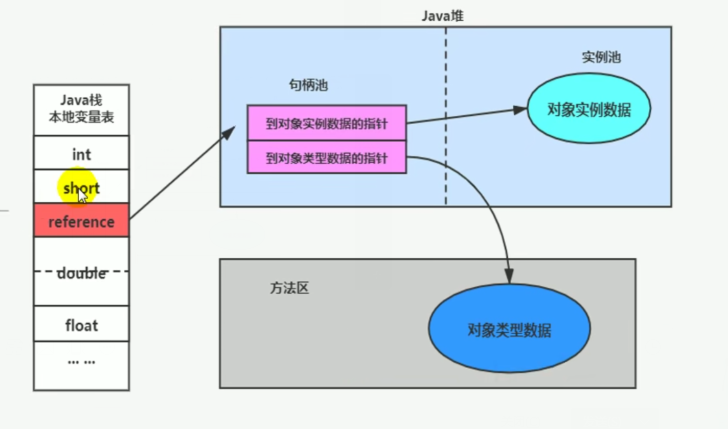
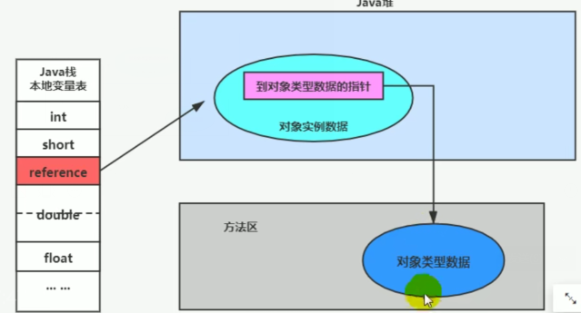

## 对象的实例化

### 对象创建的方式

new

class的newInstance

Constructor的newInstance(XXX)

使用clone

使用反序列话

第三方库Objenesis


### 对象的创建步骤

执行步骤解析

1、判断对宪法对应的类是否加载、链接、初始化

2、为对象分配内存

​		如果内存规整---指针碰撞

​		如果内部不规整---虚拟机需要分配需要维护的一个列表或者空闲列表分配

3、处理并发安全问题

​		采用CAS配上失败重试保证更新的原子性

​		每个线程预先分配一块TLAB

4、初始化分配的空间

​		所有属性设置默认自，保证对象实例字段在不赋值时可以直接使用

5、设置对象的对象头

6、执行init方法进行初始化


字节码角度解析：

```java
    public static void main(String[] args) {
     Object object = new Object();
    }
```

字节码解读

```
  public static void main(java.lang.String[]);
    descriptor: ([Ljava/lang/String;)V
    flags: ACC_PUBLIC, ACC_STATIC
    Code:
      stack=2, locals=2, args_size=1
         0: new           #2                  // class java/lang/Object
         3: dup
         4: invokespecial #1                  // Method java/lang/Object."<init>":()V
         7: astore_1
         8: return
      LineNumberTable:
        line 6: 0
        line 7: 8
      LocalVariableTable:
        Start  Length  Slot  Name   Signature
            0       9     0  args   [Ljava/lang/String;
            8       1     1 object   Ljava/lang/Object;
}

```


## 对象的内存布局





```java
public class Customer {
    int id =1001;
    String name;
    Account acct;
    {
        name = "匿名客户";
    }
    public Customer(){
        acct = new Account();
    }
}
```




## 对象的访问定位


怎么通过变量的引用找到对象的实例



创建的兑现的目的就是为了使用对象


JVM通过栈上的reference访问到内部对象的实例


访问对象的两种方式：句柄访问和直接指针


句柄访问：



需要专门开辟空间存放句柄

访问慢

栈空间的地址引用稳定


直接指针



直接访问，速度快

栈空间地址不稳定（GC）


