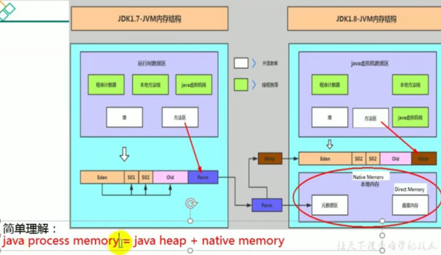

- 不是虚拟机运行时数据区的一部分，也不是《Java虚拟机规范》中定义的内存区域。
- 直接内存是在Java堆外的、直接向系统申请的内存区间。| I
- 来源于NIO，通过存在堆中的Di rectByteBuf fer操作Native内存
- 通常，访问直接内存的速度会优于Java堆。即读写性能高。
  ➢因此出于性能考虑，读写频繁的场合可能会考虑使用直接内存。
  ➢Java的NIO库允许Java程序使用直接内存，用于数据缓冲区

- 也可能导致OutOfMemoryError异常
- 由于直接内存在Java堆外，因此它的大小不会直接受限于-Xmx指定的最大
  堆大小，但是系统内存是有限的，Java堆 和直接内存的总和依然受限于操
  作系统能给出的最大内存。| I
- 缺点
  ➢分配回收成本较高
  ➢不受JVM内存回收管理
- 直接内存大小可以通过MaxDi rectMemorySize设置
- 如果不指定，默认与堆的最大值- -Xmx参数值- -致

