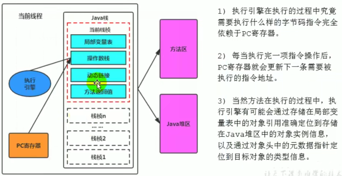
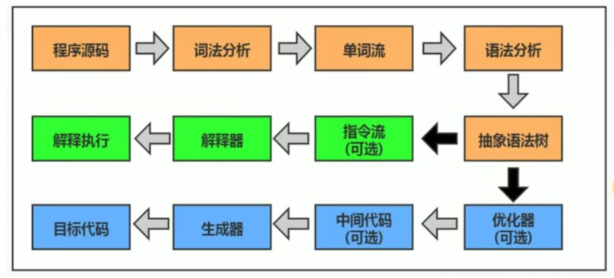
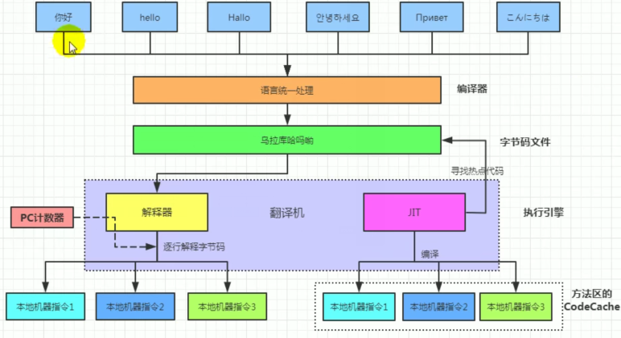
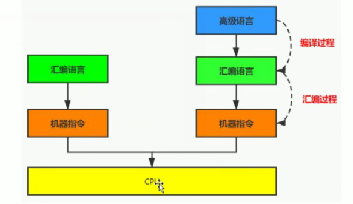
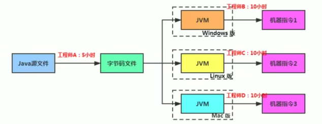
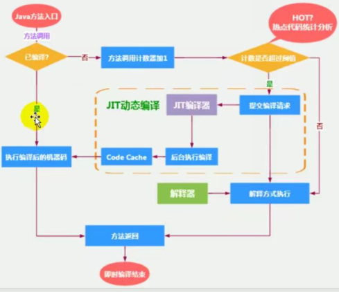
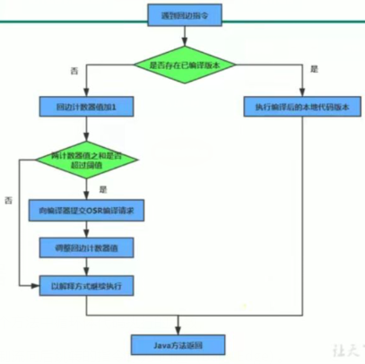

##  执行引擎概述

是java虚拟机核心组成部分之一

虚拟机相对物理机的概念，两种机器都有代码执行的能力，物理机的执行引擎是直接在处理器。缓存，指令集和操作系统层面上的。虚拟机的执行引擎室友软件自行实现的，因此可以不受物理机指定的执行结构体系，**能够执行那别部内硬件直接支持的指令集格式。**

JVM的主要任务是**负责装载字节码**到其内部，但字节码并不能够直接运行在
操作系统之上，因为字节码指令并非等价于本地机器指令，它内部包含的仅
仅只是- -些能够被JVM所识别的字节码指令、符号表，以及其他辅助信息。

那么，如果想要让-一个Java程序运行起来，执行引擎(Execution Engine)
的任务就是**将字节码指令解释/编译为对应平台上的本地机器指令才可以**。简
单来说，JVM中的执行引擎充当了将高级语言翻译为机器语言的译者。

## 执行引擎过程

## java代码编译和执行的过程

**解释器**：

当java虚拟机启动时会根据预定义的规范堆字节码采用逐行解释的方式执行，将每条节码码文件中的内容翻译成对应平台本地机器指令执行

JIT（JUST In Time Compiler）编译器就是虚拟机将源代码直接编译成和本地机器平台相关的机器语言

**java是半编译半解释类型语言**？

1.0版本，将java语言定位为‘’解释执行‘’，后来java发展出现可以直接生成本地代码的编译器

现在jvm在执行jva代码的时，通常会将解释执行域编译二者结合起来

## 机器码、指令、汇编、高级语言

机器码

各种用二进制编码方式表示的指令，叫做机器指令码。开始，人们就用
它采编写程序，这就是机器语言。

机器语言虽然能够被计算机理解和接受，但和人们的语言差别太大，不
易被人们理解和记忆，并且用它编程容易出差错。

用它编写的程序- -经输入计算机， CPU直接读取运行，因此和其他语言
编的程序相比，执行速度最快。

机器指令与CPU紧密相关，所以不同种类的CPU所对应的机器指令也就
不同。

 

指令
●由于机器码是有0和1组成的二进制序列，可读性实在太差，于是人们发明了指令。
●指令就是把机器码中特定的0和1序列，简化成对应的指令(一般为英文简写，如mov,inc等)，可读性稍好
●由于不同的硬件平台，执行同一个操作，对应的机器码可能不同，所以不同的硬件平台的同- -种指令(比如mov)，对应的机器码也可能不同。指令集
●不同的硬件平台，各自支持的指令，是有差别的。因此每个平台所支持的指令，称之为对应平台的指令集。
●如常见的
➢x86指令集，对应的是x86架构的平台
➢ARM指令集，对应的是ARM架构的平台

汇编

● 由于指令的可读性还是太差，于是人们又发明了汇编语言。
●在汇编语言中，用助记符(Mnemonics) 代替机器指令的操作码，用地址符号(Symbol)或标号(Label)代替指令或操作数的地址。
●在不同的硬件平台， 汇编语言对应着不同的机器语言指令集， 通过汇编过程转换成机器指令。
➢由于计算机只认识指令码，所以用汇编语言编写的程序还必须翻译成
机器指令码，计算机才能识别和执行。

高级语言

●为了使计算机用户编程序更容易些，后来就出现了各种高级计算机语言。
高级语言比机器语言、汇编语言更接近人的语言
●当计算机执行高级语言编写的程序时，仍然需要把程序解释和编译成机
器的指令码。完成这个过程的程序就叫做解释程序或编译程序。

字节码

字节码是- -种中间状态(中间码)的二进制代码(文件)，它比机器码更
抽象，需要直译器转译后才能成为机器码

字节码主要为了实现特定软件运行和软件环境、与硬件环境无关。

字节码的实现方式是通过编译器和虚拟机器。编译器将源码编译成字节码，
特定平台上的虚拟机器将字节码转译为可以直接执行的指令。
➢字节码的典型应用为Java bytecode.

## 解释器

JVM设计者们的初衷仅仅只是单纯地为了满足Java程序实现**跨平台特性**，因此避免采用静
态编译的方式直接生成本地机器指令，从而诞生了实现解释器在运行时采用逐行解释字节
码执行程序的想法。

工作机制：

解释器真正意义上所承担的角色就是一一个运行时“翻译者”，将字节
码文件中的内容“翻译”为对应平台的本地机器指令执行。

当一条字节码指令被解释执行完成后，接着再根据PC寄存器中记录的
下一条需要被执行的字节码指令执行解释操作。

解释器分类：

在Java的发展历史里，一.共有两套解释执行器，即古老的**字节码解释器**、现在普遍使用的**模板解释器**。
●字节码解释器在执行时通过纯软件代码模拟字节码的执行，效率非常低下。
●而模板解释器将每一条字节码和一个模板函数相关联，模板函数中直接产生这条字节码执行时的机器码，从而很大程度上提高了解释器的性能。
			➢在HotSpot VM中， 解释器主要由Interpreter模块和Code模块构成。
			Interpreter模块:实现了解释器的核心功能
		    Code模块:用于管理HotSpot VM在运行时生成的本地机器指令

 

## JIT编译器

第一种是**将源代码编译成字节码文件**，然后在运行时通过解释器将字节
码文件转为机器码执行

第二种是编译执行( 直接编译成机器码)。现代虚拟机为了提高执行效
率，会使用即时编译技术(JIT,Just In Time) 将方法编译成机器
码后再执行

HotSpotVM是目前市面上高性能虚拟机的代表作之一。它采用**解释器与即时编译器并存的架构**。在Java虚拟机运行时，解释器和即时编译器能够相互协作，各自取长补短，尽力去选择最合适的方式来权衡编译本地代码的时间和直接解释执行代码的时间。

在今天，Java程序的运行性能早已脱胎换骨，已经达到了可以和C/C++程序一较高下的地步。

**question？**

有些开发人员会感觉到诧异，既然HotSpot VM中已经内置JIT编译器了，那么为什么还
需要再使用解释器来“拖累”程序的执行性能呢?比如JRockit VM内部就不包含解释器，
字节码全部都依靠即时编译器编译后执行。

首先明确:
当程序启动后，解释器可以马上发挥作用，省去编译的时间，立即执行。
编译器要想发挥作用，把代码编译成本地代码，需要- 定的执行时间。但编译为本地代码
后，执行效率高。

所以:
尽管JRockitVM中程序的执行性能会非常高效，但程序在启动时必然需要花费更长的时
间来进行编译。对于服务端应用来说，启动时间并非是关注重点，但对于那些看中启动时
间的应用场景而言，或许就需要采用解释器与即时编译器并存的架构来换取一个平衡点。
在此模式下，当Java虚拟器启动时，解释器可以首先发挥作用，而不必等待即时编译器全
部编译完成后再执行，这样可以省去许多不必要的编译时间。随着时间的推移，编译器发
挥作用，把越来越多的代码编译成本地代码，获得更高的执行效率。

同时，解释执行在编译器进行激进优化不成立的时候，作为编译器的“逃生门”。

HotSpot

当虚拟机启动的时候，**解释器可以首先发挥作用**，而不必等待即时编译器全部编
译完成再执行，这样可以省去许多不必要的编译时间。

并且随着程序运行时间的推移，即时编译器逐渐发挥作用，根据热点探测功能，将有价值的字节码编译为
本地机器指令，以换取更高的程序执行效率。

案例

注意解释执行与编译执行在线上环境微妙的辩证关系。机器在热机状态可以承受的负载要
大于冷机状态。如果以热机状态时的流量进行切流，可能使处于冷机状态的服务器因无法
承载流量而假死。
在生产环境发布过程中，以分批的方式进行发布，根据机器数量划分成多个批次，每个批
次的机器数至多占到整个集群的1/8.曾经有这样的故障案例:某程序员在发布平台进行
分批发布，在输入发布总批数时，误填写成分为两批发布。如果是热机状态，在正常情况
下一半的机器可以勉强承载流量，但由于刚启动的JVM均是解释执行，还没有进行热点代
码统计和JIT动态编译，导致机器启动之后，当前1/2发布成功的服务器马上全部宕机,
此故障说明了JIT的存在。

### 概念

- Java语言的“编译期” 其实是- 段“不确定”的操作过程，因为它可能是指一-个
  **前端编译器**(其实叫“ 编译器的前端”更准确一 些)把.java文件转变
  成.class文件的过程;

- 也可能是指虚拟机的**后端运行期编译器**(JIT编译器，Just In Time Compiler)
  把字节码转变成机器码的过程。

- 还可能是指使用**静态提前编译器**(AOT编译器，Ahead of Time Compiler)直接
  把. java文件编译成本地机器代码的过程。

  

  

  前端编译器: Sun的Javac、 Eclipse JDT中的增量式编译器(ECJ)

  JIT编译器: HotSpot VM的C1、C2编译器。
  AOT编译器: GNU Compiler for the Java
  (GCJ)、Excelsior JET

### 热点代码探测方式

当然是否需要启动JIT编译器将字节码置接编译为对应平台的本地机器指令，
则需要根据代码被调用**执行的频率**而定。关于那些需要被编译为本地代码的字
节码，也被称之为“**热点代码**”，JIT编译器在运行时会针对那些频繁被调用
的“热点代码”做出**深度优化**，将其直接编译为对应平台的本地机器指令，以
此提升Java程序的执行性能。

- **一个被多次调用的方法，或者是一个方法体内部循环次数较多的循环体都可以被称之**
  **为“热点代码”**，因此都可以通过JIT编译器编译为本地机器指令。由于这种编译方
  式发生在方法的执行过程中，因此也被称之为栈上替换，或简称为**OSR** (On Stack
  Replacement)编译。

  

- 一个方法究竟要被**调用多少次**，或者一个循环体究竟需要执行多少次循环才可以达到
  这个标准?必然需要一个明确的阈值， JIT编译器才 会将这些“热点代码”编译为本
  地机器指令执行。这里主要依靠**热点探测功能。**

- **目前HotSpot VM所采用的热点探测方式是基于计数器的热点探测**。

- 采用基于计数器的热点探测，HotSpot VM将 会为每一个方法都建立2个不同类型的计
  数器，分别为**方法调用计数器**( Invocation Counter) 和**回边计数器**(Back Edge Counter) 。
  ➢方法调用计数器用于统计方法的调用次数
  ➢回边计数器则用于统计循环体执行的循环次数

### 方法调用计数器

- 这个计数器就用于统计方法被调用的次数，它的默认阈值在Client 模式
  下是1500次，在Server模式下是10000 次。超过这个阈值，就会触
  发JIT编译。.

- 这个阈值可以通过虛拟机参数-**xx: CompileThreshold**来人为设定。

  

- 当一个方法被调用时，会先检查该方法是否存在被JIT编译过的版本，如
  果存在，则优先使用编译后的本地代码来执行。如果不存在已被编译过的版
  本，则将此方法的调用计数器值加1， 然后判断方法调用计数器与回边计数
  器值之和是否超过方法调用计数器的阈值。如果已超过阈值，那么将会向即
  时编译器提交一个该方法的代码编译请求。

热度衰减

- 如果不做任何设置，方法调用计数器统计的并不是方法被调用的绝对次数，而是一个
  相对的执行频率，即一段时间之内方法被调用的次数。当超过**一定的时间限度**， 如果
  方法的调用次数仍然不足以让它提交给即时编译器编译，那这个方法的调用计数器就
  会被**减少一半**，这个过程称为方法调用计数器热度的**衰减**(Counter Decay) ，而
  这段时间就称为此方法统计的**半衰周期**(Counter Half Life Time).
- 进行热度衰减的动作是在虚拟机进行垃圾收集时顺便进行的，可以使用虚拟机参数
  **-xx: -UseCounterDecay来关闭热度衰减**，让方法计数器统计方法调用的绝对次
  数，这样，只要系统运行时间足够长，绝大部分方法都会被编译成本地代码。
- 另外，可以使用**-xx: CounterHalfLifeTime参数设置半衰周期的时间**，单位是
  秒。

## 回边计数器

它的作用是统计一个方法中循环体代码执行的次数，

在字节码中遇到控制流向后跳转的指令称为“回边” (Back Edge) 。

显然，建立回边计数器统计的目的就是为了触发OSR编译。

