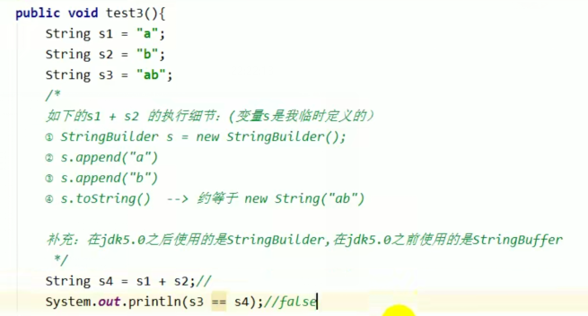
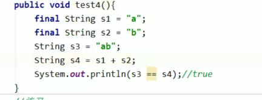

## 基本特性

- String：字符串，使用一堆""引起来
  - String s1 = "XXX" //字面量
  - String s2 = new String("XXX");

- String的底层是final修饰的char数组

- String实现了Serializable接口：表示字符串支持序列化

  ​		   实现了Comparable接口“可以比较大小

- jdk1.8  char  jdk1.9 byte

- String：代表不可变的字符序列：不可变性

  - 重新赋值时，需要重写指定内存区域赋值，不能使用原有的value进行赋值
  - 对现有的字符串进行连接操作时，也需要重新执行内存区域赋值，不能使用原有的value进行赋值
  - 使用replace()方法时，也需要重新指定内存区域赋值，不能使用原有的value进行赋值

- 通过字面量方式给一个字符串赋值，此时的字符串值生命在字符串常量池中


```java
        String  s1 = "abc";//存放常量池
        String s2 = "abc";//指向s1指向的常量池地址
        System.out.println(s1 == s2  );//true

        s1 = "hello";
        System.out.println(s1 == s2);//false s2本身是不变
```

```java
        //存放常量池
        String  s1 = "abc";
        //指向s1指向的常量池地址
        String s2 = "abc";
        s2 +="def";
        System.out.println(s1  );//abc
        System.out.println(s2);//abcdef
```

```java
        //存放常量池
        String  s1 = "abc";
        //指向s1指向的常量池地址
        String s2 = s1.replace("a","qq");
        System.out.println(s1  );//abc
        System.out.println(s2);//qqbc
```

- 字符串常量池中是不会存放相同的字符串

- String的String Pool是一个固定大小的StringTable，默认长度大小时1009

  如果放进String Pool的String非常多，就hi造成Hash冲突，从而导致链表会很长，直接影响String.intern()性能下降

- 使用**-XX:StringTableSize**可以设置StringTable长度

- jdk1.8，StringTable长度默认是60013，1009是可以设置最小值


```shell
C:\Users\test>jinfo -flag StringTableSize 11224
-XX:StringTableSize=60013

```


## String的内存分配

- 在Java语言中有8种基本数据类型和一种比较特殊的类型String。 这些
  类型为了使它们在运行过程中速度更快、更节省内存，都提供了一种常
  量池的概念。
- 常量池就类似一个Java系统级别提供的缓存。8种基本数据类型的常量
  池都是系统协调的，String类型的常量池比较特殊。它的**主要使用方法有两种**。
  ➢直接使用双引号声明出来的String对象会直接存储在常量池中。
         比如: String info = "XX";
  ➢如果不是用双引号声明的String对象，可以使用string提 供intern()方法。


- Java 6及以前，字符串常量池存放在永久代。
- Java1.7中Oracle 的工程师对字符串池的逻辑做了很大的改变，即将**字符串常量池的位置调整到Java堆内**。
  ➢所有的字符串都保存在堆(Heap)中，和其他普通对象- -样，这样
  可以让你在进行调优应用时仅需要调整堆大小就可以了。
  ➢字符串常量池概念原本使用得比较多，但是这个改动使得我们有足够
  的理由让我们重新考虑在Java 7中使用String. intern()。
- Java8元空间， 字符串常量在堆


-XX:MetaspaceSize=6m -XX:MaxMetaspaceSize=6m -Xms6m -Xmx6m

```java
 public static void main(String[] args) {
        HashSet<String> strings = new HashSet<String>();
        short i = 0;

        while (true){
            strings.add(String.valueOf(i++).intern());
        }

    }
```

Exception in thread "main" java.lang.OutOfMemoryError: Java heap space


## 拼接操作

1.常量与常量的拼接结果在常量池，原理是编译期优化
2.常量池中不会存在相同内容的常量。
3.只要其中有一一个是变量，结果就在堆中。变量拼接的原理是StringBuilder
4.如果拼接的结果调用intern()方法，则主动将常量池中还没有的字符串对象放入池中，并返回此对象地址。





拼接不一定都是StringBuilder



字符串拼接不一定使用StringBUilder

如果拼接符左右两边都是字符串常量或者常量引用，仍然使用编译期优化，非StringBuilder

针对于final修饰类，方法，基本数据类型，引用数据类型的量尽量使用final


## 拼接操作和append的操作效率

append效率更快


String a ="a" + i

拼接即每次都会创建一个StringBuilder，调用toString()又会创建一个new String()

StringBuilder sb = new StringBuilder()

自始至终之创建一个对象

StringBuilder会创建容量，在容量不够时需要扩容，数据会重新生成new StringBuilder(highLevel);


## intern()

如果不是用双引号声明的String对象，可以使用Str ing提供的intern方法: intern方法会从字符串常量池中查询当前字符串是否存在，若不存在就会将当前字符串量池中。

​	  比如: String myInfo = new String("I love atguigu") .intern() ;
也就是说，如果在任意字符串上调用String. intern方法，那么其返回结果所指向的
那个类实例，必须和直接以常量形式出现的字符串实例完全相同。


因此，下 列表达式的。值必定是true:
("a" + "b" + "c") . intern() == "abc"


通俗点讲，Interned string就是 确保字符串在内存里只有一份拷贝，这样可以节约
内存空间，加快字符串操作任务的执行速度。注意，这个值会被存放在字符串内部池(String Intern Pool) 。


如何保证变量s指向的字符串常量池中的数据？

1、String 是= ”XXX“//字面零

2、String s = new String("XXX").intern()/new StringBuilder().toString().intern();


new String()创建了几个对象

2个，new 的对象在堆中，

```java
String s = new String("1");
```

字节码：

 0 new #2 <java/lang/String>  堆空间
 3 dup
 4 ldc #3 <1>   常量池存放的对象
 6 invokespecial #4 <java/lang/String.<init>>
 9 astore_1
10 return


new String("1") + new String("2")创建了几个对象？

```java
String str =new String("a") + new String("b");
```

字节码：

 0 new #2 <java/lang/StringBuilder>  **对象一**
 3 dup
 4 invokespecial #3 <java/lang/StringBuilder.<init>>
 7 new #4 <java/lang/String>   **对象二**
10 dup
11 ldc #5 <a>   **常量池中a**
13 invokespecial #6 <java/lang/String.<init>>
16 invokevirtual #7 <java/lang/StringBuilder.append>
19 new #4 <java/lang/String>   **对象四**
22 dup
23 ldc #8 <b>    **常量池五**
25 invokespecial #6 <java/lang/String.<init>>
28 invokevirtual #7 <java/lang/StringBuilder.append>
31 invokevirtual #9 <java/lang/StringBuilder.toString>   **（toString()会创建new String（））**
34 astore_1
35 return


剖析：StringBuilder的toString()--》new String("ab")

toString（）方法的调用在字符串**常量池中没生成ab**


```java
        //2个对象  堆 -- 常量池
        String s = new String("1");
        //调用方法之前，常量池存在1
        s.intern();
        //指向常量池中的
        String s2 = "1";
        //常量池地址==堆空间地址
        System.out.println(s ==s2);//false
```


```java
      //生成的地址是堆空间地址，常量池中没有33
        String s3 = new String("3") +  new String("3");
        //将33添加到常量池(生成)  11 --> 堆空间引用11地址（指向new对象的地址11）
        s3.intern();
        //指向常量池中的33
        String s5 = "33";
        System.out.println(s3 == s5);//true

```


## StringTable垃圾回收


-Xms15m -Xmx15m -XX:+printStringTableStatistics -XX:+PrintGCDetails

打印日志的立即回收信息


## G1中的去重操作

http://openjdk.java.net/jeps/192


命令行选项
➢UseStringDeduplication (bool) :开启String去重，默认是不开启的，需要手动.开启。
➢PrintstringDeduplicationStatistics (bool) :打印详细的去重统计信息
➢StringDeduplicationAgeThreshold (uintx) :达到这个年龄的String对象被认为是去重的候选对象


