## 标记阶段：引用计数器算法


垃圾标记阶段:对象存活判断

- 在堆里存放着几乎所有的Java对象实例，在GC执行垃圾回收之前，首先<u>**需**</u>
  <u>**要区分出内存中哪些是存活对象，哪些是已经死亡的对象**</u>。只有被标记为己
  经死亡的对象，GC才会在执行垃圾回收时，释放掉其所占用的内存空间，因
  此这个过程我们可以称为**垃圾标记阶段**。
- 那么在JVM中究竟是如何标记-一个死亡对象呢?简单来说，当一个对象已经
  不再被任何的存活对象继续引用时，就可以宣判为已经死亡。
- 判断对象存活一般有两种方式:**引用计数算法**和**可达性分析算法。**


- 引用计数算法(Reference Counting)比较简单，对**每个对象保存一 个整型的引用计数器属性。用于记录对象被引用的情况**。

- 对于一个对象A，只要有任何一个对象引用了A，则A的引用计数器就加1;当引用失效
  时，引用计数器就减1。只要对象A的引用计数器的值为0，即表示对象A不可能再被使
  用，可进行回收。

- 优点:**实现简单，垃圾对象便于辨识;判定效率高，回收没有延迟性**。

- 缺点:
  ➢它需要单独的字段存储计数器，这样的做法增加了**存储空间的开销**。
  ➢每次赋值都需要更新计数器，伴随着加法和减法操作，这增加了**时间开销**。
  ➢引用计数器有-一个严重的问题，即**无法处理循环引用**的情况。这是一条致 命缺陷，

   

   导致在Java的垃圾回收器中没有使用这类算法。


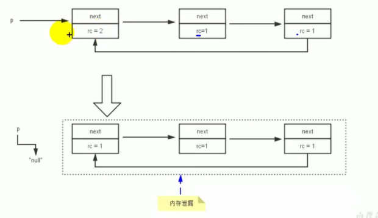


```java
//-XX:PrintGCDetails
public class Min {
    //属性占用内存
    private byte [] bigSize= new byte[5*1024*1024];
    Object reference = null;
    public static void main(String[] args) {
        Min obj1 = new Min();
        Min obj2 = new Min();
        obj1.reference = obj2;
        obj2.reference = obj1;
        obj1 =null;
        obj2=null;
        //System.gc();
    }
}

```

Heap
 PSYoungGen      total 38400K, used 14234K [0x00000000d5f00000, 0x00000000d8980000, 0x0000000100000000)
  **eden space 33280K, 42% used [0x00000000d5f00000,0x00000000d6ce69c8,0x00000000d7f80000)**
  from space 5120K, 0% used [0x00000000d8480000,0x00000000d8480000,0x00000000d8980000)
  to   space 5120K, 0% used [0x00000000d7f80000,0x00000000d7f80000,0x00000000d8480000)
 ParOldGen       total 87552K, used 0K [0x0000000081c00000, 0x0000000087180000, 0x00000000d5f00000)
  object space 87552K, 0% used [0x0000000081c00000,0x0000000081c00000,0x0000000087180000)
 Metaspace       used 3280K, capacity 4496K, committed 4864K, reserved 1056768K
  class space    used 359K, capacity 388K, committed 512K, reserved 1048576K

数据存放在新生代，并且没有进行数据回收


使用gc

  System.gc();

Heap
 PSYoungGen      total 38400K, used 333K [0x00000000d5f00000, 0x00000000d8980000, 0x0000000100000000)
  **eden space 33280K, 1% used [0x00000000d5f00000,0x00000000d5f534a8,0x00000000d7f80000)**
  from space 5120K, 0% used [0x00000000d7f80000,0x00000000d7f80000,0x00000000d8480000)
  to   space 5120K, 0% used [0x00000000d8480000,0x00000000d8480000,0x00000000d8980000)
 ParOldGen       total 87552K, used 690K [0x0000000081c00000, 0x0000000087180000, 0x00000000d5f00000)
  object space 87552K, 0% used [0x0000000081c00000,0x0000000081cacb38,0x0000000087180000)
 Metaspace       used 3280K, capacity 4496K, committed 4864K, reserved 1056768K
  class space    used 359K, capacity 388K, committed 512K, reserved 1048576K

新生代进行了数据回收

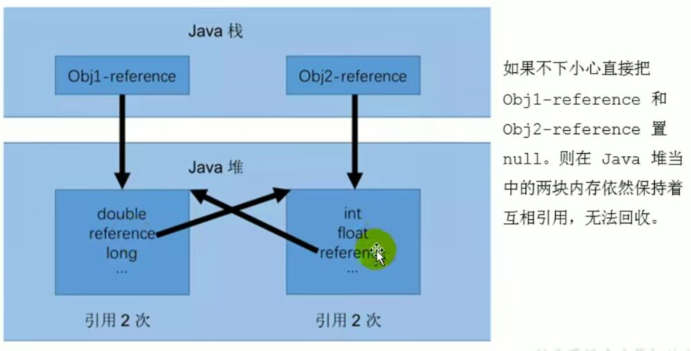

证明java不是引用计数器算法


小结


- 引用计数算法，是很多语言的资源回收选择，例如因人工智能而更加火热的Python，它更是同时支持引用计数和垃圾收集机制。
- 具体哪种最优是要看场景的，业界有大规模实践中仅保留引用计数机制，
  以提高吞吐量的尝试。
- Java并没有选择引用计数，是因为其存在-一个基本的难题， 也就是很难处
  理循环引用关系。
- Python如何解决循环引用?
  ➢手动解除:很好理解，就是在合适的时机，解除引用关系。
  ➢使用弱引用weakref， weakref是Python提供的标准库，旨在解决循环引用。


## 标记阶段：可达性分析算法

- 相对于引用计数算法而言，可达性分析算法不仅同样具备实现简单和执行高
  效等特点，更重要的是该算法可以有效地**解决在引用计数算法中循环引用的**
  **问题，防止内存泄漏的发生**。

- 相较于引用计数算法，这里的可达性分析就是Java、C#选择的。这种类型
  的垃圾收集通常也叫作**追踪性垃圾收集**(Tracing Garbage Collection)。


- 所谓"GC Roots"根集合就是一组必须活跃的引用。
  I
- 基本思路:
  ➢可达性分析算法是以根对象集合(GC Roots) 为起始点，按照从上至下
  的方式**搜索被根对象集合所连接的目标对象是否可达**。
  ➢使用可达性分析算法后，内存中的存活对象都会被根对象集合直接或间
  接连接着，搜索所走过的路径称为**引用链(Reference Chain)**
  ➢如果目标对象没有任何引用链相连，则是不可达的，就意味着该对象己
  经死亡，可以标记为垃圾对象。
  ➢在可达性分析算法中，只有能够被根对象集合直接或者间接连接的对象
  才是存活对象。


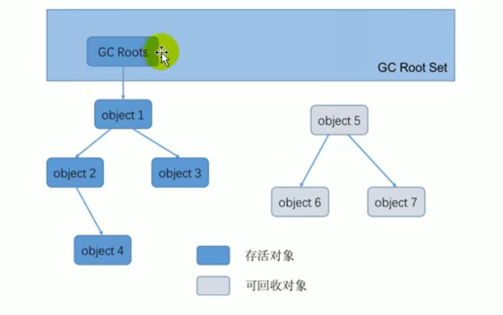


在Java语言中， GC Roots 包括以下几类元素: 

- 虛拟机栈中引用的对象
  ➢比如:各个线程被调用的方法中使用到的参数、局部变量等。
  本地方法栈内JNI (通常说的本地方法)引用的对象
- 方法区中类静态属性引用的对象
  ➢比如: Java类的引用类型静态变量
- 方法区中常量引用的对象
  ➢比如:字符串常量池(String Table) 里的引用
- 所有被同步锁synchroni zed持有的对象
- Java虚拟机内部的引用。
  ➢基本数据类型对应的Class对象，一些常驻的异常对象(如:
  NullPointerException、OutOfMemoryError) ，系统类加载器。
- 反映java虛 拟机内部情况的JMXBean、JVMTI中注册的回调、本地代码缓存等。


- 除了这些固定的GC Roots集合以外，根据用户所选用的垃圾收集器以及当
  前回收的内存区域不同，还可以有其他对象“临时性”地加入，共同构成完
  整GC Roots集合。比如:分代收集和局部回收(Partial GC)。
  	➢如果只针对Java堆中的某一块区 域进行垃圾回收(比如:典型的只针
  	对新生代)，必须考虑到内存区域是虚拟机自己的实现细节，更不是孤
  	立封闭的，这个区域的对象完全有可能被其他区域的对象所引用，这时
     候就需要一- 并将关联的区域对象也加入GC Roots集合中去考虑，才能
     保证可达性分析的准确性。
- 小技巧:
  由于Root采用栈方式存放变量和指针，所以如果-一个指针，它保存了堆内存
  里面的对象，但是自己又不存放在堆内存里面，那它就是一个Root


- 如果要使用可达性分析算法来判断内存是否可回收，那么分析工作必须在
  一个能保障一致性的快照中进行。这点不满足的话分析结果的准确性就无
  法保证。
- 这点也是导致GC进行时必须"stopTheWorld"的一个重要原因。
  ➢即使是号称(几乎)不会发生停顿的CMS收集器中，**枚举根节点时**
  **也是必须要停顿**的。


## 对象的finalization机制

Java语言提供了对象终止(finalization)机制来允许开发人员提供**对**
**象被销毁之前的自定义处理逻辑**
I
当垃圾回收器发现没有引用指向一个对象，即:垃圾回收此对象之前，总会
先调用这个对象的finalize()方法。

finalize()方法允许在子类中被重写，**用于在对象被回收时进行资源释放**。
通常在这个方法中进行一些资源释放和清理的工作，比如关闭文件、套接字
和数据库连接等。


应该交给垃圾回收机制调用。理由包括下面三点:永远不要主动调用某个对象的finalize()方法
	➢在finalize() 时可能会导致对象复活。
	➢finalize() 方法的执行时间是没有保障的，它完全由GC线程决定，极端情况下，
	若不发生GC，则finalize() 方法将没有执行机会。
	➢一个糟糕的finalize() 会严重影响GC的性能。

从功能上来说，finalize ()方法与C++中的析构函数比较相似，但是Java采用的是基
于垃圾回收器的自动内存管理机制，所以finalize ()方法在本质上不同于C++中的析
构函数。

由于finalize ()方法的存在，**虚拟机中的对象一般处于 三种可能的状态**。


如果从所有的根节点都无法访问到某个对象，说明对象己经不再使用了。一般来说，
此对象需要被回收。但事实上，也并非是“非死不可”的，这时候它们暂时处于“缓
刑”阶段。**一个无法触及的对象有可能在某-一个条件下“复活”自己**，如果这样，那
么对它的回收就是不合理的，为此，定义虚拟机中的对象可能的三种状态。如下:
	➢**可触及的**:从根节点开始，可以到达这个对象。
	➢**可复活的**:对象的所有引用都被释放，但是对象有可能在finalize ()中复活。
	➢**不可触及的**:对象的finalize()被调用，并且没有复活，那么就会进入不可触
		及状态。不可触及的对 象不可能被复活，**因为finalize() 只会被调用- -次**。

以上3种状态中，是由于finalize ()方法的存在，进行的区分。只有在对象不可触
及时才可以被回收。


具体过程：

判定一个对象objA是可回收，至少要经历两次标记过程: .
	1.如果对象objA到GC Roots没有引用链，则进行第一次标记。
	2.进行筛选，判断此对象是否有必要执行finalize()方法
		①如果对象objA没有重 写finalize()方法，或者finalize ()方法已经被虚拟机调用过，
		则虚拟机视为“没有必要执行”，objA被判定为不可触及的。
		②如果对象objA重写了 finalize()方法，且还未执行过，那么objA会被插入到E-Queue
		队列中，由一个虚拟机自动创建的、低优先级的Finalizer线程触发其finalize()方C
		法执行。
		③**finalize ()方法是对象逃脱死亡的最后机会**，稍后Gc会对E-Queue队列中的对象进行
		第二次标记。**如果objA在finalize ()方法中与引用链上的任何一个对象建立了联系**，
		那么在第二次标记时，objA会被移出“即将回收”集合。之后，对象会再次出现没有引
		用存在的情况。在这个情况下，finalize方法不会被再次调用，对象会直接变成不可触
		及的状态，也就是说，一个对象的finalize方法只会被调用一次。


````java
public class Min {
    //属性占用内存
    private byte [] bigSize= new byte[5*1024*1024];
    Object reference = null;
    public static void main(String[] args) {
        Min obj1 = new Min();
        Min obj2 = new Min();
        obj1.reference = obj2;
        obj2.reference = obj1;
        obj1 =null;
        obj2=null;
        System.gc();


        try {
            Thread.sleep(1000000);
        } catch (InterruptedException e) {
            e.printStackTrace();
        }
    }
}
````


Finalizer线程：优先级低

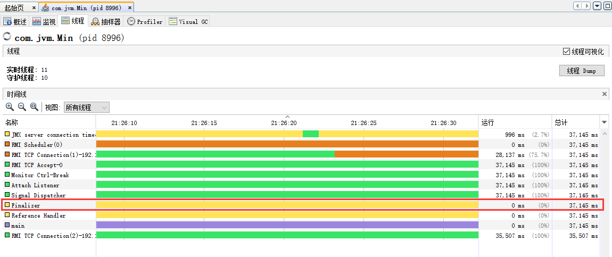

### 可复活对象


```java
package com.jvm.gcroot;

public class CanReliveObj {
    /**
     * 类变量，属于GC ROOOT
     */
    public static CanReliveObj obj;

//    @Override
//    protected void finalize() throws Throwable {
//        super.finalize();
//        System.out.println("调用dinalize方法");
//        obj = this;
//    }

    public static void main(String[] args) {
        obj = new CanReliveObj();
        //对象第一次成功拯救自己
        obj = null;
        System.gc();

        System.out.println("第一次gc");
        //Finalizer线程优先级低，暂停会
        try {
            Thread.sleep(4000);
        } catch (InterruptedException e) {
            e.printStackTrace();
        }

        if (obj == null){
            System.out.println("obj is dead");
        }else {
            System.out.println("obj is alive");
        }

        System.gc();

        System.out.println("第二次gc");
        //Finalizer线程优先级低，暂停会
        try {
            Thread.sleep(4000);
        } catch (InterruptedException e) {
            e.printStackTrace();
        }

        if (obj == null){
            System.out.println("obj is dead");
        }else {
            System.out.println("obj is alive");
        }
    }
}
```

第一次gc
obj is dead
第二次gc
obj is dead


```java
package com.jvm.gcroot;

public class CanReliveObj {
    /**
     * 类变量，属于GC ROOOT
     */
    public static CanReliveObj obj;

    @Override
    protected void finalize() throws Throwable {
        super.finalize();
        System.out.println("调用dinalize方法");
        //当前带回收的对象在dinalize方法中的引用
        obj = this;
    }

    public static void main(String[] args) {
        obj = new CanReliveObj();
        //对象第一次成功拯救自己
        obj = null;
        System.gc();

        System.out.println("第一次gc");
        //Finalizer线程优先级低，暂停会
        try {
            Thread.sleep(4000);
        } catch (InterruptedException e) {
            e.printStackTrace();
        }

        if (obj == null){
            System.out.println("obj is dead");
        }else {
            System.out.println("obj is alive");
        }

        System.gc();

        System.out.println("第二次gc");
        obj = null;
        //Finalizer线程优先级低，暂停会
        try {
            Thread.sleep(4000);
        } catch (InterruptedException e) {
            e.printStackTrace();
        }

        if (obj == null){
            System.out.println("obj is dead");
        }else {
            System.out.println("obj is alive");
        }
    }

}

```

第一次gc
调用dinalize方法
obj is alive
第二次gc
obj is dead


## MAT于JProfilerde GC Roots


### MAT

MAT是Memory Analyier的简称，它是-款功能强大的Java堆内存分析器。
用于查找内存泄漏以及查看内存消耗情况。

MAT是基于Eclipse开发的，是一款免费的性能分析工具。
http://www.eclipse.org/mat/


获取dump文件

方法1：使用jamp

->jps

->jmap -dump:format=b,live,file=test2.bin jps端口号


方法2：使用JVisualVM导出
●捕获的heap dump文件是一个临时文件，关闭JVisualVM后 自动删除，若要保留，
	需要将其另存为文件。
●可通过以下 方法捕获heap dump:
	➢在左侧"Application" (应用程序)子窗口中右击相应的应用程序，选择Heap Dump ((堆Dump)。
	➢在Monitor (监枧)子标签页中点击Heap Dump (堆Dump)技钮。
●本地应用程序的Heap dumps作 为应用程序标签页的一一个 子标签页打开。同时，
	heap dump在左侧的App1 ication (应用程序)栏中对应一个含有时间戳的节点。
	右击这个节点选择save as (另存为)即可将heap dump保存到本地。


```java
public class GCRooTsTest {

    public static void main(String[] args) {
        List<Object> numLise = new ArrayList<Object>();
        Date  birth = new Date();

        for (int j = 0; j < 100; j++) {
            numLise.add(String.valueOf(j));

            try {
                Thread.sleep(10);
            } catch (InterruptedException e) {
                e.printStackTrace();
            }

        }
        System.out.println("add data end...");
        new Scanner(System.in).next();
        numLise = null;
        birth = null;

        System.out.println("numList and birth is null...");

        new Scanner(System.in).next();

        System.out.println("end....");

    }

}
```


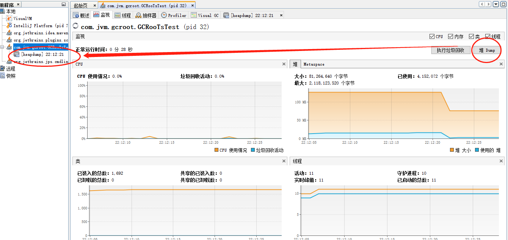


add data end...
继续执行
numList and birth is null...
结束
end....


桌面生成两个文件

打开第一个文件

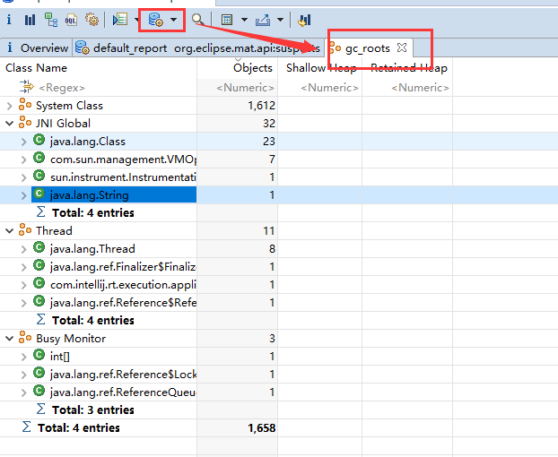

第二个文件之后在main中找不到集合的数据


### JProfile


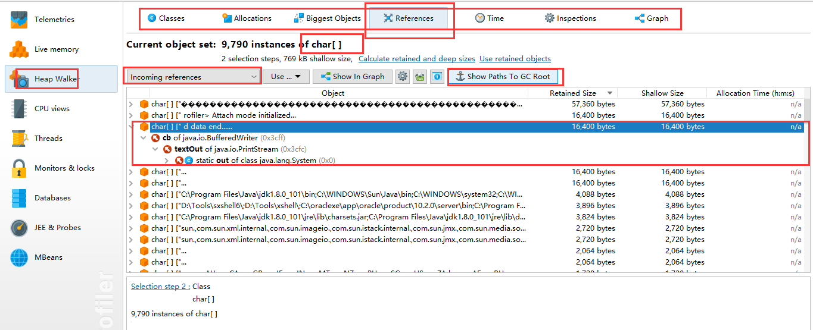


-Xms8m -Xmx8m -XX:+HeapDumpOnOutOfMemoryError:生在dump文件

```java
public class HeapOOM {

    byte [] buffer = new byte[1*1024];

    public static void main(String[] args) {
        ArrayList list = new ArrayList();
        int count = 0;
        try {
            while (true){
                list.add(new HeapOOM());
                count ++;
            }
        }catch (Exception e){
            System.out.println("count=" + count);
        }
    }
}
```

java.lang.OutOfMemoryError: Java heap space
Dumping heap to java_pid16136.hprof ...
Heap dump file created [8308586 bytes in 0.048 secs]
Exception in thread "main" java.lang.OutOfMemoryError: Java heap space
	at com.jvm.gcroot.HeapOOM.<init>(HeapOOM.java:9)
	at com.jvm.gcroot.HeapOOM.main(HeapOOM.java:16)


查看堆内存

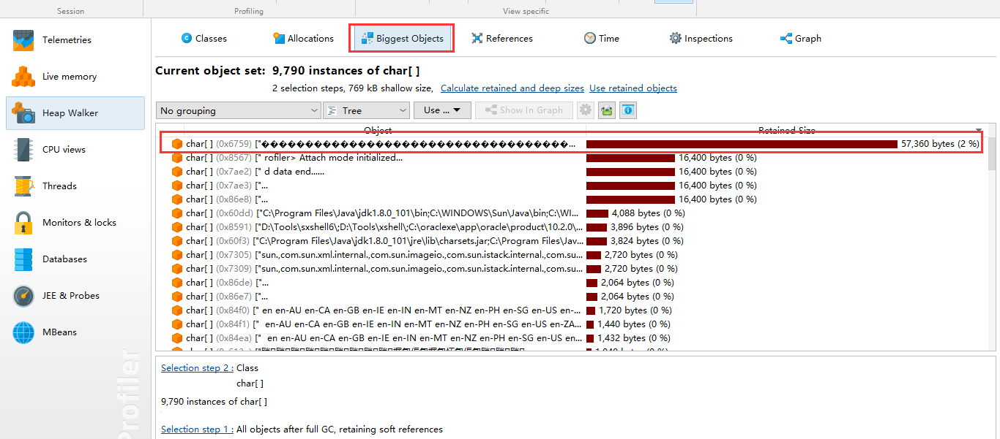


## 清除阶段：标记-清除算法

当成功区分出内存中存活对象和死亡对象后，τGC接下来的任务就是执行垃圾
回收，释放掉无用对象所占用的内存空间，以便有足够的可用内存空间为新对
象分配内存。


目前在JVM中比较常见的三种垃圾收集算法是标记-清除算法( Mark-Sweep)、复制算法(Copying)、标记-压缩算法(Mark-Compact )


### 标记-清除（Mark-Sweep）算法

背景:
标记-清除算法( Mark-Sweep )是一种非常基础和常见的垃圾收集算法，。
该算法被J .McCarthy等人在1960年提出并并应用于Lisp语言.


执行过程:
当堆中的有效内存空间(available memory)被耗尽的时候，就会停止整个
程序(也被称为stop the world)，然后进行两项工作，第一项则是标记, .
第二项则是清除。
	**标记**: Collector从引用根节点开始遍历，标记所有被引用的对象。- -般是在对象的Header中记录为可达对象。
	**清除**: collector对堆内存从头到尾进行线性的遍历，如果发现某个对象在其Header中没有标记为可达对象，则将其回收。


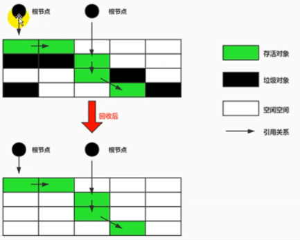


缺点
➢效率不算高
➢在进行Gc的时候，需要停止整个应用程序，导致用户体验差
➢这种方式清理出来的空闲内存是不连续的，产生内存碎片。需要维护一个空闲列表


注意:何为清除?
➢这里所谓的清除并不是真的置空，而是把需要清除的对象地址保存在空闲的地址列表里。下次有新对象需要加载时，判断垃圾的位置空间是否够，如果够，就存放。.


## 清除阶段：复制算法

背景:
为了解决标记-清除算法在垃圾收集效率方面的缺陷，M. L.Minsky于
1963年发表了著名的论文，“ 使用双存储区的Li sp语言垃圾收集器CA
LISP Garbage Collector Algorithm Using Serial
Secondary storage )”. M.L.Minsky在该论文中描述的算法被人
们称为复制(Copying) 算法，它也被M. L.Minsky本人成功地引入到了
Lisp语言的一个实现版本中。


核心思想:
将活着的内存空间分为两块，每次只使用其中一块，在垃圾回收时将正在
使用的内存中的存活对象复制到未被使用的内存块中，之后清除正在使用
的内存块中的所有对象，交换两个内存的角色，最后完成垃圾回收。

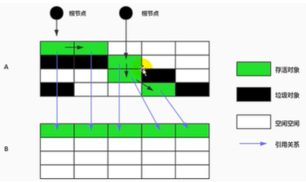


优点:
●没有标记和清除过程，实现简单，运行高效
●复制过去以后保证空间的连续性，不会出现“碎片”问题。


缺点:
此算法的缺点也是很明显的，就是需要两倍的内存空间。
●对于G1这种分拆成为大量region的GC，复制而不是移动，意味着GC需要维护region之间对象引用关系，不管是内存占用或者时间开销也不小。特别的:
●如果系统中的垃圾对象很多，复制算法需要复制的存活对象数量并不会太大,或者说非常低才行。


应用场景:
在新生代，对常规应用的垃圾回收，-次通常可以回收708- 998的内存空间。
回收性价比很高。所以现在的商业虚拟机都是用这种收集算法回收新生代。


## 清除阶段： 标记-压缩算法

背景:
复制算法的高效性是建立在存活对象少、垃圾对象多的前提下的。

这种情况在新生代经常发生，但是在老年代，更常见的情况是大部分对象都是存活对象。

如果依然使用复制算法，由于存活对象较多，复制的成本也将很高。

因此，**基于老年代垃圾回收的特性，需要使用其他的算法**。


标记一清除算法的确可以应用在老年代中，但是该算法不仅执行效率低下，而且在执行完

内存回收后还会产生内存碎片，所以JVM的设计者需要在此基础之上进行改进。

标记-压缩(Mark - Compact) 算法由此诞生。

1970年前后，G. L. Steele、c. J. Chene和D.s. Wise等研究者发布标记-
压缩算法。在许多现代的垃圾收集器中，人们都使用了标记-压缩算法或其改进版本。

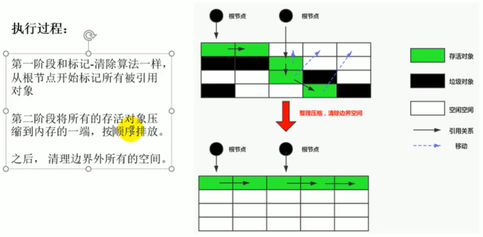


标记-压缩算法的最终效果等同于标记清除算法执行完成后，再进行一次
内存碎片整理，因此，也可以把它称为标记-清除-压缩(Mark- Sweep-
Compact)算法。

二者的本质差异在于标记-清除算法是1种**非移动式的回收算法**，标记-压
缩是**移动式**的。是否移动回收后的存活对象是1项优缺点并存的风险决策。

可以看到，标记的存活对象将会被整理，按照内存地址依次排列，而未被
标记的内存会被清理掉。如此一来，当我们需要给新对象分配内存时，
JVM只需要持有一个内存的起始地址即可，这比维护- - 个空闲列表显然少
了许多开销。


优点:
●消除了标记-清除算法当中，内存区域分散的缺点，我们需要给新对象分配
内存时，JVM只 雷要持有一个内存的起始地址即可。
●消除了复制算法当中，内存减半的高额代价。
缺点:
●从效率上来说，标记-整理算法要低于复制算法。
●移动对象的同时，如果对象被其他对象引用，则还需要调整引用的地址。
●移动过程中，需要全程暂停用户应用程序。即: STW


## 小结


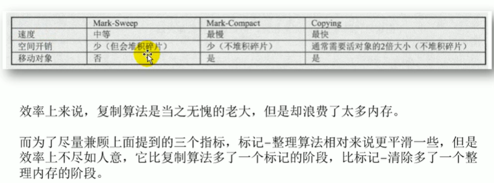


## 分带收集算法

前而所有这些算法中，并没有一种算法可以完全替代其他算法，它们都具有自
己独特的优势和特点。分代收集算法应运而生。

分代收集算法，是基于这样一个事实:不同的对象的生命周期是不一样的。因
此，**不同生命周期的对象可以采取不同的收集方式，以便提高回收效率**。一般
是把Java堆分为新生代和老年代，这样就可以根据各个年代的特点使用不同的
回收算法，以提高垃圾回收的效率。

在Java程序运行的过程中，会产生大量的对象，其中有些对象是与业务信息相
关，比如**Http请求中的Session对象、线程、Socket连接**，这类对象跟业务
直接挂钩，因此生命周期比较长。但是还有一些对象，主要是程序运行过程中
生成的临时变量，这些对象生命周期会比较短，比如: **string对象**， 由于其不
变类的特性，系统会产生大量的这些对象，有些对象甚至只用一次即可回收。


**目前几乎所有的GC都是采用分代收集Generational Collecting) 算法执行垃圾回收的**。
在HotSpot中，基于分代的概念，GC所使用的内存回收算法必须结合年轻代和老年代各自的特
点。
● 年轻代(Young Gen)
年轻代特点:区域相对老年代较小，对象生命周期短、存活率低，回收须繁。
这种情况复制算法的回收整理，速度是最快的。复制算法的效率只和当前存活对象大小有关，因此很适用于
年轻代的回收。而复制算法内存利用率不高的问题，通过hotspot中的两个survivor的设计得到解。

●老年代(Tenured Gen)
老年代特点:区域较大，对象生命周期长、存活丰高，回收不及年轻代频繁。
这种情况存在大量存活丰高的对象，复制算法明显变得不合适。-般是由标记-清除或者是标记-清除与标记-整理的混合实现。
	➢Mark阶段的开销与存活对象的数量成正比。
	➢Sweep阶段的开 销与所管理区域的大小成正相关。
	➢Compact阶段的开 销与存活对象的数据成正比。


以HotSpot中的CMS回收器为例，CMS是基于Mark- -Sweep实现的，对于对象的回
收效率很高。而对于碎片问题，CMS采用基于Mark-Compact算法的Seerial 0ld
回收器作为补偿措施:当内存回收不佳(碎片导致的Concurrent Mode
Failure时)，将采用Serial 0ld执行Full GC以达到对老年代内存的整理。
分代的思想被现有的虚拟机广泛使用。几乎所有的垃圾回收器都区分新生代和老年
代。


## 增量收集算法，分区算法

增量收集算法：

上述现有的算法，在垃圾回收过程中，应用软件将处于一-种stop the World
的状态。在**Stop the World**状态下，应用程序所有的线程都会挂起，暂停一
切正常的工作，等待垃圾回收的完成。如果垃圾回收时间过长，应用程序会被挂
起很久，**将严重影响用户体验或者系统的稳定性**。为了解决这个问题，即对实时
垃圾收集算法的研究直接导致了增量收集(Incremental Collecting) 算法
的诞生。

基本思想：
如果一次性将所有的垃圾进行处理，需要造成系统长时间的停顿，那么就可以让
垃圾收集线程和应用程序线程交替执行。每次，**垃圾收集线程只收集一小片区域**
**的内存空间，接着切换到应用程序线程。依次反复，直到垃圾收集完成**。
总的来说，增量收集算法的基础仍是传统的标记-清除和复制算法。增量收集算
法通过**对线程间冲突的妥善处理，允许垃圾收集线程以分阶段的方式完成标记、**
**清理或复制工作**。


缺点:
使用这种方式，由于在垃圾回收过程中，间断性地还执行了应用程序代码，
所以能减少系统的停顿时间。但是，因为线程切换和上下文转换的消耗，会
使得垃圾回收的总体成本上升，造成系统吞吐量的下降。


分区算法：

一般来说，在相同条件下，堆空间越大，一次GC时 所需要的时间就越长，有关GC产生
的停顿也越长。为了更好地控制GC产生的停顿时间，将一块大的内 存区域分割成多个
小块，根据目标的停顿时间，每次合理地回收若干个小区间，而不是整个堆空间，从
而减少1次GC所产生的停顿。

分代算法将按照对象的生命周期长短划分成两个部分，分区算法将整个堆空间划分成
连续的不同小区间regin。

每一个小区间都独立使用，独立回收。这种算法的好处是可以控制一次回收多少个小
区间。


