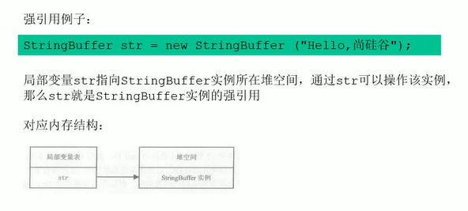

## System.gc()

●在默认情况下，通过system. gc ()或者Runtime. getRuntime() .gc ()
的调用，**会显式触发Full GC**，同时对老年代和新生代进行回收，尝试释放
被丢弃对象占用的内存。

●然而System. gc ()调用附带-一个免责声明，无法保证对垃圾收集器的调用。

●JVM实现者可以通过System. gc ()调用来决定JVM的GC行为。而一般情况
下，垃圾回收应该是自动进行的，**无须手动触发，否则就太过于麻烦了**。在

一些特殊情况下，如我们正在编写一个性能基准，我们可以在运行之间调用
System.gc().


```java
public class SystemGcTest {

    public static void main(String[] args) {
        new SystemGcTest();
        /**
         * 提醒jvm垃圾回收器执行gc
         */
        System.gc();
        //System.runFinalization();
    }

    /**
     * 调用垃圾回收期会进行执行
     * @throws Throwable
     */
    @Override
    protected void finalize() throws Throwable {
        super.finalize();
        System.out.println("finalize....");
    }
}
```

finalize....

提醒jvm执行垃圾回收器，但是不一定会执行


一定会执行垃圾回收器

一定会强制调用使用引用的finalize()方法

```
/** *  */System.runFinalization();
```


## 内存溢出和内存泄漏


内存溢出（OOM）

●内存溢出相对于内存泄漏来说，尽管更容易被理解，但是同样的，内存溢
出也是引发程序崩溃的罪魁祸首之1 。
●由于GC -直在发展，所有1般情况下，除非应用程序占用的内存增长速度
非常快，造成垃圾回收已经跟不上内存消耗的速度，否则不太容易出现00M
的情况。
●大多数情况下，GC会进行各种年龄段的垃圾回收，实在不行了就放大招，
来一次独占式的Full GC操作，这时候会回收大量的内存，供应用程序继
续使用。
●javadoc中 对OutofMemoryError的解释是，**没有空闲内存，并且垃圾收**
**集器也无法提供更多内存。**


首先说没有空闲内存的情况:说明Java虛拟机的堆内存不够。原因有二:
**(1) Java虚拟机的堆内存设置不够。**
比如:可能存在内存泄漏问题:也很有可能就是堆的大小不合理，比如我们要处理比较可
观的数据量，但是没有显式指定JVM堆大小或者指定数值偏小。我们可以通过参数- Xms、
-Xmx来调整。
**(2)代码中创建了大量大对象，并且长时间不能被垃圾收集器收集(存在被引用)**
对于老版本的Oracle JDK，因为永久代的大小是有限的，并且JVM对永久代垃圾回收
(如，常量池回收、卸载不再需要的类型)非常不积极，所以当我们不断添加新类型的时
候，永久代出现OutofMemoryError也非常多见，尤其是在运行时存在大量动态类型生
成的场合;类似intern字符串缓存占用太多空间，也会导致00M问题。对应的异常信息，
会标记出来和永久代相关: "java. lang . OutofMemoryError: PermGen space".
随着元数据区的引入，方法区内存已经不再那么窘迫，所以相应的00M有所改观，出现
00M，异常信息则变成了: "java. lang . OutOfMemoryError: Metaspace"。 直接
内存不足，也会导致00M。


这里面隐含着1层意思是，在抛出0utOfMemoryError之 前，通常垃圾收集器
会被触发，尽其所能去清理出空间。
➢例如:在引用机制分析中，涉及到JVM会去尝试回收**软引用指向的对象**等。
➢在java. nio. BIts. reserveMemory()方法中，我们能清楚的看到，System. gc()
会被调用，以清理空间。
●当然，也不是在任何情况下垃圾收集器都会被触发的
➢比如，我们去分配-一个超大对象，类似一个超大数组超过堆的最大值，JVM可 以判
断出垃圾收集并不能解决这个问题，所以直接抛出outOfMemoryError.


内存泄漏（Memory Leak）

也称作“存储渗漏”。严格来说，**只有对象不会再被程序用到了，但是GC又**
**不能回收他们的情况，才叫内存泄漏**。

但实际情况很多时候一些不太好的实践(或疏忽)会导致对象的生命周期变
得很长甚至导致0OM，也可以叫做宽泛意义.上的“内存泄漏”
尽管内存泄漏并不会立刻引起程序崩溃，但是一旦发生内存泄漏，程序中的
可用内存就会被逐步蚕食，直至耗尽所有内存，最终出现0utOfMemory异常，
导致程序崩溃。
注意，这里的存储空间并不是指物理内存，而是指虚拟内存大小，这个虚拟
内存大小取决于磁盘交换区设定的大小。


举例:
1、单例模式
单例的生命周期和应用程序是一样长的，所以单例程序中，如果持有对
外部对象的引用的话，那么这个外部对象是不能被回收的，则会导致内
存泄漏的产生。
2、一些提供close的资源未关闭导致内存泄漏
数据库连接( dataSourse. getConnection())，网络连接(socket)和
io连接必须手动close，否则是不能被回收的。


## Stop The World

●stop-the-world ，简称STW，指的是GC事件发生过程中，会产生应用
程序的停顿。停顿产生时整个应用程序线程都会被暂停，没有任何响应，
有点像卡死的感觉，这个停顿称为STW。
	➢可达性分析算法中枚举根节点(GC Roots) 会导致所有Java执行线程停顿。
			分析工作必须在- -个能确保- 致性的快照中进行
			 - 致性指整个分析期间整个执行系统看起来像被冻结在某个时间点上
			如果出现分析过程中对象引用关系还在不断变化，则分析结果的准确性无法保证
●被STW中 断的应用程序线程会在完成GC之后恢复，频繁中断会让用户感觉
像是网速不快造成电影卡带一样，所以我们需要减少sTW的发生。


●STw事件和采用哪款Gc无关I所有的GC都有这个事件。
●哪怕是G1 也不能完全避免Stop-the-world情况发生，只能说垃圾回收
器越来越优秀，回收效率越来越高，尽可能地缩短了暂停时间。
●**STw是JVM在后台自动发起和自动完成的**。在用户不可见的情况下，把用
户正常的工作线程全部停掉。
●开发中不要用System.gc() ;会导致Stop-the-world的发生。


## 垃圾回收的并行与并发

### 并发

在操作系统中，是指一个时间段中有几个程序都处于已启动运行到运行完毕之间，且这
几个程序都是在同一个处理器上运行。

并发不是真正意义上的“同时进行”，只是CPU把- -个时间段划分成几个时间片段(时间
区间)，然后在这几个时间区间之间来回切换，由于CPU处理的速度非常快，只要时 间间
隔处理得当，即可让用户感觉是多个应用程序同时在进行。


### 并行

当系统有一个以上CPU时，当一个CPU执行一个进程时，另一一个CPU可以执行另一一个进程，
两个进程互不抢占CPU资源，可以同时进行，我们称之为并行(Parallel).

其实决定并行的因素不是CPU的数量，而是CPU的核心数量，比如一个CPU多个核也可以并行。

适合科学计算，后台处理等弱交互场景


### 对比

并发，指的是多个事情，在同一时间段内同时发生了。
并行，指的是多个事情，在同- -时间点上同时发生了。

并发的多个任务之间是互相抢占资源的。
并行的多个任务之间是不互相抢占资源的。

只有在多CPU或者一个CPU多核的情况中，才会发生并行。
否则，看似同时发生的事情，其实都是并发执行的。


### 垃圾回收的并发与并行


## 安全点与安全域

### 安全点

程序执行时并非在所有地方都能停顿下来开始GC，只有在特定的位置才
能停顿下来开始GC，这些位置称为“安全点(Safepoint )”。

Safe Point的选择很重要，**如果太少可能导致GC等待的时间太长，如果**
**太频繁可能导致运行时的性能问题**。大部分指令的执行时间都非常短暂，
通常会根据“**是否具有让程序长时间执行的特征**”为标准。比如:选择
些执行时间较长的指令作为Safe Point， 如**方法调用、循环跳转和异常**
**跳转**等。


如何在GC发生时，检查所有线程都跑到最近的安全点停顿下来呢?
●**抢先式中断:|(目前没有虚拟机采用了)**
首先中断所有线程。如果还有线程不在安全点，就恢复线程，让线程跑到安
全点。
●**主动式中断:**
设置一个中断标志，各个线程运行到Safe Point的时 候主动轮询这个标志，
如果中断标志为真，则将自己进行中断挂起。


### 安全区域

Safepoint机制保证了程序执行时，在不太长的时间内就会遇到可进入GC
的Safepoint 。但是，程序不执行”的时候呢?例如线程处于Sleep 状
态或Blocked 状态，这时候线程无法响应JVM的中断请求，“走” 到安全.
点去中断挂起，JVM也不太可能等待线程被唤醒。对于这种情况，就需要安全
区域(Safe Region) 来解决。

**安全区域是指在一段代码片段中，对象的引用关系不会发生变化，在这个区域**
**中的任何位置开始GC都是安全的**。我们也可以把Safe Region看做是被扩
展了的Safepoint.


实际执行时:
1、当线程运行到Safe Region的代码时，首先标识已经进入了Safe Region,
如果这段时间内发生GC，JVM会 忽略标识为Safe Region状态的线程;
2、当线程即将离开Safe Region时，会检查JVM是否已经完成GC，如果完成。
了，则继续运行，否则线程必须等待直到收到可以安全离开Safe Region的
信号为止;


## 强引用


再谈引用


强引用---不回收





特点：

●强引用可以直接访问目标对象。
●强引用所指向的对象在任何时候都不会被系统回收，虚拟机宁愿抛出
	OOM异常，也不会回收强引用所指向对象。
●强引用可能导致内存泄漏。


## 软引用--内存不足即回收

软引用是用来描述一些还有用，但非必需的对象。**只被软引用关联着的对象，**
**在系统将要发生内存溢出异常前，会把这些对象列进回收范围之中进行第二**
**次回收**，如果这次回收还没有足够的内存，才会抛出内存溢出异常。

软引用通常用来实现内存敏感的缓存。比如**:高速缓存**就有用到软引用。如
果还有空闲内存，就可以暂时保留缓存，当内存不足时清理掉，这样就保证
了使用缓存的同时，不会耗尽内存。

垃圾回收器在某个时刻决定回收软可达的对象的时候，会清理软引用，并可
选地把引用存放到一个引用队列(Reference Queue)

类似弱引用，只不过Java虛拟机会尽量让软引用的存活时间长一一些，迫不得
已才清理。


## 弱引用--发现立即回收


## 虚引用--对象回收	跟踪


## 终结器引用


