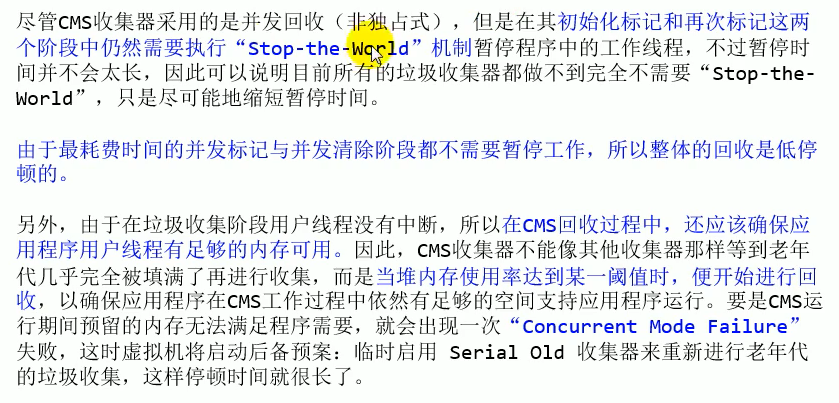

垃圾收集器没有在规范中进行过多的规定，可以由不同的厂商、不同版本的JVM来实现。

由于JDK的版本处于高速迭代过程中，因此Java发展至今已经衍生了众多的GC版本。

从不同角度分析垃圾收集器，可以将GC分为不同的类型。

按照线程：

按线程数分，可以分为串行垃圾回收器和并行垃圾回收器。

串行回收指的是在同一时间段内只允许有一个CPU用于执行垃圾回收操作，

此时工作线程被暂停，直至垃圾收集工作结束。
	➢在诸如单CPU处理器或者较小的应用内存等硬件平台不是	特别优越的场合，串行回收器的性能表现可以超过并行回收	器和并发回收器。所以，
	**串行回收默认被应用在客户端的Client模式下的JVM中**
	➢在并发能力比较强的CPU.上，并行回收器产生的停顿时要	短于串行回收器器。

和串行回收相反，并行收集可以运用多个CPU同时执行垃圾回收，因此提升了应用的吞吐量，不过并行回收仍然与串行回收-一样，采用独占式，使用了“Stop-the-world" 机制。

按照工作模式分：

按照工作模式分，可以分为并发式垃圾回收器和独占式垃圾回收器。
	➢并发式垃圾回收器与应用程序线程交替工作，以尽可能减	少应用程序的停顿时间。
	➢独占式垃圾回收器(Stop the world)- -旦运行，就停止应	用程序中的所有用户线程，直到垃圾回收过程完全结束。

按**碎片处理方式**分，可分为压缩式垃圾回收器和非压缩式垃圾回收器。
➢压缩式垃圾回收器会在回收完成后，对存活对象进行压缩整理，消除回收后的碎片。
➢非压缩式的垃圾回收器不进行这步操作。

按**工作的内存区间**分，又可分为年轻代垃圾回收器和老年代垃圾回收器。

## GC分类和性能指标

- **吞吐量**:运行用户代码的时间占总运行时间的比例
  	➢(总运行时间:程序的运行时间+内存回收的时间)

- 垃圾收集开销:吞吐量的补数，垃圾收集所用时间与总运行时间的比例。

- **暂停时间**:执行垃圾收集时，程序的工作线程被暂停的时间。

- 收集频率:相对于应用程序的执行，收集操作发生的频率。

- **内存占用**: Java堆区所占的内存大小。

- 快速:一个对象从诞生到被回收所经历的时间。

吞吐量：

- 吞吐量就是CPU用于运行用户代码的时间与CPU总消耗时间的比值，即吞
  吐量=运行用户代码时间/ (运行用户代码时间+垃圾收集时间)。
          ➢比如:虚拟机总共运行了100分钟，其中垃圾收集花掉1分钟，那吞吐量就是99%。

- 这种情况下，应用程序能容忍较高的暂停时间，因此，高吞吐量的应用程
  序有更长的时间基准，快速响应是不必考虑的。

- 吞吐量优先，意味着在单位时间内，STW的时间最短: 0.2 + 0.2 = 0.4

暂停时间：

- “暂停时间”是指一个时间段内应用程序线程暂停，让GC线程执行的状态
    	➢例如，GC期间100毫秒的暂停时间意味着在这100毫秒期间内没有应用
  程序线程是活动的。
- 暂停时间优先，意味着尽可能让单次STW的时间最短:0.1+0.1+0.1+
  0.1 + 0.1= 0.5

吞吐量 vs 暂停时间

- 高吞吐量较好因为这会让应用程序的最终用户感觉只有应用程序线程在做
  “生产性”工作。直觉上，吞吐量越高程序运行越快。

- 低暂停时间(低延迟)较好因为从最终用户的角度来看不管是GC还是其他原
  因导致一个应用被挂起始终是不好的。这取决于应用程序的类型，**有时候甚**
  **至短暂的200毫秒暂停都可能打断终端用户体验**。因此，具有低的较大暂停
  时间是非常重要的，特别是对于一个交互式应用程序。|
- 不幸的是”高吞吐量”和”低暂停时间”是- -对相互竞争的目标(矛盾)。
    ➢因为如果选择以吞吐量优先，那么必然需要降低内存回收的执行频率，但是这样
       会导致GC需要更长的暫停时间来执行内存回收。
    ➢相反的，如果选择以低延迟优先为原则，那么为了降低每次执行内存回收时的暂
      停时间，也只能频繁地执行内存回收，但这又引起了年轻代内存的缩减和导致程
      序吞吐量的下降。

现在标准:在最大吞吐量优先的情况下，降低停顿时间

## 不同的垃圾回收器概述

串行回收器: Serial、 Serial 0ld
并行回收器: ParNew、 Parallel Scavenge、 Parallel 0ld
并发回收器: CMS、G1

垃圾回收器和分代之间的关系

垃圾回收器的组合关系

为什么要有很多收集器，- 一个不够吗?因为Java的使用场景很多，移动
端，服务器等。所以就需要针对不同的场景，提供不同的垃圾收集器，
提高垃圾收集的性能。

虽然我们会对各个收集器进行比较，但并非为了挑选一个最好的收集器
出来。没有一种放之四海皆准、任何场景下都适用的完美收集器存在，
更加没有万能的收集器。所以我们选择的只是对具体应用最合适的收集
器。

如何查看默认的垃圾收集器

-XX: +PrintCommandLineFlags:查看命令行相关参数(包含使用的垃圾收集器)
使用命令行指令: jinfo -flag 相关垃圾回收器参数进程ID

## Serial回收器：串行回收

●Serial收集器是最基本、历史最悠久的垃圾收集器了。JDK1.3之前回收
新生代唯一的选择。

●serial收集器作为Hotspot中Client模式下的默认新生代垃圾收集器。

**●Serial收集器采用复制算法、串行回收和" stop- the -World"机制的**
**方式执行内存回收。**

●除了年轻代之外，Serial收 集器还提供用于执行老年代垃圾收集的
serial 0ld收集器。**Serial Old收集器同样也采用了串行回收**
**和"stop the World"机制，只不过内存回收算法使用的是标记-压缩算**
**法。**
   ➢Serial 0ld是运行在Client模式下默认的老年代的垃圾回收器
   ➢Serial 0ld在server模式下主要有两个用途:①与新生代的Parallel
      Scavenge配合使用②作为老年代CMS收集器的后备垃圾收集方案

优势:简单而高效(与其他收集器的单线程比)，对于限定单个CPU的
环境来说，Seria1收集 器由于没有线程交互的开销，专心做垃圾收集自
然可以获得最高的单线程收集效率。
➢运行在Client模式下的虚拟机是个不错的选择。

在用户的桌面应用场景中，可用内存- -般不大(几十MB至- -两百MB) ,
可以在较短时间内完成垃圾收集(几十ms至- - 百多ms)，只要不频繁发生，
使用串行回收器是可以接受的。

在HotSpot虚拟机中，使用-Xx: +UseSerialGC参数可以指定年轻代和
老年代都使用串行收集器。
➢等价于新生代用Serial GC， 且老年代用Serial 0ld GC

## ParNew回收期：并行回收

如果说serial GC是年轻代中的单线程垃圾收集器，那么ParNew收集
器则是Serial收集器的多线程版本。|
	➢Par是Paralle1的缩写，New:只能处理的是新生代

ParNew收集器除了采用**并行回收**的方式执行内存回收外，两款垃圾收
集器之间几乎没有任何区别。ParNew收 集器在年轻代中同样也是采用**复**
**制算法**、"stop- the-World"机制。

ParNew是很多JVM运行在Server模式下新生代的默认垃圾收集器。

由于ParNew收集器是基于并行回收，那么是否可以断定ParNew收集器的

回收效率在任何场景下都会比Serial收集器更高效? .
    ➢ParNew收集器运行在多CPU的环境下，由于可以充分利用多CPU、
    多核心等物理硬件资源优势，可以更快速地完成垃圾收集，提升程序.
    的吞吐量。
    ➢但是在**单个**CPU的环境下，ParNew收集器不比Serial收集器更高**
    **效**。虽然Serial收集器是基于串行回收，但是由于CPU不需要频繁地
     做任务切换，因此可以有效避免多线程交互过程中产生的一些额外开
    销。

因为除Serial外，目前只有ParNew GC能与CMS收集器配合工作

在程序中，开发人员可以通过选项"-XX: +UseParNewGC"手动指定使用
ParNew收集器执行内存回收任务。它表示年轻代使用并行收集器，不影
响老年代。

-XX: ParallelGCThreads限制线程数量，默认开启和CPU数据相同的
线程数。

## Parallel回收器：吞吐量优先

HotSpot的年轻代中除了拥有ParNew收集器是基于并行回收的以外，
Parallel Scavenge收 集器同样也采用了**复制算法、并行回收和”stop**
**the World"机制**。

那么Parallel收集器的出现是否多此一举?
	➢和ParNew收集器不同，Parallel Scavenge收集 器的目标则是达到
	一个**可控制的吞吐量**(Throughput) ，它也被称为吞吐量优先的垃
	圾收集器。
	➢自适应调节策略也是Parallel Scavenge 与ParNew一个重要区别。

高吞吐量则可以高效率地利用CPU时间，尽快完成程序的运算任务，主
要**适合在后台运算而不需要太多交互的任务。因此，常见在服务器环境中**
**使用。例如，那些执行批量处理、订单处理、工资支付、科学计算的应用**
**程序**。

Parallel收集器在JDK1.6时提供了用于执行老年代垃圾收集的
Parallel old收集器，用来代替老年代的Serial old收集器。

Parallel 0ld收集器采用了**标记-压缩算法**，但同样也是基于并行回收
和" Stop- the-world"机制。

在程序吞吐量优先的应用场景中，Parallel 收集器和Parallel Old
收集器的组合，在Server模式 下的内存回收性能很不错。

在Java8中，默认是此垃圾收集器。

Parallel Scavenge回收器:吞吐量优先

●-XX: +UseParallelGC 手动指定年轻代使用Parallel并行收集器执
行内存回收任务。
●-XX: +UseParallelOldGC 手动指定老年代都是使用并行回收收集器。
	➢分别适用于新生代和老年代。默认jdk8是开启的。
	➢上面两个参数， **默认开启一个，另一个也会被开启。( 互相激活)**
●-XX:ParallelGCThreads 设置年轻代并行收集器的线程数。- -般地，
最好与CPU数量相等，以避免过多的线程数影响垃圾收集性能。
	➢在默认情况下，当CPU数量小于8个， ParallelGCThreads 的值等于
	CPU数量。
	➢当CPU数量大于8个， ParallelGCThreads的值等于3+ [5*CPU_ Count]/8]

XX:MaxGCPauseMillis设置垃圾收集器最大停顿时间(即STW的时间)。单位是毫秒。
    ➢为了尽可能地把停顿时间控制在MaxGCPauseMills以内，收集器在
    工作时会调整Java堆大小或者其他一些参数。
    ➢对于用户来讲，停顿时间越短体验越好。但是在服务器端，我们注重
    高并发，整体的吞吐量。所以服务器端适合Parallel,进行控制。
    ➢**该参数使用需谨慎。**

-XX: GCTimeRatio垃圾收集时间占总时间的比例(= 1 / (N + 1))。用于衡量吞吐量的大小。
    ➢取值范围(0,100)。默认值99，也就是垃圾回收时间不超过1号。
    ➢与前一个-XX:MaxGCPauseMillis参数有一定矛盾性。暂停时间越
    长，Radio参数就容易超过设定的比例。

-XX: +UseAdaptiveSizePolicy设 置Parallel Scavenge收集器
具有自适应调节策略
    ➢在这种模式下，年轻代的大小、Eden和Survivor的比例、晋升老年
    代的对象年龄等参数会被自动调整，已达到在堆大小、吞吐量和停顿
     时间之间的平衡点。
    ➢在手动调优比较困难的场合，可以直接使用这种自适应的方式，仅指
     定虚拟机的最大堆、目标的吞吐量(GCT imeRatio)和停顿时间
    (MaxGCPauseMills)，让虚拟机自己完成调优工作。

## CMS回收器：低延迟

- 在JDK 1.5时期，HotSpot推出了一款在强交互应用中几乎可认为有划
  时代意义的垃圾收集器: CMS (Concurrent -Mark - Sweep)收集器，**这款收**
  **集器是HotSpot虚拟机中第一款真正意义上的并发收集器，它第一次实现了**
  **让垃圾收集线程与用户线程同时工作**。
- CMS收集器的关注点是尽可能缩短垃圾收集时用户线程的停顿时间。停顿时
  间越短(低延迟)就越适合与用户交互的程序，良好的响应速度能提升用户
  体验。
  ➢**目前很大一部分的Java应用集中在互联网站或者B/S系统的服务端上，这类应**
  **用尤其重视服务的响应速度，希望系统停顿时间最短**，以给用户带来较好的体验。
  CMs收集器就非常符合这类应用的需求。
- CMs的垃圾收集算法采用**标记-清除算法**，并且也会”stop- the-world" 

不幸的是，CMS作为老年代的收集器，却无法与JDK 1.4.0 中已经存在的
新生代收集器Parallel Scavenge配合工作，所以在JDK 1. 5中使用CMS来
收集老年代的时候，新生代只能选择ParNew或者Serial收集器中的-一个。

在G1出现之前，CMS使用还是非常广泛的。一直到今天，仍然有很多系统使
用CMS GC。

CMS整个过程比之前的收集器要复杂,整个过程分为4个主要阶段，即初始标记阶段、并发
标记阶段、重新标记阶段和并发清除阶段。
●
初始标记(Initial-Mark) 阶段:在这个阶段中，程序中所有的工作线程都将会因为
“Stop-the-World”机制而出现短暂的暂停，这个阶段的主要任务**仅仅只是标记出**
**GC Roots能 直接关联到的对象**。一旦标记完成之后就会恢复之前被暂停的所有应用
线程。由于直接关联对象比较小，所以这里的**速度非常快。**
●
并发标记(Concurrent-Mark) 阶段:从GC Roots的**直接关联对象开始遍历整个对**
**象图的过程**，这个过**程耗时较长**但是**不需要停顿用户线程**，可以与垃圾收集线程- -起
并发运行。

●

重新标记(Remark) 阶段:由于在并发标记阶段中，程序的工作线程会和垃圾收集
线程同时运行或者交叉运行，因此为了**修正并发标记期间，因用户程序继续运作而导**
**致标记产生变动的那一部分对象的标记记录**，这个阶段的停顿时间通常会比初始标记
阶段稍长一些，但也远比并发标记阶段的时间短。

●并发清除(Concurrent-Sweep) 阶段:此阶段**清理删除掉标记阶段判断的已经死亡**
**的对象，释放内存空间**。由于不需要移动存活对象，所以这个阶段也是可以与用户线
程同时并发的

## G1回收器：区域化分代式

## 垃圾回收器总结

## GC日志分析

## 垃圾回收器新发展