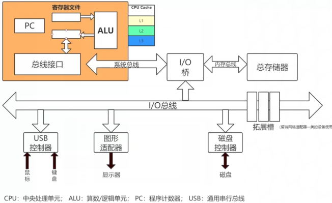
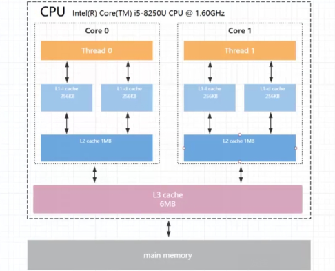
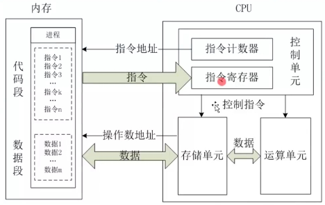
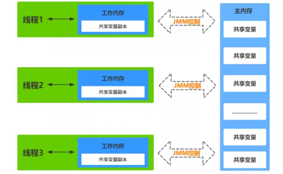
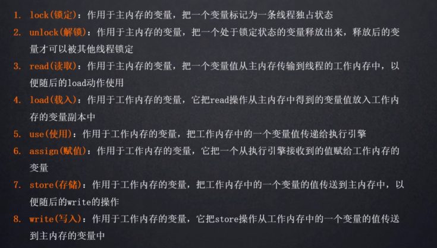
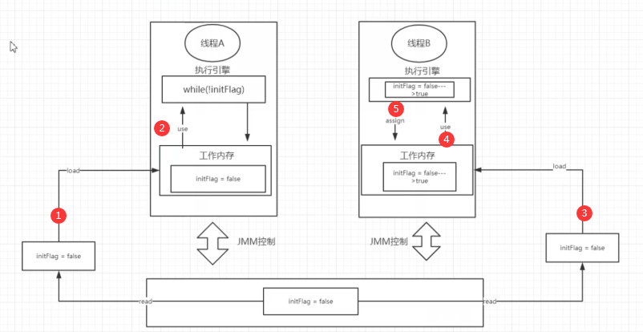

### 计算机硬件结构




数据通过IO总线经过IO桥进入内存


由于cpu的运算速度非常快

内存的**速度**与cpu不一致

会影响cpu的运行性能


###  cpu多级缓存结构

cpu缓存通常分成了三个级别：L1、L2、L3


读取速度：

寄存器>L1>L2>L3>内存


L1是最近接cpu的容量最小的，每个核上拥有一个L1缓存，

L1缓存分为两类：**数据存取**L1d Cache(Data Cache)，**指令存取**L1i Cache

每个核上有一个独立的L2缓存

L3是容量最大最慢的一级被cpu上多核共享


**L1和L2一般是 每个核单独共享的**

**L3是多核共享的**





内存数据与指令读取

**遵循空间局部性原则**

**读取一个区域的数据，读取一块会连续加载一块地区的数据在缓存中**

会认为连续的地址的数据将要被访问


### 带高速缓存cpu执行的过程

1、程序以及数据被加载到主存

2、指令和数据被加载到cpu的高速缓存

3、cpu执行指令，把结果街道高速缓存

4、高速缓存中的数据写回到主内存




### JMM

JMM模型是抽象的概念，描述的是多线程与内存之间的通信

java线程内存模型与cpu缓存模型类似

他是标准化的

用于屏蔽掉各种操作系统的内存访问差异





由于cpu有不同的型号

由于java语言是跨平台的语言

怎么去通用底层的硬件结构

所以java有了JMM内存模型


### 八大原子操作




### 小案例

```
package bf;


import org.apache.log4j.Logger;

public class VolatitleVisbilitySample extends  Thread {
    static Logger logger = Logger.getLogger(VolatitleVisbilitySample.class);

     private static  boolean initFlag = false;

     public static void  refresh(){
         logger.info("refresh data...");
         initFlag = true;
         logger.info("refresh data success");
     }

     public static  void  loadData(){
         while (!initFlag){

         }
         String current = Thread.currentThread().getName();
         System.out.println("线程" + current +"当前线程嗅探到initFlag的状态改变");
     }

    @Override
    public void run() {
        String current = Thread.currentThread().getName();
        if (current.equals("a")){
            loadData();
        }else {
            refresh();
        }
    }

    public static void main(String[] args) {
         //先执行loadData（）
        Thread threadA = new VolatitleVisbilitySample();
        threadA.setName("a");
        //在执行refresh（）
        Thread threadB = new VolatitleVisbilitySample();
        threadB.setName("b");

        threadA.start();
        try {
            Thread.sleep(1000);
        } catch (InterruptedException e) {
            e.printStackTrace();
        }
        threadB.start();
    }
}
```

```
refresh data...
refresh data success
```

大致的流程图：




线程间通信

线程的工作内存相互不可见

xianchengA感知不到线程B对变量的修改


### 保证线程间的通信

volatile：可以保证内存中的数据被修改可以被其他的线程感知到


```
 private static volatile   boolean initFlag = false;
```


```
refresh data...
refresh data success
线程a当前线程嗅探到initFlag的状态改变
```

