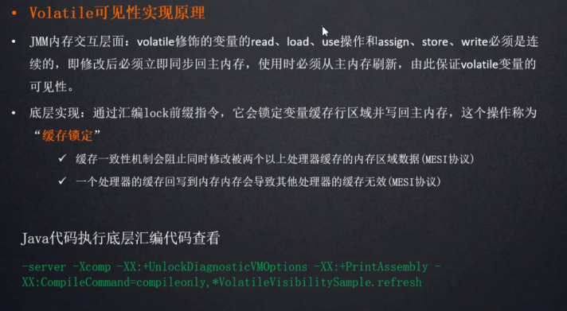
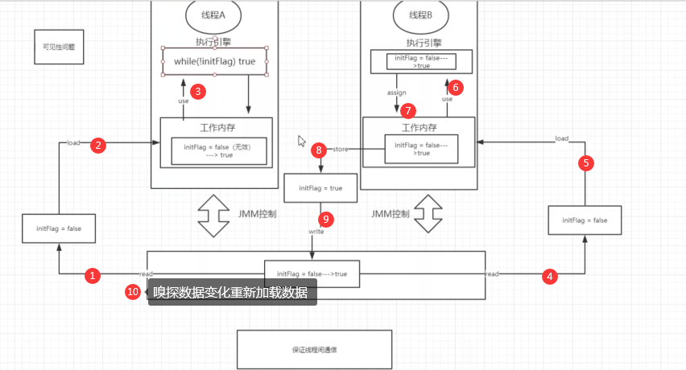

### JMM

JMM模型是抽象的概念，描述的是多线程与内存之间的通信

java线程内存模型与cpu缓存模型类似

他是标准化的

用于屏蔽掉各种操作系统的内存访问差异


由于cpu有不同的型号

由于java语言是跨平台的语言

怎么去通用底层的硬件结构

所以java有了JMM内存模型


### 八大原子操作


### 小案例

```
package bf;


import org.apache.log4j.Logger;

public class VolatitleVisbilitySample extends  Thread {
    static Logger logger = Logger.getLogger(VolatitleVisbilitySample.class);

     private static  boolean initFlag = false;

     public static void  refresh(){
         logger.info("refresh data...");
         initFlag = true;
         logger.info("refresh data success");
     }

     public static  void  loadData(){
         while (!initFlag){

         }
         String current = Thread.currentThread().getName();
         System.out.println("线程" + current +"当前线程嗅探到initFlag的状态改变");
     }

    @Override
    public void run() {
        String current = Thread.currentThread().getName();
        if (current.equals("a")){
            loadData();
        }else {
            refresh();
        }
    }

    public static void main(String[] args) {
         //先执行loadData（）
        Thread threadA = new VolatitleVisbilitySample();
        threadA.setName("a");
        //在执行refresh（）
        Thread threadB = new VolatitleVisbilitySample();
        threadB.setName("b");

        threadA.start();
        try {
            Thread.sleep(1000);
        } catch (InterruptedException e) {
            e.printStackTrace();
        }
        threadB.start();
    }
}
```

```
refresh data...
refresh data success
```

大致的流程图：


线程间通信

线程的工作内存相互不可见

xianchengA感知不到线程B对变量的修改


### 保证线程间的通信

volatile：可以保证内存中的数据被修改可以被其他的线程感知到


```
 private static volatile   boolean initFlag = false;
```


```
refresh data...
refresh data success
线程a当前线程嗅探到initFlag的状态改变
```


### JMM的三大特性

可见性

原子性

有序性


### volatitle可见性原理







底层会对标量进行加锁

其他的cpu能够实时感知到数据变化

换气一致性机制（MESI）保证变量修改之后，可以被其他cpu感知到


### 配置运行时参数

```
-server
-Xcomp
-XX:+UnlockDiagnosticVMOptions
-XX:+PrintAssembly
-XX:CompileCommand=compileonly,*VolatitleVisbilitySample.refresh
```

运行之后会产生参数

```
[Constants]
  # {method} {0x0000000057182d38} 'refresh' '()V' in 'bf/VolatitleVisbilitySample'
  #           [sp+0x40]  (sp of caller)
  0x00000000029de6a0: mov     dword ptr [rsp+0ffffffffffffa000h],eax
  0x00000000029de6a7: push    rbp
  0x00000000029de6a8: sub     rsp,30h
  0x00000000029de6ac: mov     r8,571836d8h      ;   {metadata(method data for {method} {0x0000000057182d38} 'refresh' '()V' in 'bf/VolatitleVisbilitySample')}
  0x00000000029de6b6: mov     edx,dword ptr [r8+0dch]
  0x00000000029de6bd: add     edx,8h
  0x00000000029de6c0: mov     dword ptr [r8+0dch],edx
  0x00000000029de6c7: mov     r8,57182d30h      ;   {metadata({method} {0x0000000057182d38} 'refresh' '()V' in 'bf/VolatitleVisbilitySample')}
  0x00000000029de6d1: and     edx,0h
  0x00000000029de6d4: cmp     edx,0h
  0x00000000029de6d7: je      29de890h
  0x00000000029de6dd: nop
  0x00000000029de6e0: jmp     29de8fch          ;   {no_reloc}
  0x00000000029de6e5: add     byte ptr [rax],al
  0x00000000029de6e7: add     byte ptr [rax],al
  0x00000000029de6e9: add     byte ptr [rsi+0fh],ah
  0x00000000029de6ec: Fatal error: Disassembling failed with error code: 15Decoding compiled method 0x00000000029e1850:
Code:
Argument 0 is unknown.RIP: 0x29e1980 Code size: 0x00000038
[Entry Point]
[Verified Entry Point]
[Constants]
  # {method} {0x0000000057182d38} 'refresh' '()V' in 'bf/VolatitleVisbilitySample'
  #           [sp+0x20]  (sp of caller)
  0x00000000029e1980: mov     dword ptr [rsp+0ffffffffffffa000h],eax
  0x00000000029e1987: push    rbp
  0x00000000029e1988: sub     rsp,10h           ;*synchronization entry
                                                ; - bf.VolatitleVisbilitySample::refresh@-1 (line 13)

  0x00000000029e198c: mov     edx,39h
  0x00000000029e1991: nop
  0x00000000029e1993: call    29157a0h          ; OopMap{off=24}
                                                ;*getstatic out
                                                ; - bf.VolatitleVisbilitySample::refresh@0 (line 13)
                                                ;   {runtime_call}
  0x00000000029e1998: int3                      ;*getstatic out
                                                ; - bf.VolatitleVisbilitySample::refresh@0 (line 13)

  0x00000000029e1999: hlt
  0x00000000029e199a: hlt
  0x00000000029e199b: hlt
  0x00000000029e199c: hlt
  0x00000000029e199d: hlt
  0x00000000029e199e: hlt
  0x00000000029e199f: hlt
[Exception Handler]
[Stub Code]
  0x00000000029e19a0: jmp     293f160h          ;   {no_reloc}
[Deopt Handler Code]
  0x00000000029e19a5: call    29e19aah
  0x00000000029e19aa: sub     qword ptr [rsp],5h
  0x00000000029e19af: jmp     2917600h          ;   {runtime_call}
  0x00000000029e19b4: hlt
  0x00000000029e19b5: hlt
  0x00000000029e19b6: hlt
  0x00000000029e19b7: hlt
refresh data...
refresh data success
线程a当前线程嗅探到initFlag的状态改变
Java HotSpot(TM) 64-Bit Server VM warning: PrintAssembly is enabled; turning on DebugNonSafepoints to gain additional output

Process finished with exit code 0

```


