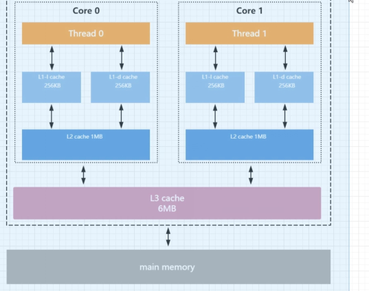
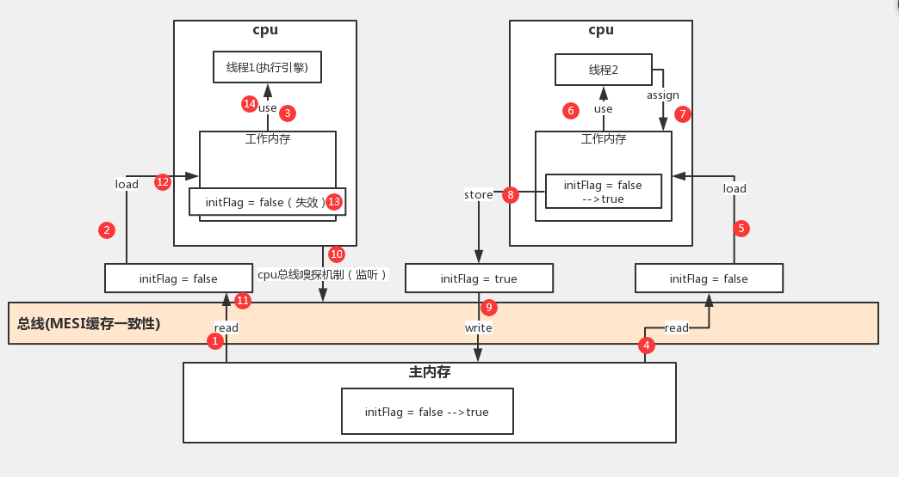

数据可能在L1、L2、L3缓存中

如何在并发的情况才保持数据的一致性（多核）

### JMM缓存不一致性问题

- 总线加锁

cpu从主存读取护具到缓冲区当其中

总线总会加锁锁定该该缓存对应的主存区域

来自其他cpu或者总线代理的空值请求将会被阻塞

无法读写该数据直到锁被释放

- MESI缓存一致性协议

多cpu从主存读取同意数据到各自的缓存区域中

该数据在lock前缀指令执行期间已经在处理器内部的缓存中被锁定

华黁锁定期间其他cpu无法读写该数据

直达该缓存数据被修改同步返回到主存后

其他cpu通过**总线嗅探机制**感知数据变化及时失效自己在缓存中的数据

在下一轮指令周期从主存重新load数据

### MESI缓存一致性协议

基于硬件底层

四种状态：修改、共享、独占、无效状态

前提是：变量的大小不能好过一个缓存行的大小（64字节、128字节）

一旦超过就会触发总线锁

会把整个总线锁住：通信信道锁住

即线程没有权限去读书内存中的变量

此时就会是串行执行

