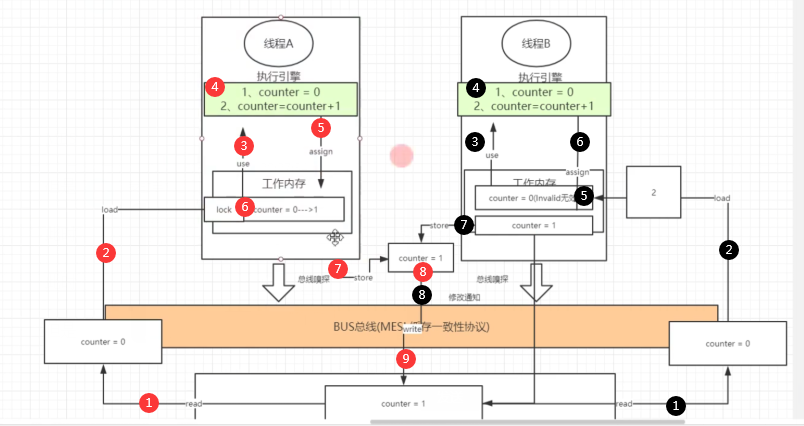

### 原子性

 

volatitle是一种轻量级的锁

**是不能保证原子性**


```
public class VolatileAtomic extends  Thread {

    private static  volatile int count = 1;

    @Override
    public void run() {
        for (int i=0;i<1000;i++){
            count++;
        }
    }

    public static void main(String[] args) throws InterruptedException {
        Thread t1 = new VolatileAtomic();

        for (int i =0 ;i < 100;i++){
            new VolatileAtomic().start();
        }
        Thread.sleep(1000);
        System.out.println(count);
    }
}

```

执行结果(<=1000)：

```
96311
96858
........
```





MESI只能作用于缓存

但是线程已经将数据读取在运行执行引擎中

此时依然会将变量写在缓存中

此时只缓冲中的数据无效,但是执行引擎中的数据已然有效

但是此时的数据会写回到内存


### 有序性


```

public class TestCountDownLatch {
    public static void main(String[] args) {
        final CountDownLatch latch = new CountDownLatch(5);
        LatchDemo ld = new LatchDemo(latch);

        //计算执行时间
        long start = System.currentTimeMillis();
        for(int i=0;i<10;i++){
            new Thread(ld).start();
        }

        long end = System.currentTimeMillis();
        System.out.println("线程执行的时间为：" + (start -end));
    }
}

class LatchDemo implements Runnable{

    private CountDownLatch countDownLatch;

    public LatchDemo(CountDownLatch latch){
        this.countDownLatch = latch;
    }

    public void run() {

        for(int i= 0;i<5000;i++){
            if(i%2==0){
                System.out.println(i);
            }
        }
    }
}
```

结果“

```
...
168
170
线程执行的时间为：-19
172
174
...
```


此时无法得到10个子线程的执行时间

因为在子线程执行完成之前main函数的线程已经执行完毕

此时我们需要设置main函数线程在10个子线程执行完毕之后再执行


指令会重排（不实用volatile）

jit优化可能会优化掉synchronize


